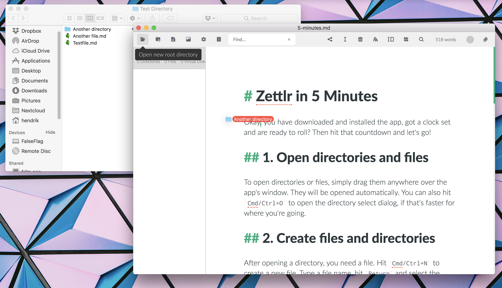
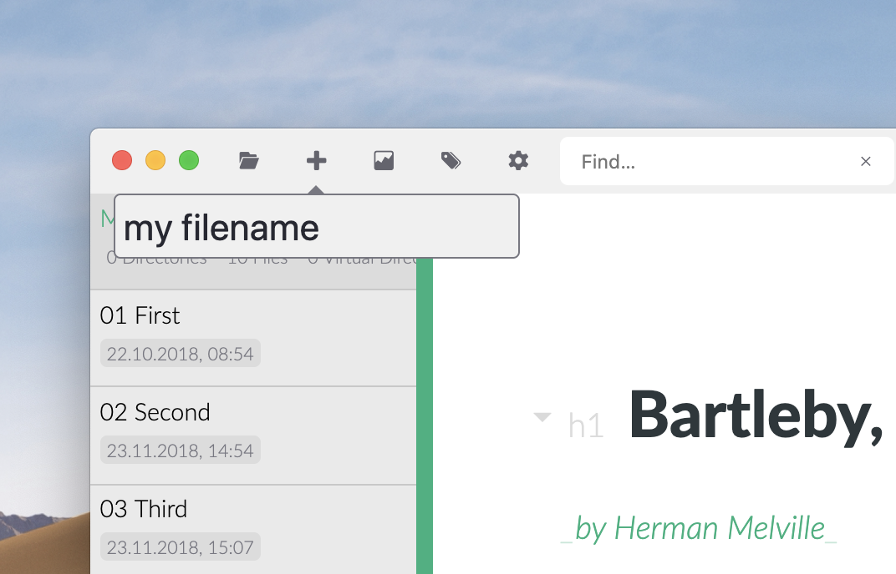
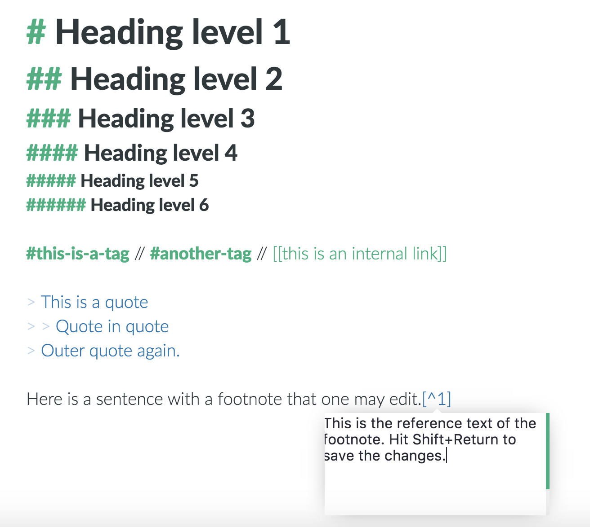
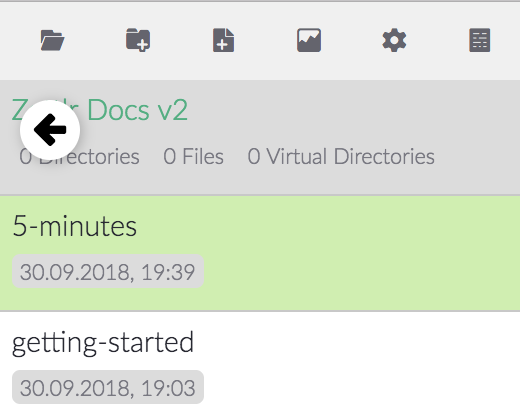
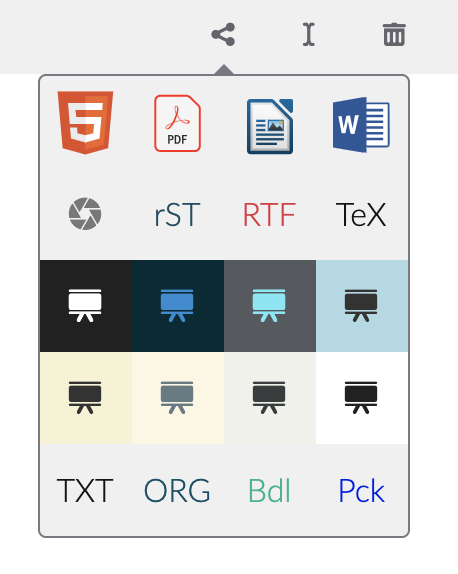

# Zettlr En 5 Minutos

Vale, descargaste e instalaste la app, tienes un cronómetro preparado ¿y estas listo para rocanrolear? Entonces empuja el botón en tu reloj ¡y vamos!

## 1. Abrir carpetas y archivos

Para abrir carpetas o archivos, simplemente muevelas en cualquier lugar sobre la ventana de la app. Se abrarán automáticamente. Alternativamente, podrías teclear `Cmd/Ctrl+O` para abrir el dialogo de carpetas, si eso es más rápido para encontrar tu destino.

## 2. Crear archivos y carpetas

Después de abrir una carpeta, necesitas archivos. Teclea `Cmd/Ctrl+N` para crear un archivo nuevo. Escribe un nombre de archivo, teclea `Entrar` y haz clic en la ventana del editor. ¿Necesitas otra carpeta más? `Cmd/Ctrl+Shift+N` hace lo necesario.

## 3. ¡Escribe!

Escribir depende de ti, pero los accesos directos más importantes son los siguientes:

- `Cmd/Ctrl+I`: poner texto en \__cursivo_\_. Funciona igual que en Word.
- `Cmd/Ctrl+B`: poner texto en \*\***negrita**\*\*. También funciona justo igual que en Word.
- `Cmd+Alt+R` (macOS) `Ctrl+Alt+F` (Windows/Linux): crear una nota a pie de la pagina.
- `Alt/Ctrl+Click` (en una referencia note al pie): Editar la nota al pie. Teclear `Mayús+Entrar` para terminar la edición.
- `Cmd/Ctrl+K`: Insertar un enlace. (`Alt/Ctrl+Clic` el enlaces para abrirlo.)
- `Cmd/Ctrl+J`: Activar el modo sin interrupción.
- `Cmd/Ctrl+Alt+L`: Alternar entre el modo nocturno/día.

Cosas que no son accesos directos, pero igualmente importante:

- Usa símbolos `#` para crear títulos. La cantidad de símbolos `#` está equivalente al nivel del titulo. Lo máximo son 6.
- Usa símbolos `>` para crear citas en bloque. También puedes usar multiples símbolos en cascada para crear símbolos de "más grande que" (p. ej. `> >`).
- Usa símbolos `#` _sin_ espacio después para crear tags (etiquetas). Puedes usarlas para la búsqueda y navegación.

## 4. ¿Que más?

Mueve el ratón al rincón arriba/izquierda de la lista de archivos y haz clic en el icono flecha, que aparece, para mostrar la estructura de carpetas. O elige el modo "extendido" del panel lateral para que puedas ver la lista de archivos y el árbol de carpetas a la vez. También puedes usar los accesos directos `Cmd/Ctrl+1` o `Cmd/Ctrl+2`.

Zettlr está basado estrictamente en contexto. Si no especificado de otra manera, archivos nuevos y carpetas serán creados en la carpeta actual. Operaciones de archivos (como renombrar o borrar) se refieren, por defecto, al archivo actual. Hacer clic con el botón derecha en cualquier archivo o carpeta puedes usar el menú de contexto para seleccionar cualquier archivo o carpeta.  

Tres reglas sencillas:

1. La tecla `Alt`(ternativo) provoca que acciones alternativas se ejecutarán en el mismo elemento.
2. La tecla modificadora `Mayús` _modifica_ el objeto de una acción tal que sea otro elemento (en la mayoría de los casos sería la carpeta en lugar del archivo).
3. Todas las acciones importantes se encuentran en la barra de herramientas. A la izquierda la acciones generales, en el medio acciones con referencia a archivos, y a la derecha otras acciones.

## 5. Que bonito, he terminado con mi texto. ¿Como puedo compartirlo?

Tres pasos sencillos:

1. Asegúrate de que Pandoc y LaTex (solo para exportar a PDF) están instalados,
2. Haz clic en el botón compartir en la barra de herramientas (o teclea `Cmd/Ctrl+E`) y elige el formato de destino.  El símbolo de la apertura te dejan elegir modos de presentación hechas usando reveal.js
3. Exportando, Zettlr abre el archivo exportado automáticamente en tu app preferida. En dicha app entonces, teclea `Cmd/Ctrl+Mayús+S` (debería funcionar en la mayoría de las apps. Ojo: 'S' viene de 'save': guardar; puede, que en sistemas en Castellano es 'G': guardar)

## 6. Vale, han pasado 5 minutos, ¿algo más?

Nada más, ya puedes empezar. Si quieres entrar más profundamente al mundo de Zettlr, no dudes en comprobar nuestras guías:

* [Usa Zettlr app para tomar notas](guides/guide-notes-es.md)
* [Usa Zettlr como sistema de Zettelkasten(fichero)](guides/guide-zettelkasten-es.md)
* [Usa Zettlr IDE completa (entorno desarrollo integrado)](guides/guide-ide-es.md)
