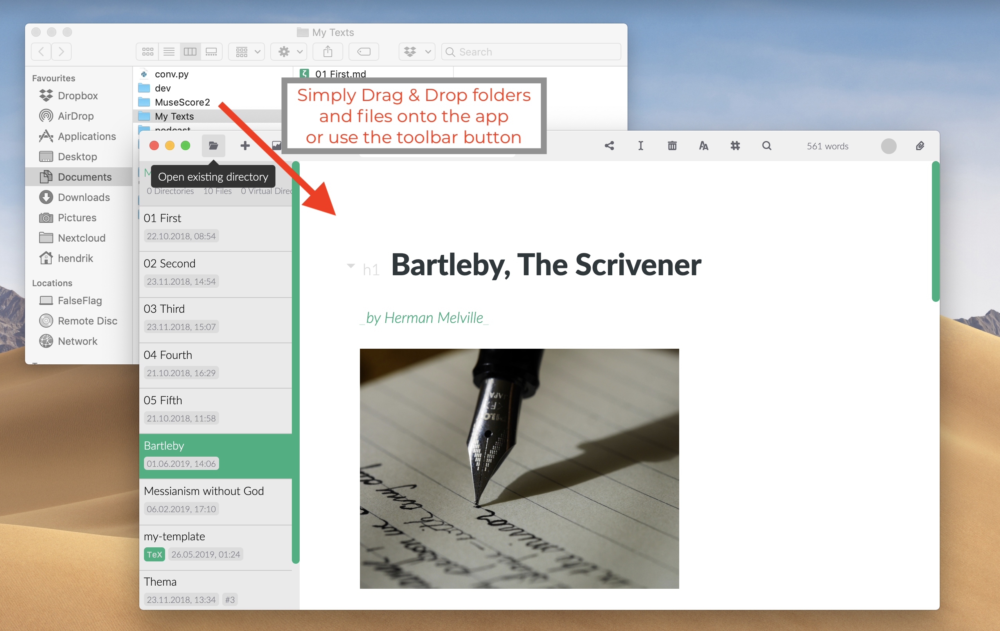
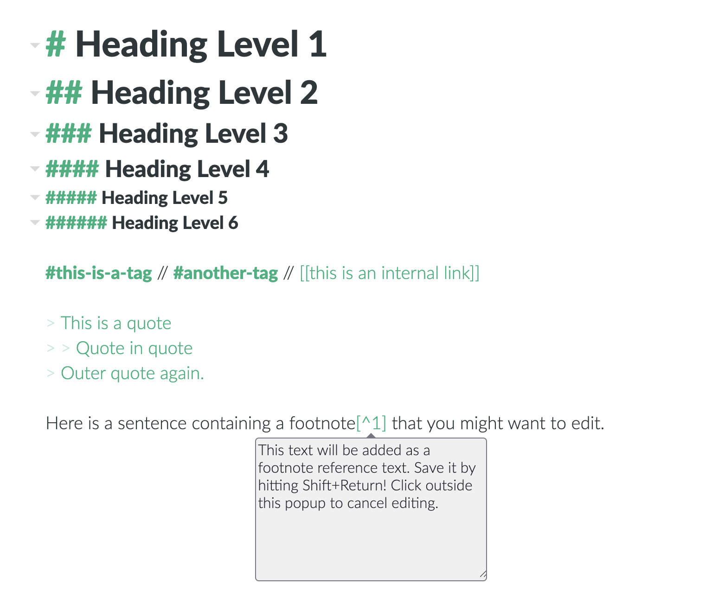
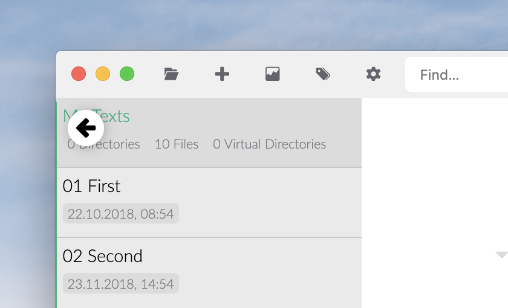
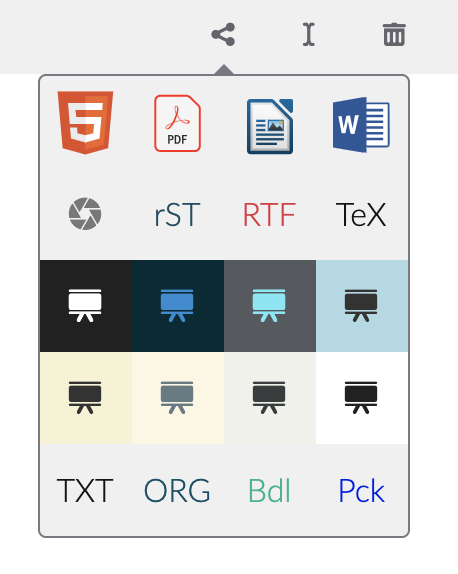

# Zettlr en cinc minuts

Zettlr ja està instal·lat i esteu a punt? Aquí teniu una introducció de cinc minuts amb les coses més importants que heu de saber.

## 1. Obriu carpetes i fitxers

Zettlr es basa en carpetes. Això significa que sempre treballeu en un directori. Podeu obrir un directori arrossegant-lo a l'aplicació, mitjançant el botó de la barra d'eines o amb la drecera `Cmd/Ctrl + O`.

## 2. Creeu fitxers i carpetes

Després d'obrir un (o més) directoris a l'aplicació, podeu crear fitxers o carpetes addicionals. Amb `Cmd/Ctrl + N` creeu un fitxer nou, amb` Cmd/Ctrl + Maj + N` podeu crear una carpeta nova, tot a la carpeta que tingueu seleccionada.

> No només podeu crear fitxers Markdown. Si deixeu de banda l'extensió de fitxer, Zettlr sempre crea un fitxer Markdown, però Zettlr també permet els fitxers `.txt` i `.tex` si especifiqueu explícitament l'extensió de fitxer.

## 3. Escriviu

Zettlr no pot escriure per vosaltres, però us pot ajudar a fer-ho. Aquí teniu algunes dreceres que us facilitaran la feina:

- `Cmd/Ctrl+I`: crea un text \__cursiva_\_. Igual que a Word.
- `Cmd/Ctrl + B`: Creeu text \* \***en negreta**\*\*. També com a Word.
- `Cmd+Alt+R` (macOS) `Ctrl+Alt+F` (Windows/ GNU/Linux): afegiu una nota al peu.
- `Alt/Ctrl+clic` (en una referència a la nota a peu de pàgina): editeu la nota a peu de pàgina. Deseu els canvis amb `Maj+Retorn`.
- `Cmd/Ctrl+K`: Insereix un enllaç web. (Amb `Alt/Ctrl+Click` podeu obrir-lo al navegador.)
- `Cmd/Ctrl+J`: canvia al mode lliure de distraccions.
- `Cmd/Ctrl+Alt+L`: canvia entre el mode clar i fosc de l'aplicació.

Un parell de coses més sobre les dreceres de teclat que també són importants:

- Podeu crear encapçalaments amb el signe `#` seguit d'un espai. El nombre de caràcters `#` determina de quin nivell serà (Hi ha sis nivells com a molt).
- Podeu crear cometes sagnades (per a citar un fragment, per exemple) amb el símbol `>`. També podeu intercalar-les (per exemple, `> >`).
- Si `#`, _NO_ va seguit d'un espai, crea una etiqueta, com a Twitter. Podeu utilitzar aquestes etiquetes per classificar i navegar.

## 4. Què més?

En mode de barra lateral fina (aquest és el mode estàndard), veieu _o bé_ la llista de fitxers _o_ l'arbre de carpetes. Moveu el ratolí a l'extrem superior esquerre i feu clic a la fletxa que apareix per mostrar l'arbre de carpetes. També podeu passar de la llista de fitxers a l'arbre de carpetes (i a l'inrevés) amb `Cmd/Ctrl+!`. En el mode de barra lateral expandit, es mostren tots dos alhora.

A Zettlr, moltes accions es basen en el context. La majoria de dreceres de teclat utilitzen el fitxer actual o la carpeta actual com a referència. Si creeu un fitxer nou amb `Cmd/Ctrl+N`, per defecte es crearà a la carpeta que teniu seleccionada actualment. Per descomptat, també podeu utilitzar el menú contextual per dirigir especificar on han d'anar els fitxers i carpetes.

Tres regles generals per utilitzar dreceres de teclat a Zettlr:

1. La tecla `Alt`(ernativa) es pot utilitzar per a _altres_ accions amb el _mateix_ tipus d'element.
2. La tecla `Shift` canvia l'objectiu d'una acció: la _mateixa_ acció amb un tipus d'element _ diferent_. Per exemple: `Ctrl+N`
crea un nou fitxer, i `Ctrl+Shift+N` crea (mateixa acció) una carpeta (tipus d'element diferent).
3. Totes les funcions principals també apareixen com a botons a la barra d'eines. Les accions bàsiques són a l'esquerra, les funcions del fitxer actual al mig i algunes addicionals a la dreta.

## 5. Com puc compartir els resultats de la meva escriptura?

En tres senzilles passes:

1. Assegureu-vos que teniu instal·lats [Pandoc](installing-pandoc.md) i [LaTeX](installing-latex.md) (només per a PDF).
2. Feu clic al botó de compartir o `Cmd/Ctrl+E` i seleccioneu el format desitjat. Reveal.JS revelarà els dissenys de presentació (_Nota: sí, hem intentat mantenir el joc de paraules de l'anglès_).
3. Després de l'exportació, Zettlr obrirà nou document amb el programa que trieu.

## 6. D'acord, han estat realment cinc minuts. Alguna cosa més?

No, ja està! Si en voleu saber més, també podeu mirar les guies:

- [Zettlr com a programa de notes](guides/guide-notes.md)
- [Zettlr com a Zettelkasten](guides/guide-zettelkasten.md)
- [Zettlr com a entorn de desenvolupament complet](guides/guide-ide.md)