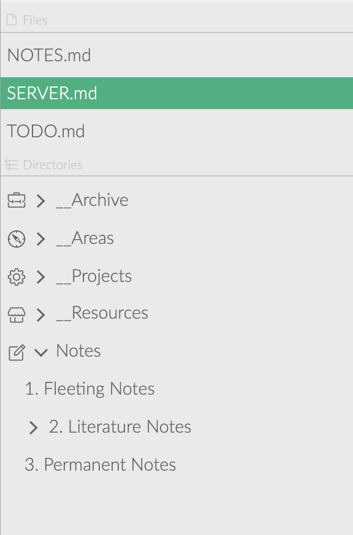

# Gestió de Fitxers a Zettlr

Zettlr conté un gestor de fitxers complet basat en la nostra capa d'abstracció del sistema de fitxers (FSAL). Això no és casualitat, ja que Zettlr es va construir amb la immersió com a principi rector. A la pràctica, això es tradueix en què Zettlr espera que escolliu una carpeta en algun lloc del vostre ordinador, en la qual realitzareu la major part del vostre treball amb Zettlr.

<iframe width = "560" height = "315" src = "https://www.youtube-nocookie.com/embed/2YX5n8-XVbU" frameborder = "0" allow = "acceleròmetre; reproducció automàtica; suport xifrat; giroscopi ; picture-in-picture "allowfullscreen> </iframe>

> Al llarg de la documentació, farem servir els termes "carpeta" i "directori" indistintament, ja que fan referència al mateix. L'única diferència és que "carpeta" és el terme que més usuaris coneixeran, mentre que "directori" és el terme tècnic per a les carpetes de l'ordinador.

## Directori arrel

Un directori arrel constitueix la base d’un sol arbre de fitxers. Com ja sabreu, els fitxers es desen jeràrquicament a les carpetes de l’ordinador. Cada directori de l'ordinador que obriu amb Zettlr s'anomena directori "arrel", perquè forma l'arrel de tot el seu contingut.

Podeu carregar diversos directoris arrel alhora, per exemple, si voleu separar diferents fases de treball (per exemple, un directori arrel anomenat "Zettelkasten" i un altre anomenat "Projectes"). Si voleu implementar l'anomenat [principi PARA](https://fortelabs.co/blog/para/) per a l'arxiu de documents, té sentit crear quatre carpetes a l'ordinador: "Projectes", "Àrees de responsabilitat", "Recursos" i  "Arxiu" carregar cada una com a arrel a l'aplicació (vegeu la captura de pantalla).

Zettlr vigilarà tots els fitxers de les vostres arrels per veure els canvis que feu de forma remota. Per exemple, si utilitzeu un servei al núvol per fer còpies de seguretat dels vostres fitxers, per exemple, a Google Drive, Dropbox o una instància de Nextcloud, pot ser que la vostra aplicació al núvol sincronitzi els canvis a un fitxer només després d'iniciar Zettlr. Zettlr reconeixerà aquests canvis i els reflectirà de manera adequada dins de l'aplicació.

> Es recomana tenir almenys un directori arrel obert a l'aplicació. És cert qu és possible obrir i treballar amb fitxers només des de l’ordinador, però això es desaconsella: d'una banda perdreu moltes funcionalitats lligades als directoris arrel; a més, és probable que tot plegat sigui menys productiu, perquè no és així com ho vam pensar.

## Arxius arrel

Hi ha un segon tipus d'"arrels" en el context Zettlr: els fitxers arrel. Els anomenem arrel, perquè apareixen dins de l'arbre de fitxers de Zettlr, però a diferència de les carpetes, aquests "arbres" només consten d'un sol fitxer.

No podeu obrir fitxers arrel directament des de l'aplicació, sinó que s'obren quan feu doble clic en un fitxer en algun lloc de l'ordinador. Si aquest fitxer es troba dins d’un directori arrel, Zettlr simplement navegarà cap a aquest directori arrel i obrirà el fitxer. Però si aquest fitxer es troba ara en qualsevol dels directoris arrel de Zettlr, Zettlr l’obrirà com a fitxer autònom o arrel.

Els fitxers arrel s’ordenen sempre a sobre dels directoris arrel, on hi teniu fàcil accés. També els podeu "tancar", cosa que significa que simplement es descarregaran de l'aplicació, però es deixaran intactes, o bé esborraran, cosa que significa que Zettlr els descarregarà de l'aplicació i també els mourà a la paperera.

> Aquest comportament facilita la càrrega d'un o dos fitxers de marcatge addicionals a l'aplicació que no resideixen en cap dels directoris arrel. Això té sentit, per exemple, per als desenvolupadors de programari que només vulguin editar el fitxer Readme del seu projecte sense carregar el directori complet a Zettlr.
