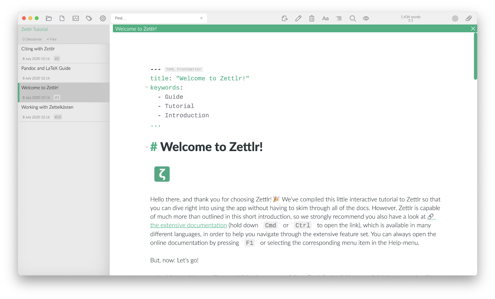

# Per començar

Després d'instal·lar Zettlr, és probable que vulgueu començar a treballar de seguida. Al primer inici, Zettlr copiarà un directori especial a la carpeta Documents que conté un tutorial interactiu molt útil que us guiarà de manera nativa pels primers passos a l'aplicació. Només heu de seguir les instruccions que hi ha; fins i tot us indicarà seccions específiques d'aquesta documentació on podreu obtenir més informació sobre l'aplicació.

Si teniu alguna pregunta que no sembla que es respongui en aquesta documentació, consulteu les [Preguntes més freqüents](faq.md) i pregunteu a la comunitat a [Reddit](https://www.reddit.com/r/Zettlr/) i al [fòrum](https://forum.zettlr.com/). També disposem d’un [canal de YouTube](https://www.youtube.com/c/Zettlr/) on de tant en tant penjem vídeos sobre com utilitzar l’aplicació i les eines associades.

Podeu veure una sèrie de vídeos introductoris seguint [aquest enllaç a la nostra llista de reproducció Zettlr HowTo](https://www.youtube.com/playlist?list=PL2ydvDwV-1u5ncnkxQWZhbHQdwpY2fx5f).

> El tutorial interactiu suggerirà instal·lar Pandoc i LaTeX al vostre ordinador. Zettlr depèn d'aquests programes per importar i exportar fitxers. Sense Pandoc, només podreu exportar documents HTML i la importació estarà desactivada. Sense LaTeX no podreu exportar fitxers PDF. Però si no voleu importar ni exportar res, no els necessiteu: a més, es poden instal·lar en qualsevol moment si canvieu d'opinió.

Totes les funcions que s’utilitzen en aquest tutorial es descriuen a la documentació, de manera que, en cas que vulgueu llegir-ne més, simplement cerqueu la característica aquí. Es recomana que seguiu el tutorial durant el primer inici de l'aplicació per acostumar-vos als diferents conceptes com la barra lateral, l'arbre de fitxers, els enllaços interns i les pestanyes del document.

Un cop hàgiu acabat el tutorial, podeu tancar el directori per descarregar-lo de l'aplicació, suprimir-lo completament i obrir una altra carpeta per treballar.