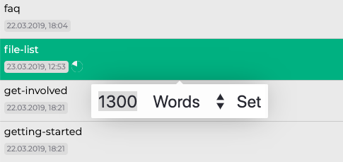

# La Lista de Archivos

Lo siguiente es la lista de archivos. La lista de archivos es algo muy especial porque tiene potentes funciones que facilitan el trabajo con muchos archivos y directorios. Así que echemos un vistazo!

## General

En el modo de barra lateral extendida, tanto la vista de árbol como la lista de archivos son visibles. Usando el modo de barra lateral delgada, siempre puedes mostrar u ocultar la lista pulsando `Cmd/Ctrl+Mayús+1`.

> **Nota**: Consulta el [manual de configuración](../reference/settings-es.md) para obtener más información sobre los modos de la barra lateral.

La lista de archivos muestra todos las carpetas y archivos dentro del directorio que está seleccionado actualmente en la vista de árbol, pero no como un navegador de archivos normal: **La lista de archivos trata todas las sub-carpetas como iguales, y te muestra todos uno tras otro! ** Por lo tanto, no es necesario que vaya más lejos en el árbol de directorios para llegar a los directorios enterrados.

Si desactivaste la meta información, tanto los directorios como los archivos se mostrarán como una sola línea. Si activas la meta información (llamada "Snippets"), verás información adicional: los directorios te mostrarán la cantidad de hijos que tienen. Los archivos, por otro lado, muestran la fecha de su última modificación. Si contienen una ID o tags (etiquetas), esta información se mostrará después de la fecha de modificación. Al pasar el ratón por encima del contador de etiquetas, puedes ver un pequeño tooltip (descripción emergente) que te muestra todas las etiquetas que se encuentran en el archivo.

> Puedes (des-)activar "Snippets" (meta información) a través del menú "View" o pulsando `Cmd/Ctrl+Alt+S`.

### Meta información sobre los archivos

[La información adicional mostrada abajo tus archivos en la lista de archivos puede ser beneficiosa por varias razones. En primer lugar, puedes comprobar si la ID del archivo se ve bien o no. A veces, Zettlr puede detectar una ID incorrecto, y esta es la primera manera de comprobar si Zettlr realmente usa tu ID, o simplemente tomó alguna parte de una URL que contiene muchos números. Además, puede pasar el ratón por encima de la cantidad de etiquetas para mostrarlas en un tooltip.

### Objetivos en Escribir

Desde la versión `1.2`, Zettlr soporta la objetivos. Para establecer un objetivo, haz clic con el botón derecho del ratón en un archivo y selecciona "Establecer objetivo de escritura...". Introduce la número de palabras o caracteres que quieres escribir y haz clic en "Establecer". Zettlr contará hacia tu objetivo y te mostrará el progreso mostrando un pequeño indicador si tienes snippets activados. Pasa el ratón por encima para ver el número absoluto de palabras o caracteres que has escrito.

> **Nota**: Para eliminar el objetivo de escritura de un archivo, simplemente pon el contador de escritura a cero.

### Sorting

Si quieres ordenar directorios, puedes hacerlo desde la lista de archivos. Simplemente mueve el ratón sobre cualquier directorio y aparecerán dos indicadores que te mostrarán el estado actual de la clasificación. Haz clic en el primero (con una flecha de la **A** a **Z**) para alternar la clasificación por nombre. La segunda alterna la clasificación según la hora / fecha de la última modificación. Las sub-carpetas no se clasificarán de esta manera, sólo los archivos.

También puedes recorrer el árbol de directorios haciendo clic en los directorios. Un simple clic seleccionará el directorio, mientras que un `ALT`-clic seleccionará su directorio padre. Esto es útil si tienes que cambiar de directorio con frecuencia, pero prefieres el modo delgado de la barra lateral y no quieres cambiar a la vista de árbol repetidamente.

## Implicaciones estructurales

Cada vez que seleccionas un directorio en la vista de árbol, la lista de archivos mostrará _todos_los archivos y directorios de este directorio. En pocas palabras, aplana todos tus diferentes sub-carpetas y archivos de la estructura en forma de árbol que se parece a la lista de directorios en una lista unidimensional. La lista siempre cambiará su contenido cada vez que seleccionas un directorio diferente en la vista de árbol.

> La lista sólo muestra _todos_las carpetas y archivos _dentro_ del directorio actualmente seleccionado. Por lo tanto, funciona un poco como una función de búsqueda muy rápida. Sólo se ven los archivos en un directorio específico y, cuando se baja nivel a nivel, cada vez son menos los archivos visibles hasta que sólo un directorio y sus archivos son visibles. Dada una buena estructura dentro de tu carpeta raíz, esta es una forma poderosa de tener sólo aquellos archivos en la lista que realmente necesitas.

A medida que la lista de archivos aplana tu complejo árbol de directorios, tienes que hacer algunas suposiciones sobre cómo _visualizar_ adecuadamente los archivos. Por lo tanto, las siguientes reglas te ayudan a distinguir dónde se encuentran realmente los archivos en tu disco:

1. El directorio seleccionado actualmente estará en la parte superior de la lista de archivos. Siempre.
2. Todos los archivos que se encuentran dentro de este directorio se colocan directamente debajo del nombre de este directorio.
3. Todos las sub-carpetas que están _dentro de este directorio siempre estarán en la parte inferior de la lista de archivos, es decir, _después_ de los archivos en la carpeta seleccionada.
4. Si los directorios están vacíos, se colocarán inmediatamente uno después de cada uno de ellos.

Así que lo que es importante recordar es: Todos los directorios se mostrarán como si estuvieran en el mismo nivel; como si no estuvieran anidados. Para identificar qué directorios contienen cada uno de ellos, consulta la vista de árbol.

> Si no te gusta la clasificación "natural" de Zettlr (de modo que 10 viene después de 2), puedes cambiar a la clasificación "ASCII" en los ajustes (de modo que 2 viene después de 10).

## Acciones en la lista de archivos

Hay muchas acciones que se refieren a la lista. En primer lugar, sólo tienes que seleccionar una ficha para abrir cualquier archivo y mostrar su contenido en el editor. Haz clic en un directorio para seleccionarlo.

Puedes mover tus archivos a diferentes ubicaciones. Simplemente arrástrelos desde la lista de archivos a un directorio en el árbol de directorios. El directorio sobre el que pase el ratón recibirá un ligero destello para indicar dónde se va a mover el archivo. Sólo tienes que soltar el archivo allí, para moverlo o soltarlo en cualquier otro lugar para abortar la "operación mudanza" y revertir el archivo a su posición original.

Si arrastras un archivo fuera de la aplicación, podrás compartirlo con otros programas. Para cancelar este arrastre, basta con volver a soltar el ratón sobre la aplicación.

## Buscar con "mapa térmico" (Heatmap)

Otra característica útil de la lista de archivos es ayudarle a distinguir qué resultados de búsqueda son los más relevantes. Una vez que hayas ejecutado una búsqueda, la lista cambiará de color como un camaleón. Pintará todos los archivos en 50 tonos de gri^h^h^h **verde**... (sí, acabamos de hacer _esa_ broma). Cuanto más verde sea un archivo, más relevante será para tu búsqueda actual.

Esta es una característica que se podría llamar "mapa térmico" para las búsquedas de texto completo.

Por favor, ten en cuenta que la lista es muy adaptable y se transformará mucho mientras usas la aplicación. Por ejemplo, no sólo mostrará todos los archivos y directorios del directorio actualmente seleccionado, sino que también ocultará los archivos sin resultados de la lista de vista previa, cuando la lista esté en modo de búsqueda.
