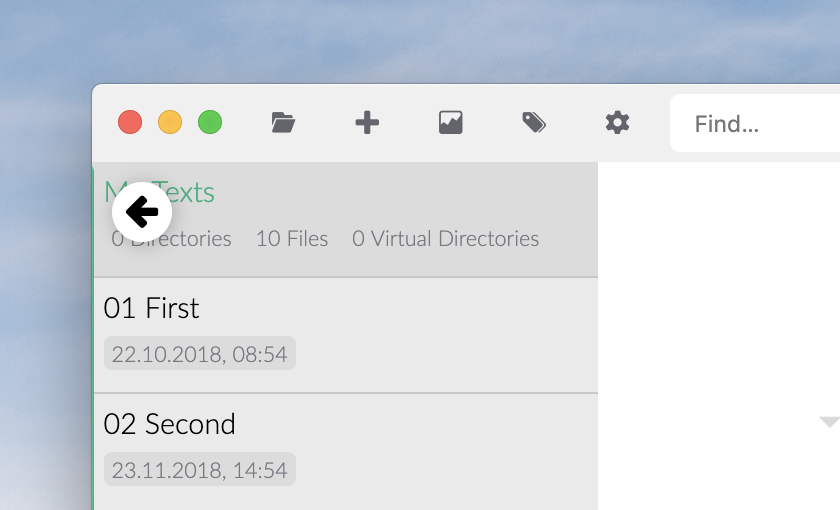

# Zettlr in fünf Minuten

Zettlr ist installiert und du bist startbereit? Hier gibt's die Fünf-Minuten-Einführung in das wichtigste, was du wissen musst!

## 1. Verzeichnisse und Dateien öffnen

Zettlr ist ordnerbasiert. Das heißt, du arbeitest immer in einem Verzeichnis. Ein Verzeichnis öffnest du, indem du es auf die App ziehst, mit dem Toolbar-Button oder mittels des Kürzels `Cmd/Ctrl+O`.

## 2. Dateien und Ordner erstellen

Nachdem du ein (oder mehrere) Verzeichnisse in der App offen hast, kannst du in ihnen natürlich weitere Dateien oder Ordner erstellen. Mit `Cmd/Ctrl+N` erstellst du eine neue Datei, mit `Cmd/Ctrl+Shift+N` kannst du ein neues Verzeichnis erstellen — und zwar immer im aktuell ausgewählten Verzeichnis.

> Du kannst nicht nur Markdown-Dateien erstellen! Wenn du die Dateiendung weg lässt, erstellt Zettlr immer eine Markdown-Datei, aber Zettlr erlaubt auch `.txt`- und `.tex`-Dateien, wenn du die Dateiendung explizit angibst!

## 3. Schreiben

Das Schreiben kann dir Zettlr leider nicht abnehmen, aber hier sind ein paar Kürzel, die dir die Arbeit wesentlich leichter machen werden:

- `Cmd/Ctrl+I`: Erstelle \__kursiven_\_ Text. Genau wie in Word.
- `Cmd/Ctrl+B`: Erstelle \*\***fetten**\*\* Text. Ebenfalls wie in Word.
- `Cmd+Alt+R` (macOS) `Ctrl+Alt+F` (Windows/Linux): Füge eine Fußnote ein.
- `Alt/Ctrl+Click` (auf eine Fußnotenreferenz): Bearbeite die Fußnote. Mit `Shift+Enter` speicherst du deine Änderungen.
- `Cmd/Ctrl+K`: Web-Link einfügen. (Mit `Alt/Ctrl+Click` kannst du ihn in deinem Browser öffnen.)
- `Cmd/Ctrl+J`: Wechsle in den ablenkungsfreien Modus.
- `Cmd/Ctrl+Alt+L`: Wechsle zwischen hellem und dunklem Modus der App.

Noch ein paar Dinge ohne Tastaturkürzel, die aber ebenfalls wichtig sind:

- Mit `#`-Zeichen gefolgt von einem Leerzeichen erzeugst du Überschriften. Die Anzahl an `#`-Zeichen bestimmt, welche Ebene es wird. Maximal sechs.
- Mit `>`-Zeichen erzeugst du eingerückte Zitate. Du kannst sie auch verschachteln (z.B. `> >`).
- Mittels `#`-Zeichen, die _nicht_ von einem Leerzeichen gefolgt werden, erstellst du Tags, wie auf Twitter. Diese Tags kannst du zum Kategorisieren und Navigieren nutzen.

## 4. Was noch?

Im dünnen Seitenleisten-Modus (das ist der Standard-Modus) siehst du _entweder_ die Dateiliste _oder_ den Verzeichnisbaum. Bewege die Maus zur oberen linken Ecke und klicke auf den erscheinenden Pfeil, um den Verzeichnisbaum anzuzeigen. Zwischen Dateiliste und Verzeichnisbaum kannst du auch mittels `Cmd/Ctrl+!` hin und her wechseln. Im erweiterten Seitenleisten-Modus werden beide gleichzeitig angezeigt.

In Zettlr funktionieren viele Aktionen Kontext-basiert. Die meisten Tastaturkürzel nutzen entweder die aktuelle Datei oder das aktuelle Verzeichnis als Basis. Erstellst du also mittels `Cmd/Ctrl+N` eine neue Datei, wird diese standardmäßig im aktuell ausgewählten Verzeichnis angelegt. Mittels des Kontext-Menüs kannst du aber natürlich auch spezifische Dateien und Verzeichnisse direkt ansprechen.

Drei Daumenregeln für die Verwendung von Tastaturkürzeln in Zettlr:

1. Die `Alt`(ernative)-Taste kann für _andere_ Aktionen mit dem _selben_ Element genutzt werden.
2. Die `Shift`-Taste verschiebt ("shift") das Ziel einer Aktion (von der aktuellen Datei auf das aktuelle Verzeichnis), ergo: die _selbe_ Aktion mit einem _anderen_ Element.
3. Alle zentralen Funktionen befinden sich als Buttons in der Toolbar. Links befinden sich grundlegende Aktionen, in der Mitte Funktionen für die aktuelle Datei und rechts ein paar zusätzliche.

## 5. Wie teile ich meine schriftlichen Ergebnisse nun?

Drei einfache Schritte:

1. Stelle sicher, dass Pandoc und LaTeX (nur für PDF) installiert sind.
2. Klicke auf den Teilen-Button (Kürzel: `Cmd/Ctrl+E`) und wähle das gewünschte Format aus. Die Blende blendet die Präsentations-Designs ein (im Englischen funktioniert der Wortwitz mit dem Namen des Werkzeugs, reveal.JS, im Deutschen leider nicht).
3. Nach dem Export öffnet Zettlr die fertige Datei mit dem Programm deiner Wahl.

## 6. Okay, das waren fünf Minuten. Sonst noch etwas?

Nein, das war es schon! Wenn du mehr wissen willst, kannst du natürlich auch weiter schauen:

- [Zettlr als Notizprogramm](guides/guide-notes.md)
- [Zettlr als Zettelkasten](guides/guide-zettelkasten.md)
- [Zettlr als volle Entwicklungsumgebung](guides/guide-ide.md)
