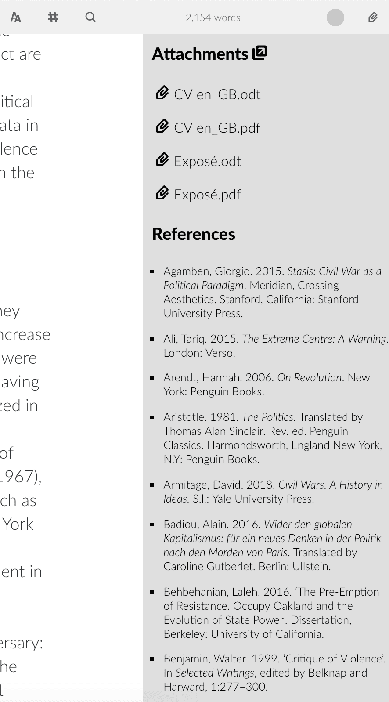

# Zitieren mit Zettlr

Zettlr nutzt `citeproc-js` zum Zitieren bei wissenschaftlichen Artikeln, eine Bibliothek, die beispielsweise auch von Pandocs Citeproc-Engine oder Zotero verwendet wird. Das heißt, die Zitationen in Zettlr funktionieren genauso auch in Zoteros Word oder LibreOffice-Plugins. Die Zitations-Engine von Zettlr besteht aus drei Komponenten: Eine CSL JSON oder BibTex-Bibliothek mit sämtlichen Literaturreferenzen, optional einer CSL-Stildatei, welche den Standard-Stil von Zettlr ersetzt ([American Psychological Association's 6th edition](https://www.apastyle.org/manual/index), kurz APA), und eine Vorschau-Engine. Diese Anleitung beschreibt, wie Zitationen mit Zettlr ermöglicht werden.

## Aktivieren der Zitationsfähigkeiten von Zettlr

Beim Zitieren wird zwischen zwei Prozessen entschieden: Einmal die Vorschau von Zitationen (um zu überprüfen, dass auch das korrekte Paper zitiert wird), und einmal das finale Generieren von Zitationen (was beim Export passiert). Beide Funktionen werden in Zettlr eingeschaltet, sobald in den Einstellungen im „Export“-Tab Eine Bibliotheks-Datei ausgewählt wird. Ohne eine solche Bibliothek wird Zettlr entsprechende Zitations-Felder im Text zwar immer noch hervorheben, aber nicht selbstständig ersetzen (weil es nicht weiß, welche Daten zu den einzelnen Zitationsschlüsseln gehören). Weiterhin wird Zettlr Pandoc nicht mit der Citeproc-Engine starten, wodurch die Zitationen auch beim Export nicht umgewandelt werden.

Das heißt: Zunächst muss eine solche Bibliotheksdatei erstellt werden. Dieses Tutorial wird der Einfachheit halber Zotero als Literaturverwaltungsprogramm annehmen, aber die Schritte sollten mit leichten Anpassungen auch auf die anderen Tools wie JabRef, Mendeley oder Citavi anwendbar sein.

> Die benötigte Datei muss entweder im **CSL JSON**- _oder_ im **BibTex**-Format vorliegen. Beide Dateitypen können von Zettlr geöffnet werden.

### Schritt 1: BetterBibTex installieren

Zunächst sollte für Zotero das [BetterBibTex-Plugin](https://github.com/retorquere/zotero-better-bibtex/releases/latest) installiert werden. Der hauptsächliche Vorteil dieses Plugins ist, dass es die CiteKeys (die Zitations-Schlüssel, mit denen zitiert werden kann) eindeutig hält, d.h. in keiner Bibliothek kommt ein Schlüssel doppelt vor (insbesondere bei häufig vorkommenden Nachnamen kann dies schnell passieren). Der Vorteil, solche CiteKeys zu verwenden, liegt darin, dass diese Schlüssel unabhängig von den bibliographischen Angaben in der Datenbank ist. Das bedeutet: Wenn beispielsweise der Verlagsort falsch ist, kann dieser einfach aktualisiert werden, ohne, dass sich der CiteKey ändert und Dokumente angepasst werden müssten. Ohne BetterBibTex steigt die Gefahr von doppelten CiteKeys, was entweder zu Fehlern führt (gut, da so klar ist, dass irgendetwas nicht stimmt) oder dazu, dass die erstbeste Referenz genutzt wird (schlecht, da es so Glück bedarf, um den Fehler rechtzeitig zu erkennen).

Nach der Installation des Plugins können bei Bedarf noch die Einstellungen angepasst werden (z.B., wie die CiteKeys generiert werden).

> **Tip**: BetterBibTex generiert automatisch eindeutige Schlüssel mittels einem konfigurierbaren Algorithmus. Dieser Algorithmus nutzt hauptsächlich die bekannten [JabRef](http://help.jabref.org/en/BibtexKeyPatterns)-Muster, erweitert diese aber. Beispielsweise nutzt der Algorithmus Buchstaben, um die Schlüssel eindeutig zu halten (z.B. `Harvey2005a`, `Harvey2005b` und `Harvey2005c`). Alle Informationen finden sich in der [ausführlichen Dokumentation von BetterBibTex](https://retorque.re/zotero-better-bibtex/citation-keys/).

### Schritt 2: Die Bibliothek exportieren

Im nächsten Schritt muss die Literaturdatenbank aus Zotero oder dem entsprechenden Manager heraus exportiert werden. Um sie in einem von Zettlr und Citeproc lesbaren Format zu exportieren, muss zunächst in der linken Spalte eine entsprechende Sammlung ausgewählt werden. Solange die Literaturdatenbank nicht _zu_ groß ist, kann auch die gesamte Bibliothek exportiert werden. Einzelne Sammlungen zu exportieren macht also mehr Sinn für kollaborative Projekte, in welchen die einzelnen Mitarbeiter\*innen auf nur einen Teil der Datenbank zugreifen müssen.

> Bei verschiedenen Tests konnten wir sogar Bibliotheken mit mehreren Tausend Einträgen verlässlich laden.


Als nächstes wird die Bibliothek mittels Klick auf `Datei` und `Bibliothek exportieren…` exportiert (oder per Rechtsklick auf einzelne Sammlungen). Als Format muss entweder `Better CSL JSON` oder `CSL JSON` (wenn BetterBibTex nicht installiert ist) ausgewählt werden. Mithilfe des Kästchens „Halte Bibliothek aktualisiert“ wird BetterBibTex dafür sorgen, dass Änderungen an einzelnen Einträgen in Zotero direkt in die Datei geschrieben werden. Diese Änderungen erkennt Zettlr sofort und wird die Datenbank aktualisieren.

Um den Status der Exporte zu überprüfen, hält BetterBibTex in den Zotero-Einstellungen den tab `Automatischer Export` bereit, wo alle exportierten Dateien angezeigt werden, und wann diese das letzte mal aktualisiert wurden.

### Schritt 3: Öffnen der Bibliothek mit Zettlr

Jetzt ist es an der Zeit, die Datei endlich in Zettlr zu öffnen. Dies geht in den Einstellungen im Export-Tab und dann das Datei-Selektionsfeld für die Datenbank. Mittels Klick auf das Ordnersymbol lässt sich zum Speicherort der Bibliothek navigieren und diese öffnen. Nach dem Auswählen genügt ein Klick auf „Speichern“ und Zettlr lädt die Bibliothek.


## Zitieren mit Zettlr

Zitationen in Zettlr sind einfach und schnell. Zettlr unterstützt die Pandoc Citeproc-Syntax, das heißt Zitationen können grundsätzlich auf zwei Arten geschrieben werden. Zunächst können einzelne CiteKeys in den Fließtext eingebaut werden, mit einem vorangestellten `@`-Zeichen. Ein solcher Schlüssel sieht beispielsweise wie folgt aus: `@Harvey2005a`.

> Zettlr hat ein Autocomplete-Feature, welches nach der Eingabe eines `@`-Zeichens eine Auswahl aller verfügbaren Literaturtitel anzeigt. Durch weiteres Tippen kann diese Liste reduziert werden. Mittels Tab oder Enter wird der aktuell ausgewählte Titel eingefügt, mit den Pfeiltasten kann hoch und runter navigiert werden. Mit der Leertaste oder Escape wird die Liste wieder geschlossen und nichts ersetzt.

Meistens soll aber etwas spezifischer als schlicht „Nachname Jahr“ zitiert werden, beispielsweise werden in den meisten Fällen Seiten oder Kapitel zitiert. Hierzu muss der Zitations-Schlüssel in eckige Klammern gesetzt werden und kann dann um Informationen vor und nach der ID erweitert werden. Außerdem können so mehrere Literaturtitel gleichzeitig verwendet werden. Wird der Bereich nicht mit einer Angabe wie „Kapitel“ oder „Sektion“ erweitert, wird automatisch angenommen, dass es sich um Seiten handelt. Eine solche Angabe kann wie folgt aussehen:

`[See @Harvey2005a, 45-51]`

Mehrere Angaben können mittels Semikolon abgetrennt werden:

`[See @Harvey2005a, 45-51; also @Ciepley2013, 8-9]`

Die allgemeine Form einer solchen Zitation lautet:

`[Präfix @Zitations-Schlüssel, Seite/Kapitel/Sektion von-bis Suffix]`

Weitere Informationen zur Verwendung von Zitationsschlüssel finden sich in der [Anleitung von Citeproc](http://pandoc.org/demo/example19/Extension-citations.html).

> **Beachte** dass Zettlrs Engine ist ausschließlich für **Vorschauzwecke**. Der Einfachheit halber bietet Zettlr keine Möglichkeit, den Stil für die Vorschau von Literaturangaben zu verändern (es gibt beispielsweise auch Fußnoten-Stile, die nicht im Text zitieren, was für die Zwecke von Zettlr nicht umsetzbar ist). Der korrekte, gewünschte Stil kann dann über den Export bestimmt werden.

## Literaturverzeichnis überprüfen

Nachdem das Paper geschrieben und mit Literatur belegt worden ist, lohnt sich meist ein überprüfender Blick auf das Literaturverzeichnis. Das Literaturverzeichnis erstellt Zettlr automatisch aus allen im Text gefundenen Schlüsseln in der rechten Seitenleiste. Mittels `Strg/Cmd+?` lässt sich diese öffnen. Unter den zusätzlichen Dateien findet sich das automatisch generierte Literaturverzeichnis. Wenn dort etwas fehlt, ist dies ein Hinweis auf einen potenziell fehlerhaften Schlüssel.



## Den Zitierstil anpassen

Intern wird Zettlr grundsätzlich nach APA zitieren (inklusive das Literaturverzeichnis). Nichtsdestotrotz ist dieser Stil bei weitem nicht immer wünschenswert, und daher ist es möglich, eigene Stile auszuwählen. Diese müssen im CitationStyleLanguage-Format angelegt sein. Glücklicherweise gibt es bereits über 9.000 verschiedene Stile, davon wenige grundlegende Stile und sehr viele für verschiedene Zeitschriften. Im [Zotero Style Repository](https://www.zotero.org/styles) lassen sich diese Stile alle durchsuchen und herunterladen.

Im nächsten Schritt kann Zettlr eine solche Datei angezeigt werden, sodass diese Datei (anstelle des Standard-Stils von Pandoc Citeproc) zum Erstellen von Literaturangaben genutzt wird. Diese Datei kann entweder in den Einstellungen im „Export“-Tab ausgewählt werden und zusätzlich für jedes Projekt (in den Projekt-Einstellungen).

## Das Literaturverzeichnis weiter formatieren

Bislang wurde eine Frage noch nicht beantwortet: Wo das Literaturverzeichnis eigentlich in der exportierten Datei zu finden ist. In Zettlr wird es in der rechten Seitenleiste angezeigt, aber in einem Journal-Artikel wird es natürlich als letztes Kapitel aufgeführt. Pandoc Citeproc hängt alle gefundenen Literaturtitel automatisch an das Ende des Dokumentes an, das heißt, das Papier sollte idealerweise mit der Überschrift „Literatur“ (o.ä.) abschließen. Fußnoten können danach natürlich noch folgen, da sie beim Export ja „nach oben rutschen“.

Allerdings wird insbesondere beim PDF-Export auffallen, dass die erste Literaturangabe nicht eingerückt ist und die Angaben allesamt auch nicht sonders formatiert sind. Das liegt daran, dass Citeproc die Angaben als einfache Absätze anhängt und keine weitere Formatierung anwendet. Dies ist unsere Aufgabe. Da ein PDF-Export natürlich `LaTeX` nutzt, können wir uns hier der Möglichkeiten dieser Auszeichnungssprache bedienen.

LaTeX ist stark auf Konsistenz ausgerichtet, daher werden die meisten Textabschnitte in einem LaTeX-Dokument mit den gleichen Angaben dargestellt — das heißt der gleiche Abstand zwischen Absätzen, gleiches Einrücken, gleiche Schriftgröße. Das ist vergleichbar mit den Formatierungsvorlagen von Word oder LibreOffice. Das heißt aber auch, dass LaTeX keine solchen Formatierungsvorlagen kennt, sondern nur „Absatz“ und „Überschrift“. Um dennoch das Literaturverzeichnis anders zu formatieren, müssen wir LaTeX sagen, dass es nach der letzten Überschrift „Literatur“ (oder wie auch immer sie im fraglichen Dokument heißt) die Absätze anders formatieren soll.

Dies funktioniert über gewisse Variablen, beispielsweise `parindent` (kurz für Paragraph Indent; dt. hängender Einzug). Diese müssen am Ende des Dokumentes schlicht angepasst werden, damit für alle folgenden Absätze diese anstelle der Standard-Einstellungen verwendet werden. Beispielsweise:

```latex
\setlength{\parindent}{-1cm} % Negativer hängender Einzug
\setlength{\leftskip}{0.5cm} % Abstand zum linken Rand
\setlength{\parskip}{0.1cm} % Abstand zwischen den Absätzen
```

Dieses Beispiel stellt die Bibliographie mit einem negativen hängenden Einzug von einem Zentimeter, einem halben Zentimeter Abstand zum linken Rand und zehn Millimeter Abstand dar. Diese Angaben lassen sich natürlich anpassen und noch um weitere erweitern.
