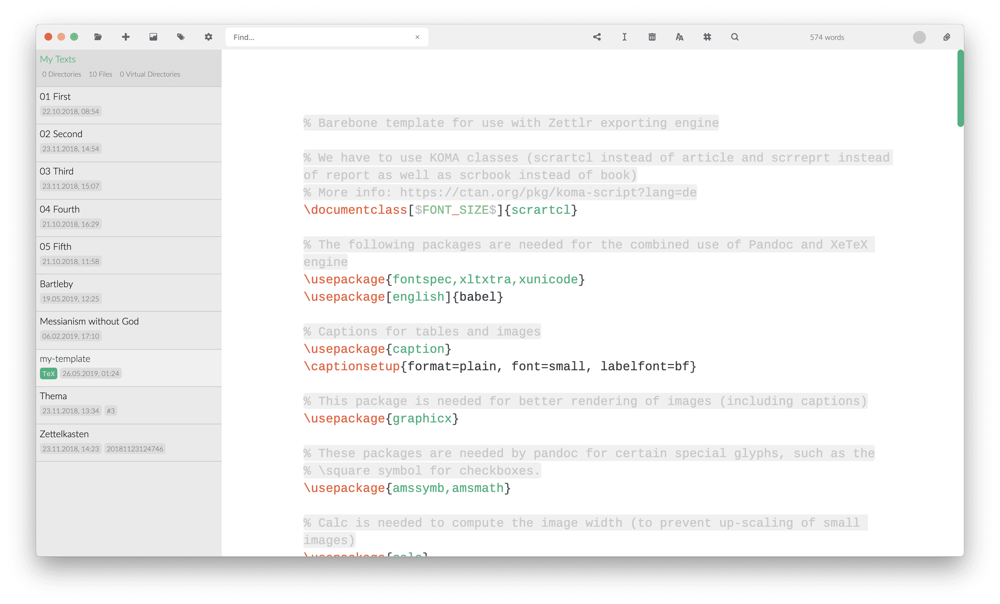

# Benutzerdefinierte Vorlagen

Während [Custom CSS](../core/custom-css.md) eine großartige Möglichkeit ist, Zettlr durch das Aussehen Ihr eigenes zu geben, macht es Ihre Beiträge nicht wirklich zu den Ihren. Wenn du mit dem Schreiben fertig bist, ist die Ästhetik genauso wichtig wie der Inhalt. Ihre Ideen sind für sich genommen schon viel wert, aber ohne ein gutes Design und eine Typografie, die zum Lesen einlädt, werden Ihre Ideen darunter leiden.

Sie brauchen eine eigene Schriftart, einen guten Zeilenabstand und vielleicht sogar ein paar Farben. In den [PDF-Voreinstellungen](../reference/settings.md) können Sie zwar einige allgemeine Einstellungen sowohl projektbezogen als auch für den Export einzelner Dateien anpassen, aber Sie können nicht wirklich alle Funktionen nutzen, die Ihnen der LaTeX-Satz bietet. Und, oh Mann, [es gibt so viele gute Beispiele](https://tex.stackexchange.com/questions/1319/showcase-of-beautiful-typography-done-in-tex-friends).

Glücklicherweise ist es eines der Grundprinzipien der Zettlr-Philosophie, Ihnen nicht nur die größtmögliche Freiheit zu geben, Werkzeuge wie Pandoc und LaTeX zu Ihrem Vorteil zu nutzen, sondern auch dafür zu sorgen, dass es _gut_ für Sie funktioniert. Diese Seite soll Ihnen einen Einstieg in die Verwendung von benutzerdefinierten LaTeX-Vorlagen für Ihre Arbeit geben, so dass sowohl Ihr Text als auch das Endprodukt vorzeigbar sind!

## Vorüberlegungen

Bevor Sie mit dem Schreiben Ihrer eigenen, benutzerdefinierten LaTeX-Vorlagen beginnen, sollten wir ein paar Worte darüber verlieren, was beim Export passieren wird. Die Zettlr-Export-Engine ist ein mächtiges Stück Software, das eine Vielzahl von Aufgaben ausführt, bevor es Ihre Dokumente für die letzten Schritte an Pandoc übergibt. Es ist wichtig zu wissen, was Zettlr mit Ihren Dokumenten macht, um eine konsistente Ausgabe zu gewährleisten und Probleme und Schluckauf zu vermeiden, insbesondere wenn Sie fortgeschrittene Vorlagen erstellen. In diesem Kapitel werden alle Schritte erläutert, die Zettlr an Ihren Projekten und Dateiexporten durchführt, bevor es sie an Pandoc weitergibt (das wiederum die Datei an LaTeX weitergibt).

### 1. Alle Eingabedateien verketten (gilt nur für Projekte)

Wenn Sie ein Projekt exportieren, führt Zettlr zunächst eine einfache Aufgabe aus: Es fügt alle Dateien so zusammen, wie sie Ihnen in der Dateiliste angezeigt werden, und schreibt sie in eine einzige temporäre Datei. Dazu liest es das Projektverzeichnis auf die gleiche Weise ein wie die Dateiliste (wodurch die Reihenfolge beibehalten wird) und liest die Dateien ein. Während dieses Schritts werden **zwei Operationen an der Markdown-Quelle** durchgeführt:

1. Alle Bildpfade werden in absolute Bilder umgewandelt. Dies geschieht aus Sicherheitsgründen, da LaTeX den Export nicht durchführen kann, wenn die Bildpfade nicht absolut sind (da der CWD von LaTeX nicht derjenige ist, in dem sich Ihre Markdown-Datei befindet). Auf diese Weise können Sie überall relative Pfade verwenden, ohne sich Gedanken darüber machen zu müssen, was LaTeX mit ihnen macht.
2. Machen Sie alle Fußnoten eindeutig. Jedes Ihrer Kapitel wird mit der Fußnotennummer 1 beginnen. Daher haben Sie in den meisten Fällen doppelte Fußnoten, die möglicherweise nicht exportiert werden, oder, noch schlimmer, eine der doppelten Fußnoten wird verwendet, während die anderen weggelassen werden. Zettlr macht Fußnoten eindeutig, indem der interne Hash der Datei vorangestellt wird. Aus einem `[^1]` erzeugt Zettlr also zum Beispiel `[^1934976181]`. Auf diese Weise wird jede Fußnote eindeutig sein.

Danach wird die resultierende Datei im temporären Verzeichnis gespeichert und der Exporter gestartet, was uns zu Schritt 2 führt.

### 2. Einlesen der Quelldatei

Die naheliegendste Aufgabe für Zettlr ist das Einlesen der Quelldatei. Das ist entweder die Datei, die Sie mit der Funktion "Teilen" schnell exportieren wollen, oder die generierte, verkettete Datei aus Ihrem Projekt (siehe Schritt 1). Während die Datei eingelesen wird, werden alle Bildpfade absolut gesetzt (dies geschieht nicht, wenn Sie ein Projekt exportieren, da die Bildpfade bereits absolut sind, wie in Schritt 1 beschrieben).

Als nächstes werden alle Tags ersetzt, sofern Sie die entsprechende Option in den Voreinstellungen aktiviert haben. In diesem Schritt werden auch Ihre Zettelkasten-Links behandelt, falls zutreffend. Dabei werden entweder die Formatierungszeichen für die Links entfernt (standardmäßig `[[` und `]]`) oder alles komplett entfernt. Wenn Sie diese Funktion ausgeschaltet haben, bleiben die Links unberührt. Wenn Sie die entsprechende Option angegeben haben, werden außerdem alle IDs entfernt.

> Dies ist der Grund, warum die Funktion "IDs entfernen" standardmäßig ausgeschaltet ist: Sie würde aufgrund der Natur der Standard-IDs, nur aus Zahlen zu bestehen, auch einige Arten von Weblinks unbrauchbar machen.

Nachdem die Datei vorbereitet wurde, wird sie an einem temporären Ort gespeichert.

### 3. Vorbereiten der Vorlage

Nachdem die Datei fertig ist, liest Zettlr die Vorlage ein und schreibt sie in eine temporäre Datei. In diesem Schritt wird eine Reihe von Variablen in der Vorlage ersetzt. Diese sind wie folgt:

- $$PAGE_NUMBERING$`: Die Seitennummerierung, die Sie in den PDF-Einstellungen gewählt haben, z. B. Arabische Zahlen.
- `$PAPIERART$`: Das Papier, das Sie ausgewählt haben, z. B. `a4paper`.
- `$TOP_MARGIN$`: Der obere Seitenrand, den Sie angegeben haben (z.B. 3cm).
- `$RIGHT_MARGIN$`: Der rechte Seitenrand, den Sie angegeben haben (z. B. 3 cm).
- `$BOTTOM_MARGIN$`: Der untere Seitenrand, den Sie angegeben haben (z. B. 3 cm).
- `$LEFT_MARGIN$`: Der linke Seitenrand, den Sie angegeben haben (z. B. 3 cm).
- `$MAIN_FONT$`: Die Hauptschriftart (für den meisten Text), die Sie angegeben haben (z.B. Times New Roman)
- `$SANS_FONT$`: Die sekundäre Schriftart (hauptsächlich für Überschriften), die Sie angegeben haben (z. B. Arial)
- `$LINE_SPACING$`: Der von Ihnen angegebene Zeilenabstand (z.B. 150 %).
- `$FONT_SIZE$`: Die von Ihnen angegebene Schriftgröße (z. B. 12pt).
- `$PDF_TITLE$`: Der PDF-Titel (entweder der Dateiname oder benutzerdefiniert, wenn ein Projekt exportiert wird).
- $$PDF_SUBJECT$`: Der Betreff der PDF-Datei.
- `$PDF_AUTHOR$`: Die PDF-Autoren-Meta-Informationen.
- `$PDF_KEYWORDS$`: Schlüsselwörter für die PDF-Datei.
- `$TITLEPAGE$`: Entweder ein leerer String oder `\\maketitle\n\\pagebreak\n`, wenn Sie ein Projekt mit aktivierter Titelseitenoption exportieren.
- `\$GENERATE_TOC$`: Entweder eine leere Zeichenfolge oder `\\\setcounter{tocdepth}{<number>}\n\tableofcontents\n\\pagebreak\n`, wenn Sie ein Projekt exportieren, bei dem die Option zur Erstellung eines Inhaltsverzeichnisses aktiviert ist. <Zahl>" wird durch die Ebene (1 bis 6) ersetzt.

Diese Variablen werden global ersetzt, d.h. wenn die Variable `\$PDF_AUTHOR$` mehrfach in der Vorlage vorkommt, wird sie jedes Mal ersetzt.

### 4. Vorbereiten des PDF-Exports

Mit den vorbereiteten Dateien füllt Zettlr nun die Befehlsvariablen vor, die an die Pandoc-Engine weitergegeben werden. In diesem Schritt wird die vorbereitete LaTeX-Vorlage zu den Befehlsvariablen hinzugefügt. Wenn keine benutzerdefinierte Vorlage vorhanden ist, verwendet Zettlr seine Standardvorlage, [die Sie hier finden] (https://github.com/Zettlr/Zettlr/blob/master/source/main/assets/export.tex). Die Standardvorlage von Zettlr ist eine Anpassung der Standardvorlage von Pandoc ([Sie finden sie hier](https://github.com/jgm/pandoc/blob/master/data/templates/default.latex)), wobei viele der zusätzlichen Bonbons für maximale Kompatibilität entfernt wurden.

> Viele der Befehle in der Standard-Pandoc-Vorlage erfordern zusätzliche LaTeX-Pakete. Die Zettlr PDF-Vorlage strebt nach maximaler Kompatibilität, nicht nach perfekten PDFs, um Benutzer, die nur die Grundlagen benötigen, nicht zu verwirren.

### 5. Führen Sie den Befehl aus!

Nun, da alle Voraussetzungen erfüllt sind, führt Zettlr den Pandoc-Befehl aus. Es übergibt ihm die temporäre Eingabedatei sowie die temporäre Vorlagendatei und lässt ihn seine Arbeit tun. Falls Sie sich für die Erstellung eines Inhaltsverzeichnisses entschieden haben, wird Pandoc angewiesen, ein solches zu erstellen. Das bedeutet, dass Pandoc intern die XeLaTeX-Binärdatei **zweimal** ausführt. Das liegt daran, dass der XeLaTeX-Befehl eine PDF-Datei erstellen muss, damit er weiß, wo die Überschriften mit allen Abständen tatsächlich landen, und dann muss er sie erneut erstellen, nur diesmal mit dem Inhaltsverzeichnis.

> Es ist äußerst wichtig, das ToC-Flag im Pandoc-Befehl beizubehalten (das Sie auf der Registerkarte "Erweitert" in den Voreinstellungen bearbeiten können), denn wenn Sie es entfernen, wird das Inhaltsverzeichnis nicht eingefügt, unabhängig von dem in den Projekteinstellungen gesetzten Schalter!

Nachdem der Befehl erfolgreich ausgeführt wurde, weist Zettlr Ihr Betriebssystem an, die Datei zu öffnen, so als ob Sie auf die endgültige Datei doppelklicken würden. Das bedeutet, dass die Datei mit Ihrem Standard-PDF-Reader geöffnet wird (oder mit einem Word-Editor, wenn Sie z. B. den Export nach Word gewählt haben). Wenn Pandoc mit einem Fehler beendet wurde, wird Ihnen dieser Fehler in einem erweiterten Fehlerdialog angezeigt, aus dem Sie den Fehler auch kopieren können, um ihn zu googeln.

**Achtung:** Wenn LaTeX eine Fehlermeldung zurückgibt, wird Ihnen die vollständige Konsolenausgabe angezeigt, die - meistens - sehr ausführlich und auch frustrierend leer ist. Wenn z.B. einfach ein LaTeX-Paket fehlt, wird eine lange Liste von Fehlermeldungen ausgegeben, in der Sie feststellen müssen, dass die Datei <Paketname>.sty fehlt". Als Faustregel gilt: Wenn Sie weder eine benutzerdefinierte Vorlage noch irgendein LaTeX-Paket in Ihrer Markdown-Datei verwenden, und trotzdem ein Fehler auftritt, deutet dies auf ein Problem mit der Standardvorlage hin. In diesem Fall melden Sie es bitte. In anderen Fällen konsultieren Sie bitte zuerst die LaTeX- oder Pandoc-Hilfeforen.

## Erste Schritte mit Vorlagen

Jetzt ist es an der Zeit, eine Vorlage zu erstellen! Sie können entweder einen externen Editor verwenden, um Ihre LaTeX-Vorlage zu schreiben, bevor Sie Zettlr darauf verweisen. Aber es wäre natürlich schön, wenn du deine LaTeX-Vorlagen einfach von Zettlr aus bearbeiten könntest, oder?


Oh Mann, wir haben gute Nachrichten. Wenn Sie eine neue Datei erstellen, aber **als Dateierweiterung `.tex`** angeben, wird Zettlr keine Markdown-Datei, sondern eine echte LaTeX-Datei erstellen! Diese Datei wird mit einem kleinen `TeX`-Indikator in der Dateiliste angezeigt (wenn die Dateimeta eingeschaltet ist) und kann von Zettlr aus bearbeitet werden. Hurra!



Zettlr erkennt automatisch, ob es sich um eine LaTeX-Datei handelt und schaltet sogar die Codehervorhebung von Markdown auf LaTeX um, um dir beim Schreiben der Datei zu helfen!

## Erforderliche Inhalte

Abgesehen von dem üblichen LaTeX-Zeug, gibt es ein paar Dinge, die in Ihren Dateien vorhanden sein müssen. Denken Sie daran, dass die Dateien zunächst durch einen Filter in Zettlr, dann durch Citeproc (falls zutreffend) und schließlich durch Pandoc geleitet werden, bevor sie an die LaTeX-Engine übergeben werden. Daher können Sie optional alle Zettlr-spezifischen Variablen ganz weglassen, aber eine Variable muss immer vorhanden sein:

```
$body$
```

Diese Variable wird in Pandoc durch den geparsten Inhalt Ihrer Markdown-Datei(en) ersetzt. Wenn Sie sie weglassen, wird Ihr Inhalt in Vergessenheit geraten. Vergessen Sie also nie, diese Variable dort zu platzieren, wo Ihr Inhalt landen soll!

> Das bedeutet auch, dass die Standardvorlage von Zettlr zwar viele Variablen der Standardvorlage von Pandoc auslässt, Sie aber alle Variablen selbst einfügen können! Sie können die gesamte Palette der Pandoc-Variablen und der Zettlr-Variablen nutzen --- oder sie einfach weglassen. An dieser Stelle werden die Vorlagen wirklich mächtig.

## Hacking Your Templates!

Kommen wir nun zu den lustigen Dingen. Im Laufe der Zeit hat Zettlr immer mehr Optionen eingebaut, um die Kontrolle über den Exportprozess zu verfeinern. Das bedeutet, dass Sie mit Zettlr tatsächlich einige lustige Dinge tun können. Sie können zum Beispiel all die netten Dinge, die das Exportprogramm mit Ihren Dateien macht, komplett umgehen (außer dem Parsen der Quelldatei(en)), indem Sie einfach den Pandoc-Befehl in Ihren Einstellungen auf einen festen Befehl ändern.

Sie können auch Pandoc-Variablen in Ihre Zettlr-Variablen einfügen (indem Sie z. B. den PDF-Autor in Ihren Einstellungen auf eine Pandoc-Variable setzen). Wenn Zettlr dann Ihre Datei durchsucht hat, ersetzt Pandoc seine eigene Variable, nachdem die Zettlr-Variable ersetzt worden ist.

Und wenn Sie _wirklich_ Lust haben, alles zu hacken, schauen Sie sich den Befehl Pandoc noch einmal an. Wenn Sie genau hinschauen, können Sie sehen, dass vor dem Befehl `pandoc` steht. Wissen Sie, was das bedeutet? Sie haben es vielleicht schon erraten: Der Pandoc-Befehl ist nicht nur etwas, das an Pandoc übergeben wird, sondern es ist der **vollständige Konsolenbefehl, der ausgeführt wird**! Was das bedeutet, sollte nun klar sein: Sie können einige benutzerdefinierte Skripte und Logik vor und nach dem eigentlichen Pandoc-Befehl ausführen!

Nehmen wir an, Sie wollen die temporäre Markdown-Datei an ein benutzerdefiniertes Skript übergeben, um noch mehr Aktionen auszuführen und die Datei anschließend an einen anderen Ort zu verschieben? Betrachten Sie die folgende Anpassung des Pandoc-Befehls in den Voreinstellungen:

```shell
pandoc "$infile$" -f markdown $outflag$ $tpl$ $toc$ $tocdepth$ $citeproc$ $standalone$ --pdf-engine=xelatex -o "$outfile$" && cp "$outfile$" /Users/zettlr/Desktop/Final.pdf
```

Dieser Befehl würde die endgültige Ausgabedatei auf den Desktop des fiktiven Benutzers "zettlr" kopieren und sie "Final.pdf" nennen (vorausgesetzt, Sie arbeiten unter macOS). Anstelle eines einfachen Shell-Befehls wie `cp` könnten Sie auch ganze Skripte übergeben, die anschließend ausgeführt werden. Der Himmel ist wirklich die Grenze!

## Abschließende Gedanken

Zettlr ist bestrebt, seinen Nutzern die volle Kontrolle darüber zu geben, was sie mit ihren Dateien machen können. Was wir auf dieser Seite skizziert haben, ist nur der Anfang. Wir haben nicht versucht, selbst verrückt zu werden, aber Sie können wirklich einiges tun. Wie nutzen Sie die Möglichkeiten von Zettlr, um verrückte Dinge zu tun? Sag es uns auf [Twitter](https://www.twitter.com/Zettlr), im [Forum](https://forum.zettlr.com/) oder auf [Reddit](https://www.reddit.com/r/Zettlr)!
