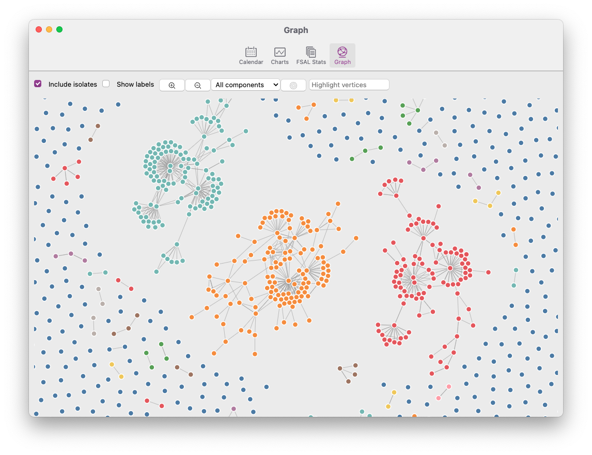

# Graph Ansicht

Wie andere Anwendungen bietet auch Zettlr eine grafische Ansicht, mit der Sie das Netzwerk, das Sie durch die Verknüpfung Ihrer Dateien erstellt haben, betrachten können. Dies kann Ihnen helfen, entstehende Cluster zu erkennen, Wege zu finden, getrennte Komponenten zu verbinden und einen Überblick über alle Ihre Dateien zu erhalten.

> Diagramme und Netzwerke sind völlig andere Gebilde. Sie können sehr leistungsfähig sein, aber auch wie ein Rorschach-Test wirken, bei dem man Muster erkennt, die nicht vorhanden sind. Für eine allgemeine Einführung empfehlen wir Ihnen wärmstens die Lektüre von [What is the point of a graph view?] (https://www.arthurperret.fr/blog/2022-02-13-what-is-the-point-of-a-graph-view.html) von Arthur Perret sowie - für eine vorsichtigere Betrachtung - den Artikel [Quo Vadis, PKM?] (https://www.hendrik-erz.de/post/quo-vadis-pkm) von Hendrik Erz.

## Was ist ein Graph?

Beginnen wir mit einem Crashkurs in Netzwerkwissenschaft. Eine Graphenansicht einer Datenbank für persönliches Wissensmanagement (PKM) ist nur lose mit empirischen Netzwerken wie z. B. sozialen Netzwerken verwandt, kann aber dennoch hilfreich sein.

Ein Graph ist mathematisch definiert als eine Menge von **Vertices** (oder Knoten), die durch eine Menge von **Kanten** (oder Links) verbunden sind. Kanten werden **arcs** genannt, wenn sie gerichtet sind. Scheitelpunkte können entweder mit einem einzigen anderen Scheitelpunkt (Dyade), mit zwei anderen Scheitelpunkten (Triade) oder mit mehr als diesen verbunden sein. Scheitelpunkte können auch isoliert, d. h. unverbunden sein. Eine Gruppe von miteinander verbundenen Knoten innerhalb eines Netzes wird als **Komponente** bezeichnet. Außerdem kann ein Graph entweder **gerichtet** sein (d. h. die Bögen zwischen zwei Knoten haben eine Richtung, d. h. der Bogen von A nach B ist nicht derselbe wie der Bogen von B nach A) oder **ungerichtet** (was bedeutet, dass die Kante von A nach B auch die Kante von B nach A impliziert). Ein Graph kann auch **gewichtet** sein, in diesem Fall werden die Kanten mit einer Zahl versehen. Schließlich kann ein Graph entweder einfach oder **multiplex** sein. Ein multiplexer Graph hat nicht nur eine Art von Kante, sondern mehrere.

Wenn dies alles sehr abstrakt klingt, lassen Sie uns die Definitionen mit Beispielen belegen:

* Jede **Datei**, die in Zettlr geladen wird, ist ein **Vertex**.
* Jeder **Link** zwischen zwei Dateien wird als **Bogen** (= gerichtete Kante) von Datei A zu Datei B dargestellt
* Ein **Rücklink** erzeugt dann auch den entgegengesetzten **Bogen** von B nach A
* Ein **Verknüpfungsgewicht** könnte die Anzahl der Verknüpfungen von Datei A zu Datei B sein (wenn Sie z.B. von mehreren Teilen Ihrer Datei aus verlinken)
* Ein **Multiplex**-Graph würde bedeuten, dass Dateien nicht nur durch Links verbunden sein können, sondern z. B. auch durch gemeinsame Schlüsselwörter oder andere Merkmale

Es gibt noch viel mehr über Netze zu wissen, aber damit wollen wir es erst einmal bewenden lassen. Wenn Sie interessiert sind, können Sie gerne online weiter lesen!

## Zettlrs Graph-Implementierung

Zettlr implementiert nun eine Teilmenge der verfügbaren Funktionen zur Erstellung eines Graphen. Genauer gesagt, wird es ab sofort ...

* ... einen Scheitelpunkt pro Datei, die in Zettlr geladen wird, erzeugen
* ... eine Kante pro Link von einer Datei zur anderen erstellen
* ... alle Verknüpfungen als *ungerichtet* und *ungewichtet* behandeln

Unter der Haube verwendet Zettlr die Bibliothek D3, um das eigentliche Rendering des Graphen zu erleichtern. Wir verwenden ein zwangsgerichtetes Layout (allerdings nicht Fruchterman-Reingold, für diejenigen, die etwas Erfahrung mit Netzwerkvisualisierungen haben), das versucht, die verschiedenen Knoten so zu platzieren, dass sie sich nicht überlappen und dass man Cluster sehen kann.

> Die tatsächliche Platzierung der Knotenpunkte sowie der Abstand zu anderen Knotenpunkten **hat keine inhärente Bedeutung**! Dies ist sehr wichtig zu wissen: Nur die Kanten zwischen den verschiedenen Scheitelpunkten haben eine Bedeutung, nicht ihre Positionen oder Abstände!

## Öffnen der Diagrammansicht

Die Diagrammansicht ist derzeit nicht über eine prominent platzierte Schaltfläche verfügbar. Sie können auf die Diagrammansicht zugreifen, indem Sie das Statistik-Informationsfenster in der Symbolleiste öffnen und mit der Schaltfläche "Weitere Statistiken..." zu einem separaten Fenster navigieren, das im folgenden Screenshot zu sehen ist.ot übereinstimmen, werden abgeblendet, und diejenigen, die übereinstimmen, werden hervorgehoben. Außerdem verschiebt das Diagramm das Ansichtsfenster automatisch zu den zentralen Koordinaten der übereinstimmenden Elemente.

## Interaktion mit der Diagrammansicht

Die Interaktion mit dem Netz ist auf verschiedene Weise möglich. Wenn Sie den Mauszeiger über einen Knoten im Netzwerk bewegen, wird ein Tooltip angezeigt, der Ihnen den Dateinamen und die zugehörige Komponente anzeigt. Klicken Sie auf einen Knoten, um ihn in Ihrem Haupteditor zu öffnen. Auf diese Weise können Sie die Diagrammansicht neben dem Hauptfenster geöffnet lassen und auf diese Weise in Ihren Dateien navigieren.

Außerdem stehen Ihnen einige Steuerelemente zur Verfügung, mit denen Sie die Anzeige des Diagramms anpassen können.

Das erste Kontrollkästchen bestimmt, ob **Isolate** angezeigt werden. Vor allem, wenn Sie sich für bestimmte Cluster von Knoten (Komponenten) interessieren, kann es sinnvoll sein, diese Isolate auszuschließen, da die Visualisierung dadurch viel übersichtlicher wird.

Mit dem zweiten Kontrollkästchen können Sie die Beschriftungen neben den Knotenpunkten permanent anzeigen lassen. Besonders in dichten Netzen kann dies jedoch chaotisch sein, daher ist es standardmäßig deaktiviert.

Mit den beiden Zoom-Schaltflächen können Sie den Graphen vergrößern und verkleinern, um Ihr Netzwerk aus der Vogelperspektive zu betrachten oder um sich auf einen bestimmten Teil des Netzwerks zu konzentrieren.

Wenn Sie immer mehr Dateien hin- und herverknüpfen, kann es sinnvoll sein, nur eine bestimmte Komponente zu betrachten, die sich gebildet hat. Das Dropdown-Menü neben den Zoom-Schaltflächen ermöglicht es Ihnen, nach bestimmten Komponenten zu filtern. Die Nummer der Komponente selbst ist nicht aussagekräftig (der zugrunde liegende Algorithmus zur Erkennung von Gemeinschaften listet die Komponenten einfach in der Reihenfolge ihrer Erkennung auf), aber die Liste ist nach der **Größe** der Komponente sortiert. Die größten Komponenten stehen ganz oben in der Auswahlliste, während die kleinsten Komponenten (d. h. die Dyaden) ganz am Ende stehen.

Nach der Auswahlliste finden Sie eine Schaltfläche "Ziel". Mit dieser Schaltfläche wird die Ansicht des Diagramms auf den Ursprung zurückgesetzt.

Das letzte Element ist ein Textfeld, mit dem Sie den Scheitelpunkt filtern können. Der Text, den Sie hier eingeben, wird mit den absoluten Pfaden der einzelnen Dateien abgeglichen, wobei diejenigen, die nicht übereinstimmen, abgeblendet und diejenigen, die übereinstimmen, hervorgehoben werden. Außerdem verschiebt das Diagramm das Ansichtsfenster automatisch zu den mittleren Koordinaten der übereinstimmenden Elemente.
