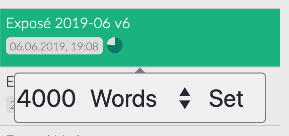

# Die Dateiliste

Als nächstes kommt die Dateiliste. Die Dateiliste ist etwas ganz Besonderes, denn sie verfügt über leistungsstarke Funktionen, die Ihnen die Arbeit mit vielen Dateien und Verzeichnissen erleichtern. Werfen wir also einen Blick darauf!

## Allgemein

Im erweiterten Seitenleistenmodus sind sowohl die Baumansicht als auch die Dateiliste sichtbar. Im Modus "Dünne Seitenleiste" können Sie die Liste jederzeit mit der Tastenkombination "Befehl/Strg+!`" ein- und ausblenden.

> **Hinweis**: Bitte konsultieren Sie das [Einstellungshandbuch](../reference/settings.md) für weitere Informationen zu den Seitenleistenmodi.

Die Dateiliste zeigt Ihnen alle Verzeichnisse und Dateien innerhalb des Verzeichnisses, das gerade in der Baumansicht ausgewählt ist, aber nicht wie ein normaler Dateibrowser: **Die Dateiliste behandelt alle Unterverzeichnisse als gleichwertig und zeigt sie alle nacheinander an!** Daher müssen Sie nicht weiter in den Verzeichnisbaum vordringen, um vergrabene Verzeichnisse zu erreichen.

Wenn Sie die Metainformationen ausgeschaltet haben, werden sowohl Verzeichnisse als auch Dateien als Einzeiler angezeigt. Wenn Sie die Dateiinformationen anzeigen lassen, erhalten Sie zusätzliche Informationen: Verzeichnisse zeigen Ihnen die Anzahl ihrer Kinder an. Bei den Dateien hingegen wird das Datum der letzten Änderung angezeigt. Wenn sie eine ID oder Tags enthalten, werden diese Informationen nach dem Änderungsdatum angezeigt. Wenn Sie den Mauszeiger über den Tag-Zähler bewegen, sehen Sie einen kleinen Tooltip, der Ihnen alle Tags in der Datei anzeigt.

> Sie können die Dateiinformationen über das Menü "Ansicht" oder durch Drücken von "Befehl/Strg+Alt+S" umschalten.

### Meta-Informationen zu Dateien

Die zusätzlichen Informationen, die Ihre Dateien in der Dateiliste anzeigen, können aus mehreren Gründen nützlich sein. Erstens können Sie damit überprüfen, ob die ID der Datei richtig aussieht oder nicht. Manchmal erkennt Zettlr eine falsche ID, und dies ist die erste Möglichkeit zu überprüfen, ob Zettlr tatsächlich Ihre ID verwendet oder nur einen Teil einer URL mit vielen Zahlen übernommen hat. Außerdem können Sie den Mauszeiger über die Anzahl der Tags bewegen, um sie in einem Tooltip anzuzeigen.

### Ziele schreiben

Seit Version `1.2` unterstützt Zettlr das Schreiben von Zielen. Um ein Ziel zu setzen, klicken Sie mit der rechten Maustaste auf eine Datei und wählen Sie "Schreibziel setzen ...". Geben Sie die Anzahl der Wörter oder Zeichen ein und klicken Sie auf "Setzen". Zettlr zählt dann auf Ihr Ziel hin und zeigt Ihnen den Fortschritt mit einem kleinen Indikator an, wenn Sie Snippets aktiviert haben. Bewegen Sie den Mauszeiger darüber, um die absolute Anzahl der Wörter oder Zeichen zu sehen, die Sie geschrieben haben.

> Um das Schreibziel aus einer Datei zu entfernen, setzen Sie den Schreibzielzähler einfach auf Null.

### Sortieren

Wenn Sie Verzeichnisse sortieren möchten, können Sie dies direkt aus der Dateiliste heraus tun. Bewegen Sie einfach die Maus über ein beliebiges Verzeichnis, und es erscheinen zwei Indikatoren, die Ihnen den aktuellen Status der Sortierung anzeigen. Klicken Sie auf das erste Symbol (mit einem Pfeil von A bis Z), um die Sortierung nach Namen umzuschalten. Die zweite schaltet die Sortierung nach dem Zeitpunkt der letzten Änderung um. Unterverzeichnisse werden auf diese Weise nicht sortiert - nur Dateien.

Sie können sich auch durch den Verzeichnisbaum bewegen, indem Sie auf die Verzeichnisse klicken. Ein einfacher Klick wählt das Verzeichnis aus, während ein `ALT`-Klick das übergeordnete Verzeichnis auswählt. Dies ist nützlich, wenn Sie häufig zwischen Verzeichnissen wechseln müssen, aber den dünnen Modus der Seitenleiste bevorzugen und nicht immer wieder zur Baumansicht wechseln wollen.

## Strukturelle Auswirkungen

Jedes Mal, wenn Sie ein Verzeichnis in der Baumansicht auswählen, zeigt die Dateiliste _alle_ Dateien und Verzeichnisse in diesem Verzeichnis an. Einfach ausgedrückt, werden alle Unterverzeichnisse und Dateien aus der baumartigen Struktur, die durch die Verzeichnisliste nachgebildet wird, in eine eindimensionale Liste gepackt. Die Liste wird ihren Inhalt immer dann ändern, wenn Sie ein anderes Verzeichnis in der Baumansicht auswählen.

> Die Liste zeigt nur _alle_ Verzeichnisse und Dateien _innerhalb_ des aktuell ausgewählten Verzeichnisses an. Daher funktioniert sie ein wenig wie eine sehr schnelle Suchfunktion. Sie sehen nur die Dateien in einem bestimmten Verzeichnis, und wenn Sie sich Ebene für Ebene nach unten bewegen, sind immer weniger Dateien sichtbar, bis nur noch ein Verzeichnis und seine Dateien zu sehen sind. Bei einer guten Struktur innerhalb Ihres Stammverzeichnisses ist dies eine leistungsfähige Methode, um nur die Dateien in der Liste zu haben, die Sie tatsächlich benötigen.

Da die Dateiliste Ihren komplexen Verzeichnisbaum abflacht, muss sie einige Annahmen darüber machen, wie die Dateien angemessen _angezeigt_ werden können. Daher helfen Ihnen die folgenden Regeln dabei, zu unterscheiden, wo sich die Dateien tatsächlich auf Ihrer Festplatte befinden:

1. Das aktuell ausgewählte Verzeichnis steht ganz oben in der Dateiliste. Immer.
2. Alle Dateien, die sich in diesem Verzeichnis befinden, werden direkt unter diesem Verzeichnisnamen angezeigt.
3. Alle Unterverzeichnisse, die sich _innerhalb_ dieses Verzeichnisses befinden, stehen immer am Ende der Dateiliste, d.h. _nach_ den Dateien im ausgewählten Verzeichnis.
4. Wenn Verzeichnisse leer sind, werden sie direkt hintereinander platziert, ohne Dateien dazwischen.

Es ist also wichtig, sich daran zu erinnern: Alle Verzeichnisse werden so angezeigt, als befänden sie sich auf der gleichen Ebene, als wären sie nicht verschachtelt. Um zu erkennen, welche Verzeichnisse was enthalten, schauen Sie bitte in der Baumansicht nach.

> Wenn Sie die "natürliche" Sortierung von Zettlr nicht mögen (so dass 10 nach 2 kommt), können Sie in den Einstellungen auf "ASCII"-Sortierung umschalten (so dass 2 nach 10 kommt).

## Aktionen in der Dateiliste

Es gibt viele Aktionen, die sich auf die Liste beziehen. Wählen Sie zunächst einfach eine Kachel aus, um eine beliebige Datei zu öffnen und ihren Inhalt im Editor anzuzeigen. Klicken Sie auf ein Verzeichnis, um es auszuwählen.

Sie können Ihre Dateien an andere Orte verschieben. Ziehen Sie sie einfach von der Dateiliste auf ein Verzeichnis im Verzeichnisbaum. Das Verzeichnis, über das Sie den Mauszeiger bewegen, erhält ein leichtes Schimmern, um anzuzeigen, wohin die Datei verschoben werden soll. Legen Sie die Datei einfach dort ab, um sie zu verschieben, oder legen Sie die Datei an einer anderen Stelle ab, um den Verschiebevorgang abzubrechen und die Datei an ihre ursprüngliche Position zurückzubringen.

Wenn Sie eine Datei außerhalb der App ziehen, können Sie die Datei mit anderen Programmen teilen. Um das Herausziehen abzubrechen, lassen Sie die Maus einfach wieder über Ihrer Anwendung los.

> Um eine Datei in andere Anwendungen zu ziehen, halten Sie die Strg- oder die Alt-Taste gedrückt, bevor Sie die Datei ziehen. Damit teilen Sie Zettlr mit, dass Sie die Datei nicht innerhalb von Zettlr, sondern außerhalb der Anwendung verschieben möchten.

## Heatmap durchsuchen

Eine weitere nützliche Funktion der Dateiliste ist, dass sie Ihnen hilft, die wichtigsten Suchergebnisse zu erkennen. Sobald Sie eine Suche ausgeführt haben, ändert die Liste ihre Farbe wie ein Chamäleon. Sie malt alle Dateien in 50 verschiedenen Grüntönen an (ja, das war jetzt ein Witz). Je grüner eine Datei ist, desto relevanter ist die Datei für Ihre aktuelle Suche.

Dies ist eine Funktion, die man als "Heatmap" für die Volltextsuche bezeichnen könnte.

Bitte denken Sie daran, dass die Liste sehr anpassungsfähig ist und sich im Laufe der Nutzung der App stark verändern wird. So werden beispielsweise nicht nur alle Dateien und Verzeichnisse im aktuell ausgewählten Verzeichnis angezeigt, sondern auch Dateien ohne Ergebnisse aus der Vorschauliste ausgeblendet, wenn sich die Liste im Suchmodus befindet.
