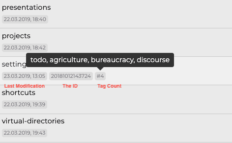
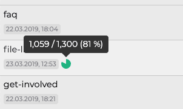

# Der Dateimanager

Der Dateimanager ist im Grunde ein eingebauter Explorer (oder Finder, wenn Sie einen Mac benutzen), der auf die Bedürfnisse von Zettlr abgestimmt ist. Er ist eine der Kernkomponenten der Anwendung.

## Allgemein

In den Einstellungen können Sie den Dateimanager-Modus auswählen:

* **Erweitert**: Im erweiterten Modus werden sowohl der Dateibaum als auch die Dateiliste angezeigt. Der Dateibaum zeigt keine einzelnen Dateien an (außer eigenständige Dateien).
* **Kombiniert**: Im kombinierten Modus sehen Sie nur den Dateibaum, der dann auch Dateien enthält.
* **Dünn**: Im dünnen Modus haben Sie sowohl Zugriff auf den Dateibaum als auch auf die Dateiliste, aber es wird immer nur eine angezeigt.

Im Thin-Modus gibt es mehrere Möglichkeiten, zwischen dem Dateibaum und der Dateiliste zu wechseln. Wenn Sie gerade den Dateibaum sehen, aber die Dateiliste sehen möchten, klicken Sie einfach auf ein beliebiges Verzeichnis. Zettlr wechselt dann zur Dateiliste und zeigt Ihnen alle Dateien in diesem Verzeichnis an. Wenn Sie gerade die Dateiliste sehen, fahren Sie einfach mit der Maus über den oberen Bereich der Dateiliste. Es erscheint ein Pfeil, auf den Sie klicken können, um zurück zum Dateibaum zu gelangen.

Wenn Sie ein Trackpad oder eine Maus haben, die den horizontalen Bildlauf unterstützt, können Sie auch den horizontalen Bildlauf nutzen, um hin- und herzuwechseln, was in vielen Fällen viel schneller geht als irgendwo zu klicken.

> **Hinweis**: Bitte konsultieren Sie das [Einstellungshandbuch](../reference/settings.md) für weitere Informationen über die Dateimanager-Modi.

## Die Dateiliste

Die Dateiliste zeigt Ihnen alle Verzeichnisse und Dateien innerhalb des Verzeichnisses, das gerade in der Baumansicht ausgewählt ist, aber nicht wie ein normaler Dateibrowser: **Die Dateiliste behandelt alle Unterverzeichnisse als gleichwertig und zeigt sie alle nacheinander an!** Daher müssen Sie nicht weiter in den Verzeichnisbaum vordringen, um vergrabene Verzeichnisse zu erreichen.

Wenn Sie die Metainformationen ausgeschaltet haben, werden sowohl Verzeichnisse als auch Dateien als Einzeiler angezeigt. Wenn Sie die *Dateiinformationen* anzeigen, erhalten Sie zusätzliche Informationen: Verzeichnisse zeigen Ihnen die Anzahl der darin enthaltenen Dateien und Ordner. Bei den Dateien hingegen werden das Datum der letzten Änderung, eventuelle Tags, eine ID und mehr angezeigt.

> Sie können die Dateiinformationen über das Menü "Ansicht", mit der Tastenkombination "Befehl/Strg+Alt+S" oder über die entsprechende Einstellung im Einstellungsdialog auf der Registerkarte "Allgemein" ein- und ausblenden.

Zusätzlich können Sie sich innerhalb der Dateiliste durch den Verzeichnisbaum bewegen, indem Sie auf die Verzeichnisse klicken. Ein einfacher Klick wählt das Verzeichnis aus und bewegt sich weiter nach unten im Baum, während `Alt+Klick` das übergeordnete Verzeichnis auswählt. Dies ist nützlich, wenn Sie häufig zwischen Verzeichnissen wechseln müssen, aber den dünnen Modus der Seitenleiste bevorzugen und nicht immer wieder zur Baumansicht wechseln wollen.

> Im Dateimanager können Sie die meisten Aktionen ausführen, die Sie auch in Ihrem Explorer/Finder/Dateibrowser ausführen können, wie Sie es erwarten würden, z. B. Öffnen, Duplizieren, Erstellen und Entfernen von Dateien, Verschieben von Dateien und vieles mehr.

### Datei- und Ordnereigenschaften

Jede Datei und jeder Ordner hat auch Eigenschaften. Sie können diese anzeigen, indem Sie mit der rechten Maustaste auf eine Datei oder einen Ordner klicken und den entsprechenden Menüpunkt wählen.

Ein Eigenschaften-Dialog für ein Verzeichnis](../img/directory_properties.png)

Jeder Ordner kann in ein [Projekt](../academic/projects.md) umgewandelt werden, indem Sie auf den Schalter in seinem Eigenschaften-Popover klicken. Anschließend können Sie die Projekteinstellungen feinabstimmen. Außerdem können Sie ein Verzeichnissymbol auswählen, das die visuelle Identifizierung des Verzeichnisses erleichtert. Schließlich können Sie Verzeichnisse in ihren Eigenschafts-Popovers sortieren. Dateien hingegen zeigen Ihnen ihre Tags, ID und andere nützliche Informationen an. In den Eigenschaften einer Datei können Sie auch Schreibziele festlegen.

> Um das Schreibziel aus einer Datei zu entfernen, setzen Sie einfach den Schreibzähler auf Null.

Die Popover zu den Datei- und Ordnereigenschaften zeigen Ihnen einige allgemeine Informationen an, wie z. B. den Zeitpunkt der letzten Änderung, den Zeitpunkt der Erstellung und die Größe.

## Strukturelle Auswirkungen auf die Dateiliste

Jedes Mal, wenn Sie ein Verzeichnis auswählen, zeigt die Dateiliste _alle_ Dateien und Ordner in diesem Verzeichnis an. Einfach ausgedrückt, werden alle Ihre verschiedenen Unterverzeichnisse und Dateien aus der baumartigen Struktur, die durch den Dateibaum nachgebildet wird, in eine eindimensionale Liste abgeflacht. Die Liste ändert ihren Inhalt immer dann, wenn Sie in der Baumansicht ein anderes Verzeichnis auswählen.

> Die Liste zeigt nur alle Verzeichnisse und Dateien _innerhalb_ des aktuell ausgewählten Verzeichnisses an. Daher funktioniert sie ein wenig wie eine sehr schnelle Suchfunktion. Sie sehen nur die Dateien in einem bestimmten Verzeichnis, und wenn Sie sich Ebene für Ebene nach unten bewegen, sind immer weniger Dateien sichtbar, bis nur noch ein Verzeichnis und seine Dateien zu sehen sind. Bei einer guten Struktur innerhalb Ihres Stammverzeichnisses ist dies eine leistungsfähige Methode, um nur die Dateien in der Liste zu haben, die Sie tatsächlich benötigen.

Da die Dateiliste Ihren komplexen Verzeichnisbaum abflacht, muss sie einige Annahmen darüber machen, wie die Dateien angemessen _angezeigt_ werden können. Daher helfen Ihnen die folgenden Regeln dabei, zu unterscheiden, wo sich die Dateien tatsächlich auf Ihrer Festplatte befinden:

1. Das aktuell ausgewählte Verzeichnis steht ganz oben in der Dateiliste. Immer.
2. Alle Dateien, die sich in diesem Verzeichnis befinden, werden direkt unter diesem Verzeichnisnamen angezeigt.
3. Alle Unterverzeichnisse, die sich _innerhalb_ dieses Verzeichnisses befinden, stehen immer am Ende der Dateiliste, d.h. _nach_ den Dateien im ausgewählten Verzeichnis.
4. Wenn Verzeichnisse leer sind, werden sie direkt hintereinander platziert, ohne Dateien dazwischen.

Es ist also wichtig, sich daran zu erinnern: Alle Verzeichnisse werden so angezeigt, als befänden sie sich auf der gleichen Ebene, als wären sie nicht verschachtelt. Um zu erkennen, welche Verzeichnisse welche Dateien enthalten, schauen Sie bitte in die Baumansicht.

> Wenn Ihnen die "natürliche" Sortierung von Zettlr nicht gefällt (so dass 10 nach 2 kommt), können Sie in der Registerkarte Allgemein des Einstellungsdialogs auf "ASCII"-Sortierung umschalten (so dass 2 nach 10 kommt).

