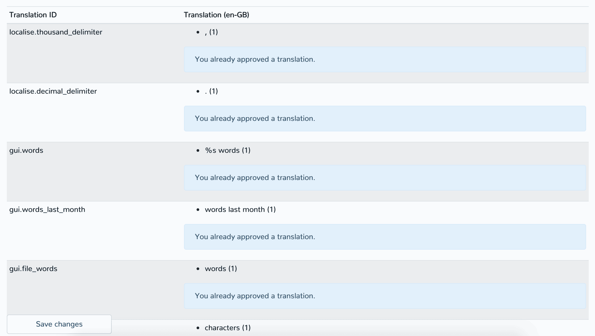

# Mitmachen

Du möchtest Zettlr zu einer noch besseren App machen? Das ist toll! Egal, ob du ein Nutzer bist, bei den Übersetzungen mithelfen willst oder gar entwickelst — du bist hier an der richtigen Stelle!

## Allgemeines

Zettlr hat eine große und aktive Community, die sich gegenseitig von überall auf der Welt hilft. Hier haben wir einmal die üblichen Orte aufgelistet, wo du Hilfe bekommen oder geben kannst:

* [Das Forum](https://forum.zettlr.com) — Hier kannst du allgemeine Fragen stellen, Arbeitsabläufe diskutieren und sogar deine benutzerdefinierten Designs teilen!
* [Zettlr Subreddit](https://www.reddit.com/r/Zettlr) — Das Zettlr Subreddit ist der perfekte Ort für die Redditnutzer in der Community.
* [Der offizielle Twitteraccount](https://www.twitter.com/Zettlr) — Da wir Wissenschaftler sind, geben wir die meisten Infos über unseren offiziellen Twitteraccount heraus. Hier kannst du fast minuziös miterleben, was gerade passiert. Außerdem antworten wir gerne auf alle deine Fragen.
* [Die offizielle Facebookseite](https://fb.me/Zettlrapp) — Natürlich haben wir auch eine Facebookseite. Wir sind da nicht allzu aktiv, aber wenn du eine Frage hast, beantworten wir sie dir natürlich auch hier!
* [Unser YouTube-Kanal](https://www.youtube.com/c/Zettlr) — Wenn du eher der visuelle Typ bist, findest du hier ein paar Einführungsvideos.
* [Der GitHub Issuetracker](https://github.com/Zettlr/Zettlr/issues) — Das ist der Kern unserer Versuche, die App besser zu machen. Bugs, Features, Verbesserungen und anderes kann hier platziert werden. Nichtsdestotrotz solltest du natürlich neue Features **immer zuerst auf Reddit oder dem Forum diskutieren**.

## Hilf uns aus Nutzersicht

Es ist für viele Dinge sogar besser, wenn du nicht programmieren kannst und daher einen reinen Nutzerblick auf die App hast. Denn so fallen dir Probleme viel schneller auf als all jenen, die Programmieren können und daher wissen, wie man mit fehlerhafter Software umgehen muss. Wir können nur für uns sprechen und es hilft daher, Infos von Menschen zu bekommen, die anders als wir arbeiten. Zwar müssen wir bei Vorschlägen zu Arbeitsabläufen immer Kompromisse machen, damit wir nicht andere benachteiligen, versuchen aber, jeden Arbeitsablauf möglich zu machen!

Fehler berichtest du am besten direkt mit einem neuen Ticket auf GitHub. Dadurch ist es uns möglich, den Fehler schnell zu berichtigen.

## Übersetzen

Ein inklusives Programm zu schreiben heißt auch, es für alle einfach zu machen, die App auch zu verstehen. Daher brauchen wir immer motivierte Helfer, die die App in alle Sprachen der Welt übersetzen. Wir haben dafür mit Zettlr Translate auch ein eigenes Portal entwickelt, mit dem das Übersetzen super einfach ist. Dafür brauchst du allerdings einen Account (der allerdings nur dazu dient, Spam zu vermeiden). Allerdings kannst du dadurch natürlich auch deinen Namen in den "Über Zettlr"-Dialog zu bekommen, denn dort werden alle Übersetzer\*innen genannt, so sie es denn wünschen.

Übersetzen ist sehr einfach. Auf Zettlr Translate kannst du einfach eine der Sprachen anwählen und siehst dann eine Liste mit allen Identifikationsnummern der einzelnen Zeichenketten:



Auf der linken Seite siehst du alle Übersetzungs-IDs sowie die englische Übersetzung als Hilfestellung. Meistens sind das schon alle Infos, die du brauchst. Wenn du dir nicht sicher bist, wo ein bestimmter String vorkommt, kannst du einfach die App anschauen. Meistens findest du die Infos dann sehr schnell.

Weiterhin haben wir in den Servive ein nutzerbasiertes Qualitätsmanagement-System eingebaut. Das besteht in einem einfachen Abstimmungs-Algorithmus. Wenn du denkst, dass eine Übersetzung richtig ist, kannst du sie "approven". Wenn keine richtig aussieht, kannst du auch eine neue Übersetzung vorschlagen. Die Übersetzung mit den meisten Stimmen schafft es dann in die App!

[Weitere Informationen darüber, wie das alles funktioniert, findest du auf unserer Einführung (Englisch).](https://translate.zettlr.com/welcome)

## Entwickeln

Um mit dem Entwickeln zu beginnen, forke das Repository, arbeite an neuen Features und Bugfixes und öffne dann ein Pull-Request auf die Develop-branch des Repositories. Die Master-Branch wird nur aktualisiert, wenn wir kurz vor einem neuen Release stehen.

Wenn du beginnst, irgendetwas zu entwickeln, sage bitte den anderen Entwicklern bescheid mit einem Issue oder ähnlichem, sodass nicht zwei Leute das gleiche angehen und wir effizienter arbeiten können!

### Mit dem Entwickeln beginnen

Um mit dem Entwickeln los zu legen, starte deinen Lieblings-Editor und fahre dein Terminal hoch. Zettlr basiert auf einem [NodeJS](https://nodejs.org/)-stack, das heißt, du brauchst Node auf deinem System installiert. Zettlr nutzt meistens nicht NPM, sondern Yarn, daher solltest du [Yarn](https://yarnpkg.com/) idealerweise auch installieren.

Anschließend musst du die ganzen Ressourcen für die App erst einmal generieren, da diese nicht im Repository liegen. Zunächst installiere alle Module, die Zettlr braucht:

**Mit Yarn**

```bash
$ git clone https://github.com/Zettlr/Zettlr.git
$ cd Zettlr
$ yarn install
$ cd source
$ yarn install
```

**Mit NPM**

```bash
$ git clone https://github.com/Zettlr/Zettlr.git
$ cd Zettlr
$ npm install
$ cd source
$ npm install
```

Der zweite `install`-Befehl im `source`-Verzeichnis ist notwendig, da wir von [electron-builder](https://www.electron.build/)'s zweifachen Verzeichnisstruktur Gebrauch machen.

### Konsolenbefehle

Zettlr bringt von Haus aus einen Haufen nützlicher Befehle zum Entwickeln mit. Nachfolgend eine Liste aller Befehle. Die Befehle kannst du allesamt entweder mit `npm run <command>` oder `yarn <command>` starten. **Achte darauf, immer im Hauptverzeichnis zu sein!**

* `start`: Starte die Anwendung.
* `build:quick`: Erstellt die Anwendung für das aktuelle Betriebssystem und schreibt die Datei nach `/release`.
* `release:this`: Das gleiche wie `build:quick`, aber die App wird ebenfalls in einen Installer gepackt (als `.dmg`-Datei auf macOS, ein `.exe`-Installer auf Windows, oder ein Linux-Paket).
* `release:mac`: Baut einen Installer explizit für macOS.
* `release:win`: Baut einen Installer explizit für Windows.
* `release:linux`: Baut einen Installer explizit für Linux.
* `less`: Konvertiert die Quelldateien für die Stylesheets in `/resources/less` in das finale CSS unter `source/common/assets/css`. Nach allen Änderungen der Designs solltest du diesen Befehl ausführen.
* `less:extract`: Liest alle IDs und Klassen aus den Rohdateien aus und schreibt sie in die Datei `/resources/css_list.md`. Damit erstellen wir eigentlich nur unsere [Custom CSS Referenzliste](core/custom-css.md#complete-css-class-and-id-reference).
* `handlebars`: Hiermit kompilierst du die Templates für Dialoge und Popups und schreibt sie nach`/source/common/assets/tpl`. Führe diesen Befehl immer aus, wenn du irgendetwas an den Templates geändert hast.
* `lang:refresh`: Lädt die aktuellsten Versionen der vier Standardsprachen (Britisches Englisch, Amerikanisches Englisch, Deutsch und Französisch) herunter und schreibt sie in die entsprechenden Verzeichnisse. Muss mittlerweile eigentlich nur noch vor einem Release ausgeführt werden.
* `reveal:build`: Baut die nötigen Templates und Dateien für die revealJS-Präsentationen neu.

Neben diesen Konsolenbefehlen gibt es einen "Hauptbefehl", den wir nutzen, um einen vollen Release-Cycle laufen zu lassen. Es handelt sich um `/scripts/make.sh` und ist ein Shell-Script, das die meisten der oben genannten Befehle ausführt, bevor es die App für sämtliche Betriebssysteme erstellt und eine `SHASUMS.txt`-Datei erstellt.

> Vorsicht: Aktuell verlangt das Script Yarn sowie macOS. Es funktioniert daher nicht mit NPM oder irgendeiner anderen Plattform. Das liegt am Programm, mit welchem die SHA256-Checksums erstellt werden. Das heißt nämlich auf macOS anders als auf Linux.

### Projektstruktur

Nach diesen Einführungen jetzt zum eigentlich technischen Krams: Die Projektstruktur! Die Verzeichnisstruktur der App orientiert sich an vielen Best Practices. Nichtsdestotrotz ist die Anwendung natürlich extrem groß. Daher wollen wir hier eine kurze Anleitung geben. Die Liste enthält nicht alle, sondern nur die wichtigsten Verzeichnisse.

```
Zettlr                 // Das Wurzelverzeichnis
|
+ release              // Hier liegen alle erstellten Binaries.
|
+ resources            // Dieser Ordner enthält viele Rohdaten.
|  |
|  + less              // Hier liegen die Quelldateien für CSS.
|  |
|  + templates         // Hier liegen die Templates für Dialoge und Popups.
|
+ scripts               // Hier liegen die ganzen Skripte.
|
+ source                // Dieser Ordner wird tatsächlich mitgeliefert.
|  |
|  + common             // Allgemeine Dateien
|  |  |
|  |  + assets          // CSS, Schriften, Bibliotheken, Bilder, JS, Templates.
|  |  |
|  |  + lang            // Standardsprachen und das i18n-Modul
|  |  |
|  |  + util            // Helferfunktionen
|  |  |
|  |  + data.json       // Statische Daten für die Anwendung
|  |  |
|  |  + validate.js     // Das Verifikationsmodul
|  |  |
|  |  + validation.json // Verifikationsregeln
|  |
|  + main               // Dateien für den Hauptprozess
|  |  |
|  |  + assets          // Zusätzliche Dateien
|  |  |
|  |  + commands        // Kommandos, die im Prozess ausgeführt werden.
|  |  |
|  |  + providers       // Service Providers (Konfiguration oder Rechtschreibprüfung)
|  |
|  + print              // Quellcode für das Druckvorschaufenster
|  |
|  + quicklook          // Quellcode für die QuickLooks
|  |
|  + renderer           // Der Renderer-Prozess (Das Hauptfenster)
|  |  |
|  |  + assets          // Zusätzliche Dateien
|  |  |  |
|  |  |  + codemirror   // CodeMirror-Plugins
|  |  |  |
|  |  |  + context      // Kontextmenü
|  |  |  |
|  |  |  + toolbar      // Toolbar-Template.
|  |  |
|  |  + dialog          // Code für die Dialoge
|  |  |
|  |  + util            // Hilfsfunktionen.
|  |
|  + main.js            // Das ist der Entry Point der Anwendung.
|
+ CHANGELOG.md          // Hier werden alle Änderungen gelistet.
```