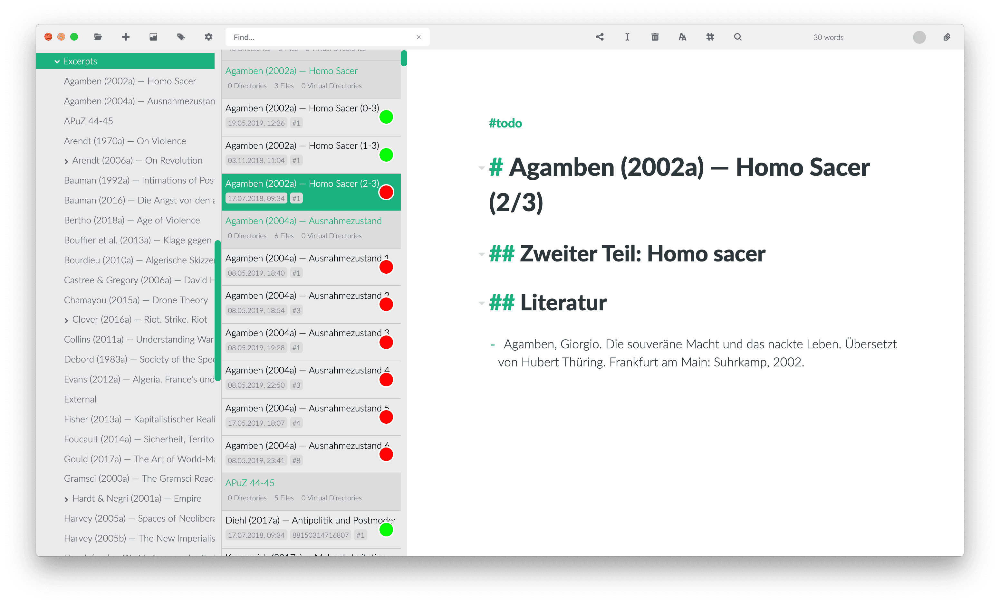

# Anleitung: Zettlr als integrierte Entwicklungsumgebung (IDE)

Zettlr ist voll mit Funktionen, die Ihren Arbeitsablauf unterstützen. Sie können es als kleine Notiz-App, als Zettelkasten oder, wie in dieser Anleitung erklärt, als vollwertige integrierte Entwicklungs- (sprich: Schreib-) Umgebung verwenden. Fangen wir also an!

> Mit dieser Anleitung können Sie Zettlr als Ersatz für Anwendungen wie Ulysses, Atom oder Sublime Text einrichten.

## Schritt 1: Anpassen der Einstellungen

Der erste Schritt besteht darin, einige der Parameter von Zettlr anzupassen. Drücken Sie also `Cmd/Ctrl+,` oder drücken Sie das Zahnrad in der Symbolleiste, um den Einstellungsdialog zu öffnen. Passen Sie die folgenden Einstellungen an:

- Registerkarte "Allgemein
    - Datei-Informationen: Auf
    - Seitenleisten-Modus: Erweitert
- Registerkarte Editor
    - Wählen Sie alle Wörterbücher für die Sprachen, in denen Sie schreiben werden (z. B. en-UK, de-DE und fr-FR)
- Registerkarte Export
    - Wählen Sie das aktuelle Arbeitsverzeichnis als Exportverzeichnis
    - Interne Links vollständig entfernen
- Registerkarte Zettelkasten
    - Nehmen Sie die Einstellungen gemäß der Anleitung für den Zettelkasten vor
- Registerkarte Anhänge
    - Geben Sie alle Dateierweiterungen der Dateien ein, die Sie wahrscheinlich verwenden werden. Auf diese Weise werden alle diese Dateien in der Anhangsleiste auf der rechten Seite der App angezeigt

Wenn Sie mit der Einrichtung von Zettlr fertig sind, klicken Sie auf "Speichern". Jetzt sollte Zettlr wie eine echte IDE aussehen, mit drei Segmenten (Verzeichnisbaum, Dateiliste und Editor) und allen aktiven Einstellungen.

## Schritt 2: Schreiben!

Diese Anleitung ist recht kurz, denn sie zeigt Ihnen nur, wie Sie Zettlr einrichten können, um eine vollwertige IDE zu erstellen. Was Sie dann damit machen, bleibt ganz Ihnen überlassen. Ein guter Anfangspunkt ist die Lektüre der beiden Anleitungen zu Zettelkästen und Notizen, da Sie wahrscheinlich einige Konzepte aus diesen Anleitungen verwenden werden.

Hier sind alle Ressourcen, die für Sie interessant sein könnten:

- [Anleitung: Zettlr als Zettelkasten](guide-zettelkasten.md)
- [Anleitung: Zettlr als Notiz-App](guide-notes.md)
- [Zettlr-Projekte](../academic/projects.md)
- [Präsentationen mit Zettlr erstellen](../academic/presentations.md)
- [Markdown für Zettlr](../reference/markdown-basics.md)
- [Exportieren nach PDF](../core/export.md)