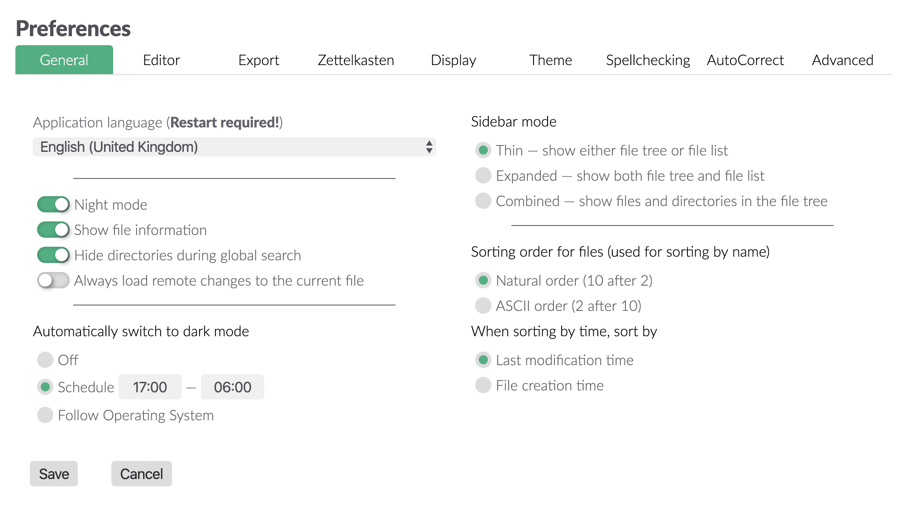
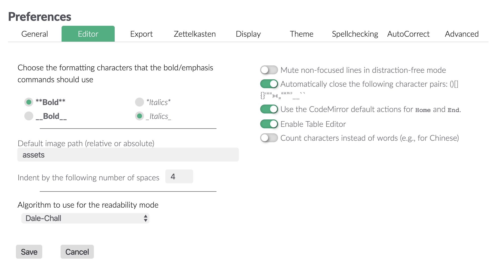
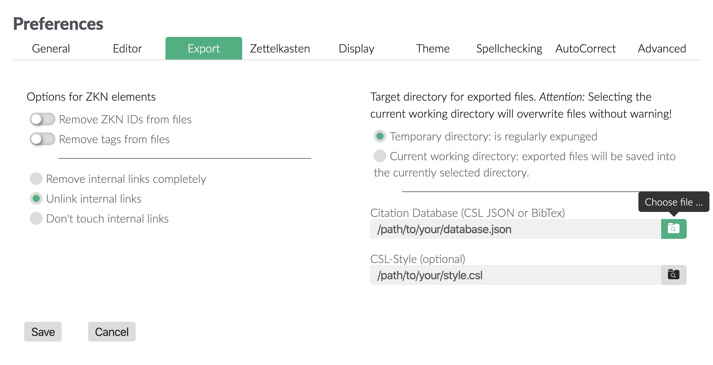
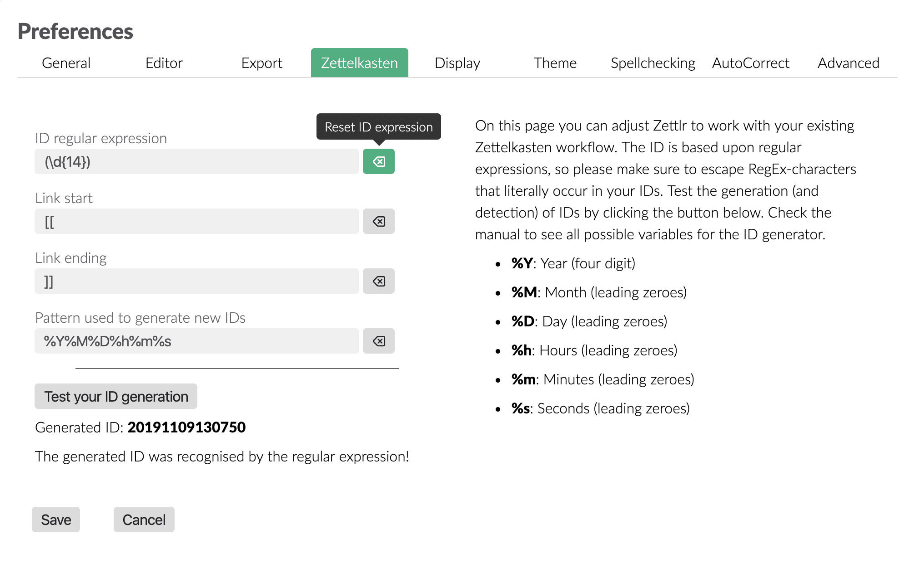
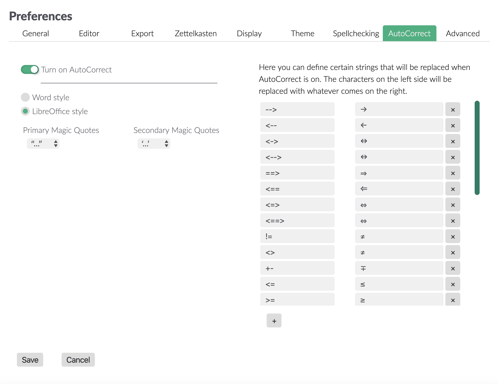
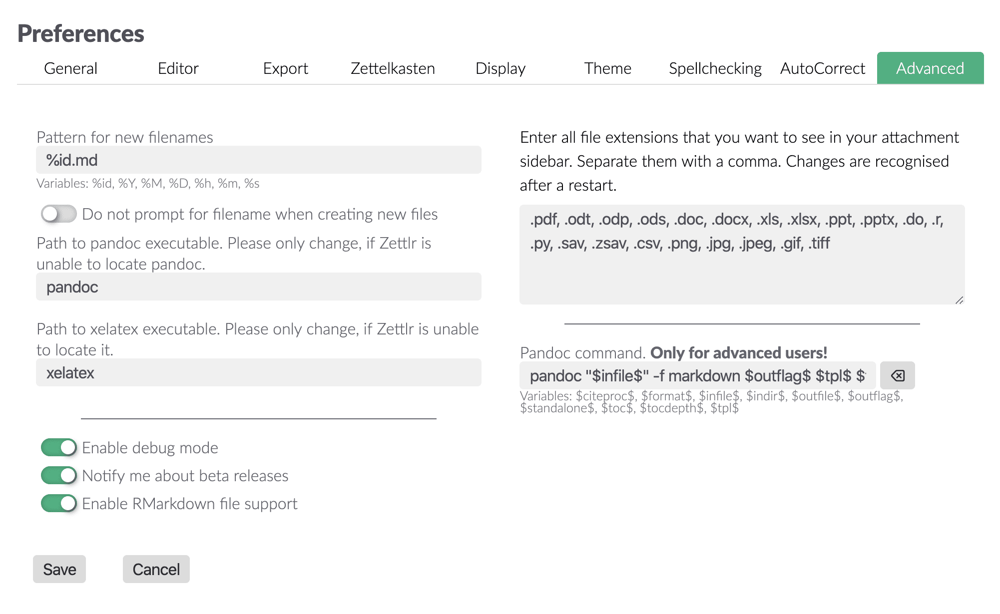
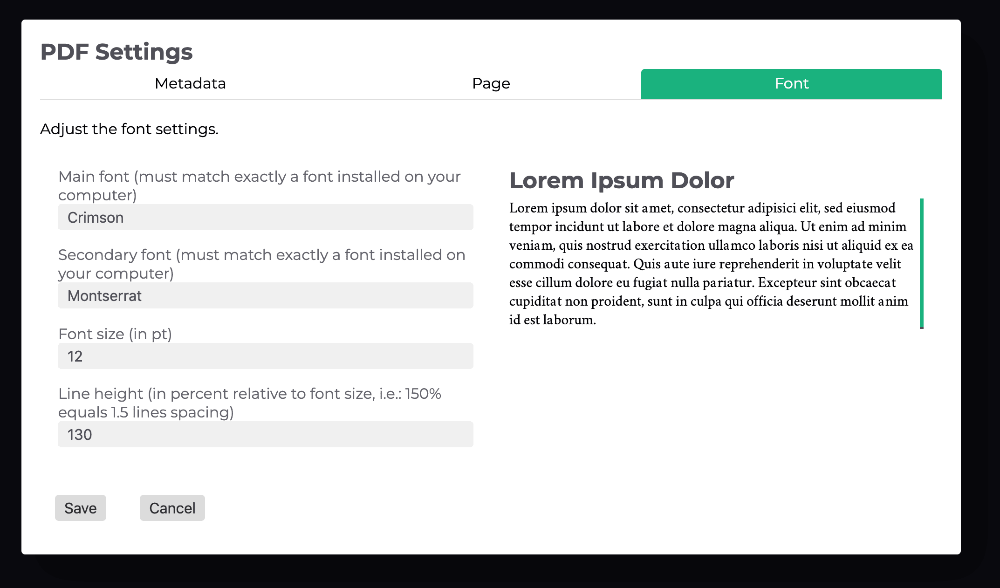
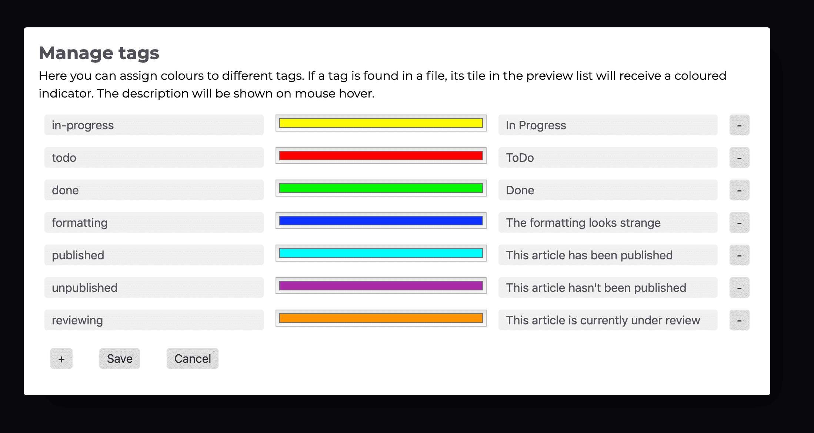

# Einstellungen

Zettlr bietet eine Vielzahl an Einstellungen zur Anpassung seines Verhaltens an. Es gibt in der App insgesamt drei verschiedene Einstellungs-Dialoge, die hier in allem Detail eingeführt werden sollen.

## Allgemeine Einstellungen

Die allgemeinen Einstellungen können entweder mit `Strg/Cmd+,` oder über die Toolbar aufgerufen werden. Die Einstellungen sind in neun Kategorien sortiert, abrufbar über die Tableiste oben im Dialog.

* Allgemein: Diese Einstellungen betreffen die App als solche.
* Editor: Diese Einstellungen gelten nur für den Editor.
* Export: Hier kannst du bestimmen, wie Dateien exportiert werden sollen.
* Zettelkasten: Hier finden sich alle Einstellungen zu Zettlr als einem Zettelkasten.
* Anzeige: Bestimmt, wie verschiedene Elemente im Editor dargestellt werden können.
* Theme: Hiermit kannst du zwischen den mitgelieferten Styles der App auswählen.
* Rechtschreibprüfung: Aktiviere verschiedene Wörterbücher und verwalte das benutzerdefinierte Wörterbuch.
* AutoCorrect: Verwalte Einstellungen zum automatischen Ersetzen von Zeichen und verwalte die „Magic Quotes“.
* Erweitert: Einstellungen für fortgeschrittene Benutzer.

### Allgemein

Im allgemeinen Tab lassen sich die Programmsprache einstellen sowie weitere größere Anpassungen vornehmen. Die Schalter haben folgenden Effekt:

* Dunkles Thema: Ob Zettlr den hellen oder dunklen Modus nutzen soll
* Metainformationen: Soll Zettlr in der Dateiliste zusätzliche Informationen zu den Dateien wie Zettelkasten-ID, letztes Änderungsdatum oder Schlagworte anzeigen?
* Sollen die Verzeichnisse während Suchen vollständig ausgeblendet werden?
* Sollen Änderungen an der gerade offenen Datei automatisch geladen werden?

Die drei Modi für den automatischen Nachtmodus haben folgende Funktion:

* Aus: Zettlr verwendet nur das dunkle Thema, wenn manuell über das Anzeige-Menü oder über das Shortcut `Strg/Cmd+Shift+L` der dunkle Modus ausgewählt wird.
* Zeitplan: Im 24-Stunden-Modus kann hier die Zeitspanne ausgewählt werden, zwischen der Zettlr automatisch in den Nachtmodus wechseln soll (Standard: Von 21 Uhr bis 6 Uhr morgens).
* Dem Betriebssystem folgen: Windows und macOS unterstützen einen Betriebssystem-weiten Nachtmodus, dem Zettlr folgen kann. Auf Linux-Plattformen ist diese Option nicht verfügbar.

Seitenleisten-Modi:

* Dünn: Zeige den Ordnerbaum und die Dateien separat an, zeige aber immer nur eine der Spalten
* Erweitert: Zeige Ordnerbaum und die Dateien separat an, aber in zwei Spalten
* Kombiniert: Zeige Ordner und Dateien in einem Baum an (z.B. wie bei Code-Editoren)

Mit den Sortier-Optionen lässt sich umstellen, ob die Dateien anhand ihres Erstell-Datums oder Änderungsdatums sortiert werden sollen (welches der Daten in der Dateiliste angezeigt werden soll, kann separat in den Anzeige-Einstellungen bestimmt werden). Die Sortierung nach Namen bestimmt, ob beispielsweise die Datei „10 - Kapitel 10“ vor „2 - Kapitel 2“ oder danach erscheinen soll, d.h. ob eine natürliche Sortierung oder eine strikte buchstabenbasierte Sortierung angewendet werden soll.

### Editor

Hier können Einstellungen bezüglich des Editor getroffen werden. Die Formatierungszeichen bestimmen, welche Zeichen die Tastaturkürzel für fetten und kursiven Text verwenden, da Markdown sowohl Sterne als auch Unterstriche zulässt.

Der Algorithmus für den Readability-Modus [ist auf unserer Seite ausführlich erklärt](https://www.zettlr.com/readability).

Der Einzug in Leerzeichen bestimmt, wie viele Leerzeichen zum Einrücken (beispielsweise von Listen) verwendet werden sollen. Da Pandoc und einige andere Markdown-Interpreter mindestens 4 Leerzeichen verlangen, ist dies die Standard-Einstellung.

Der Bild-Pfad hat folgende Auswirkungen:

- Wenn ein Bild aus der Zwischenablage eingefügt wird und der „aktuelle Ordner“ ausgewählt wird, bestimmt sie den Ordner.
- Ist das Textfeld leer, wird das Bild in denselben Ordner wie die aktuelle Markdown-Datei gelegt
- Ist im Textfeld ein relativer Pfad (wie „assets“) angegeben, wird das Bild in diesen Ordner gelegt (dies funktioniert auch mit Navigation, d.h. „../img“ würde den Ordner „img“ im übergeordneten Verzeichnis auswählen)
- Ist im Textfeld ein absoluter Pfad angegeben, wird das Bild immer in diesen gelegt.

Die Schalter haben folgenden Effekt:

- Zeilen im Ablenkungsfreienmodus abblenden: Im Ablenkungsfreien Modus kann Zettlr alle Zeilen außer der, wo sich der Cursor befindet, transparent darstellen, sodass der Fokus auf der aktuellen Zeile liegt
- Automatisches Schließen: Wird eine runde oder eckige Klammer eingegeben, fügt Zettlr automatisch das Pendant hinzu. Wird das Pendant dann ebenfalls eingegeben, wird es nicht doppelt eingefügt, sondern Zettlr „springt“ über die schließende Klammer. Funktioniert nicht nur mit Klammern.
- CodeMirror Standard-Aktionen: Die „Home“- und „End“-Taste springen bei CodeMirror meistens intelligent an den Anfang bzw. das Ende der Zeile, wobei Zeilenumbrüche ignoriert werden. Hiermit kann das Verhalten umgestellt werden auf „Springe ans Ende der sichtbaren Zeile anstelle ans Ende des Absatzes“.
- Table Editor aktivieren: Mithilfe des Table Editors lassen sich Tabellen in Markdown sehr einfach in den Text einfügen.
- Zeichen anstelle von Wörtern zählen: Dies ist besonders für Symbolschriften wie chinesischen oder japanischen (Kanji) Text praktisch, da hier meist ein Symbol gleich einem Wort ist.

### Export

Was beim Exportieren von Dateien passiert, kann hier bestimmt werden. Die Schalter haben folgenden Effekt:

- Zettelkasten-IDs entfernen: Sucht mithilfe des regulären Ausdrucks (vgl. Zettelkasten-Einstellungen) nach IDs und entfernt diese vor dem Exportieren aus dem Text
- Schlagworte entfernen: Sucht nach Schlagworten und entfernt diese ebenfalls vor dem Exportieren

> Wir empfehlen, Zettelkasten-IDs _nicht_ zu entfernen, insbesondere nicht mit den Standard-Einstellungen, bei welchen eine Zettelkasten-ID schlicht als 14 aufeinanderfolgende Ziffern definiert ist. Denn viele Internet-Links können auch viele Ziffern enthalten, sodass Zettlr diese auch entfernen würde und damit die entsprechenden URLs zerstören würde.

Der Schalter für interne Links kann zwischen drei Modi umgeschaltet werden:

- Komplett entfernen bedeutet, dass alle Links im Format „Beginn Link“ „Inhalt des Links“ „Ende Link“ (vgl. Zettelkasten-Einstellungen) komplett aus dem Text entfernt werden
- „Unlink“ bedeutet, dass sowohl „Beginn Link“ als auch „Ende Link“ entfernt werden, der Inhalt aber erhalten bleibt
- Unverändert lassen: Die Links bleiben so wie sie sind erhalten.

Die exportierten Dateien können entweder ins temporäre Verzeichnis exportiert werden oder ins aktuelle Verzeichnis. Das temporäre Verzeichnis wird bei jedem Neustart des Rechners geleert, erspart also einiges an Aufräumarbeit. Wird in das aktuelle Verzeichnis gespeichert, werden gleichnamige Dateien grundsätzlich ohne Warnung überschrieben, d.h. wenn ein Dokument exportiert wird, dann eine Änderung am exportierten Dokument vorgenommen wird und es erneut exportiert wird, sind die Änderungen verloren.

Weiterhin können hier eine aus einem Literaturverwaltungsprogramm exportierte Datenbank sowie ein Zitier-Stil eingebunden werden, die an Pandoc beim Export übergeben werden.

> Die Zitations-Optionen können für Projekte in deren Einstellungen überschrieben werden.

### Zettelkasten

Die Zettelkasteneinstellungen sorgen dafür, dass sich Zettlr in seinem Verhalten an die persönlichen Vorlieben ausrichtet.

#### Der Reguläre Ausdruck für die ID

Zettelkästen funktionieren über ein System von Links zwischen einzelnen Dateien. Um Dateien eindeutig ansprechen zu können, wird eine ID benötigt. Es hat sich etabliert, das aktuelle Datum zu nutzen, d.h. beispielsweise 20191124141823. Um diese IDs aber auch zu finden, muss Zettlr wissen, wonach es suchen muss. Dazu nutzt es intern reguläre Ausdrücke. Reguläre Ausdrücke werden zum Durchsuchen von Text nicht nach konkreten Buchstabenketten sondern nach Mustern benutzt. Anstelle nach „2019“ zu suchen kann also auch nach „vier aufeinanderfolgenden Ziffern“ gesucht werden. Datums-IDs werden also von vierzehn aufeinanderfolgenden Ziffern gefunden, daher: `\\d{14}`. Die runden Klammern vor und hinter dem Ausdruck sind eine sogenannte „Capturing-Group“, die erhalten bleiben muss. Zettlr wird zwar versuchen, die runden Klammern hinzuzufügen, aber dies könnte je nach Ausdruck zu unerwartetem Verhalten führen.

Für technisch nicht versierte Benutzer ist es empfohlen, diese Einstellung nicht zu verändern, um das Verhalten der App nicht negativ zu beeinflussen. Vor dem Anpassen der Optionen lohnt es sich, einen Blick auf [reguläre Ausdrücke](https://de.wikipedia.org/wiki/Regul%C3%A4rer_Ausdruck), genauer gesagt [reguläre Ausdrücke im Dialekt von JavaScript](https://developer.mozilla.org/de/docs/Web/JavaScript/Guide/Regular_Expressions) zu werfen.

> Zettlr wird immer die _erste_ gefundene ID als Datei-ID annehmen. Wenn also mehrere 14-stellige Ziffern im Text gefunden wurden, wird die erste als ID akzeptiert, die anderen nicht.

#### Interne Links

Während es sich zum Verlinken von Dateien etabliert hat, Wiki-Style-Links mit doppelten eckigen Klammern zu verwenden (`[[ID oder Dateiname]]`), bietet Zettlr die Möglichkeit, dieses Verhalten zu verändern. So könnten anstelle eckiger Klammern geschweifte Klammern verwendet werden (z.B. `{{ID oder Dateiname}}`).

> Beachte, dass Dateien keine IDs verwenden werden, die sich in solchen Links befinden, da Zettlr davon ausgeht, dass auf eine andere Datei verwiesen werden soll.

#### Der ID-Generator

Das letzte Puzzlestück der Zettelkasten-Funktionalität ist der Generator für IDs. Es stehen verschiedene Variablen zur Verfügung (vgl. die Liste auf der rechten Seite des Tabs), die verwendet werden können. So ließe sich die Standard-Datums-ID auch verändern zu `%Y-%M-%D_%h:%m:%s`, d.h. anstelle von 20191124141823 würde die ID dann 2019-11-24_14:18:23 lauten. Auch können Variablen mehrfach verwendet werden (`%s%s%s` ergäbe beispielsweise `232323`).

Sobald der ID-Generator verändert wird, bietet es sich natürlich auch an, den regulären Ausdruck entsprechend anzupassen.

Der Test-Button ermöglicht dann, beides (den regulären Ausdruck wie auch den ID-Generator) zu testen. Zunächst wird mittels des angegebenen Musters eine ID erstellt, die im zweiten Schritt gegen den regulären Ausdruck getestet wird. Wenn Zettlr sagt, dass der Ausdruck die erstellte ID erkannt habe, sind die Einstellungen vermutlich so richtig.

### Anzeige

Dieser Tab bestimmt, welche Elemente in Zettlr dargestellt werden, und welche nicht. Die einzelnen Schalter regeln folgendes:

- Zitationen: Ob die gefundenen Zitationen interpretiert und dargestellt werden sollen
- Iframes: YouTube-Videos oder Vimeo-Videos können mittels Iframe in Dateien eingebettet werden und Zettlr kann sie darstellen. **Vorsicht: Bei Iframes von fragwürdigen Seiten kann Schadcode auf das System gelangen!**
- Bilder: Ob Bilder dargestellt werden sollen. Die maximale Größe der Bilder kann links im Tab bestimmt werden.
- Links: ob Links lesbar dargestellt werden sollen. Ein bedeutet, dass Emails verlinkt werden, einzelne Links ebenfalls, und dass Links mit Anzeige-Text entsprechend gefiltert werden sollen.
- Fomeln: Kann deaktiviert werden, wenn beispielsweise keine Math-Equations mit LaTeX-Syntax genutzt werden sollen.
- Aufgaben: Markdown ermöglicht Listen mit abhak-baren Kästchen. Hiermit können diese auch dargestellt werden.

Die letzte Option bestimmt, ob in der Dateiliste das Änderungsdatum oder das Erstellungsdatum angezeigt werden soll.

### Theme

Dieser Tab sollte selbsterklärend sein: Hiermit kann das zu verwendende Theme ausgewählt werden. Derzeit bietet Zettlr vier Stück an: Ein grünes und ein rotes mit serifenloser Schrift, ein blaues mit einer Serifen-schrift, sowie ein Sepiafarbenes mit fester Zeichenbreite.

### Rechtschreibprüfung

Hier können Wörterbücher ausgewählt werden — werden beispielsweise Deutsch und Englisch aktiviert, können Dateien sowohl auf deutsch als auch auf englisch verfasst werden. Erst, wenn beide Wörterbücher berichten, dass ein Wort falsch geschrieben sei, wird Zettlr dies auch so anzeigen. Auf der rechten Seite können Wörter aus dem benutzerdefinierten Wörterbuch entfernt werden.

> **Tip**: Die Rechtschreibprüfung wird deaktiviert, indem alle Wörterbücher abgewählt werden. Weitere Wörterbücher können installiert werden, indem die Anweisungen [auf dieser Seite](../core/localisation.md) befolgt werden.

### AutoCorrect

AutoCorrect dürfte aus Word und LibreOffice bekannt sein. Es ersetzt einzelne Zeichen, beispielsweise wird `-->` zu `→`. Weiterhin bietet Zettlr sogenannte „Magic Quotes“ an. Ist diese Option aktiviert, werden nicht mehr die generischen einfachen und doppelten Anführungszeichen verwendet, sondern länderspezifische. Magic Quotes können deaktiviert werden, indem die generischen Anführungszeichen aus der Dropdown-Liste ausgewählt werden (jeweils die erste Option).

> Hinweis: Wird AutoCorrect ausgeschaltet, werden auch die Magic Quotes ausgeschaltet!

Zuletzt kann zwischen dem Word- und LibreOffice-Stil gewählt werden. Word ist lediglich etwas aggressiver, was die Ersetzung angeht, d.h. Word ersetzt Wörter, sobald das letzte benötigte Zeichen gesetzt wird, während LibreOffice explizit ein Leerzeichen oder einen neuen Absatz erwartet.

> Tip: Im LibreOffice-Modus kann verhindert werden, dass Zeichen ersetzt werden, wenn statt nur `Leer` die `Shift`-Taste gehalten wird. Es wird ein normales Leerzeichen eingefügt, aber AutoCorrect wird nicht aktiviert. Im Word-Modus kann mittels `Backspace` eine Ersetzung rückgängig gemacht werden.

### Erweitert

Diese Optionen sind für fortgeschrittene Benutzer.

Das Muster für neue Dateinamen bestimmt, mit welchem Dateinamen das Textfeld vorbesetzt werden soll, wenn eine neue Datei angelegt werden soll. Dies ist praktisch für Personen, welche die ID eines Zettelkasten-Zettels direkt im Dateinamen anlegen möchten. Mit dem zugehörigen Schalter kann angegeben werden, dass eine Datei direkt angelegt werden soll und der Dateiname gar nicht erst abgefragt wird.

Die beiden Textfelder für Pandoc und XeLaTeX dienen für vereinzelte Fälle, in denen die Programme nicht in die Standard-Pfade installiert werden und Zettlr sich beschwert, dass die Programme nicht gefunden worden seien. In diesem Fall kann hier der vollständige Pfad zu den Programmen eingefügt werden, sodass Zettlr diese direkt aufruft.

Die Schalter haben folgende Funktion:

- Debug: Wenn aktiv, wird ein zusätzliches Menü aktiv, mit welchem verschiedene Entwickleroptionen freigeschaltet werden. Zudem werden fehlende Übersetzungs-IDs nicht mit den englischen Übersetzungen ersetzt, sondern bleiben bestehen, was praktisch für Übersetzer\*innen ist.
- Beta Releases: Wenn gewünscht, kann Zettlr auch über Beta-Releases informieren.
- RMarkdown-Unterstützung: Da R seine Dateien mit der Dateiendung `.rmd` abspeichert und leider auch einige weit verbreitete binäre Formate die Endung `.rmd` verwenden, muss hier explizit die Unterstützung aktiviert werden.

Das Textfeld für die rechte Seitenleiste bestimmt, welche Dateien dort angezeigt werden sollen. Zusätzliche Dateien sind alle Nicht-Markdown-Dateien, die sich im aktuell ausgewählten Verzeichnis befinden. Sollen beispielsweise PowerPoint-Präsentationen _nicht_ in der Seitenleiste angezeigt werden, genügt es, die entsprechende Dateiendung hier zu entfernen.

Der Pandoc-Befehl ermöglicht weitgehende Freiheiten in Bezug auf den Export von Dateien. Für mehr Informationen genügt ein Blick in die [Dokumentation zu benutzerdefinierten Vorlagen](../academic/custom-templates.md). Die verfügbaren Variablen sind:

- `$infile$`: Der absolute Pfad zur Quelldatei.
- `$outfile$`: Der absolute Pfad zur Zieldatei.
- `$citeproc$`: Enthält Anweisungen für die Citeproc-Engine.
- `$format$`: Enthält das Zielformat (z.B. HTML oder DOCX).
- `$outflag$`: Dies ist der Formatierungsflag für Pandoc (da das Zielformat auch vom internen Pandoc-Format abweichen kann).
- `$standalone$`: Das Standalone-Flag für Pandoc.
- `$toc$`: Ob ein Inhaltsverzeichnis generiert werden soll.
- `$tocdepth$`: Bis zu welcher Überschriften-Ebene das Inhaltsverzeichnis generiert werden soll.
- `$tpl$`: Enthält die Vorlage für Pandoc.

## PDF-Einstellungen

Die PDF-Einstellungen ermöglichen es, die zentralen Angaben für PDF-Exporte zu bestimmen.

Auf dem Tab „Metadaten“ kann der PDF-Autor und ggfs. Schlagworte für die Dateien angegeben werden. Ebenfalls kann hier eine von dem Standard-Template abweichende Vorlage ausgewählt werden (vgl. [benutzerdefinierte Vorlagen](../academic/custom-templates.md)). Die Seiten-Einstellungen funktionieren wie bei bekannten Word-Editoren.

Im Schriftarten-Tab lassen sich die Schriftart für Überschriften und für den Fließtext anpassen, ebenso wie Schriftgröße und der Zeilenabstand.

> **Achtung**: Die Schriftart muss auf dem Rechner vorhanden sein, und es muss der _exakte_ Name verwendet werden. Die LaTeX-Engine ist in dieser Hinsicht leider sehr strikt.

## Schlagworte verwalten

Mit diesen Einstellungen (im Datei-Menü oder im App-Menü auf macOS) können bestimmten Tags Farben zugewiesen werden. Im ersten Feld wird das Schlagwort angegeben, im zweiten die Farbe bestimmt, im dritten eine Beschreibung angegeben und mit dem Minus-Knopf lassen sich einzelne Schlagworte wieder entfernen (natürlich nicht aus allen Dateien, die sie enthalten).

Der Vorteil dieser Farbcodierung ist, dass diese in der Dateileiste angezeigt werden, sodass sich Dateien visuell einsortieren lassen. Mit dem Plus-Knopf lassen sich neue Schlagworte hinzufügen.