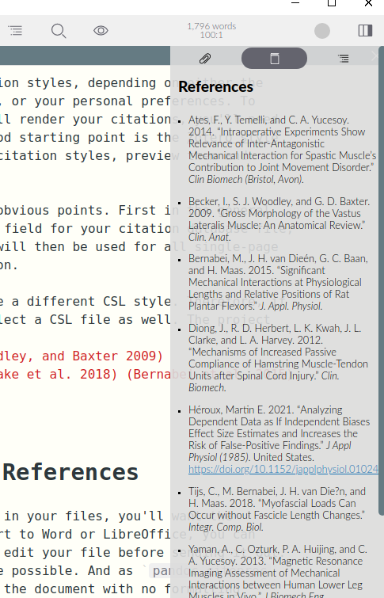

# Citing with Zettlr

Citing in Zettlr is done using `citeproc-js`, a library that works like Pandoc's citeproc-engine or Zotero. So what you see in Zettlr will match the output of Zotero's Word or LibreOffice plugins. Zettlr's citation engine has three parts: A CSL JSON or BibTex library containing all items that can be cited, a preview engine and an optional CSL stylesheet that can alter Zettlr's default citation style (which is the [Chicago Manual of Style, 17th edition](http://www.chicagomanualofstyle.org/tools_citationguide.html)). This guide will help you enable citations and produce beautiful looking files (not just PDF!) that contain correct and consistent citations.

## Enabling Citations in Zettlr

There are two engines related to citations: previews (citations can be previewed as images or links) and the actual process of generating citations (which happens only on export). Both of these engines are triggered by selecting a citation library that contains references. Without such a library, Zettlr will preview citations (so that you can see what will trigger Pandoc's citeproc), but won't replace them with formatted citations. Also, if you do not specify such a library, Zettlr will _not_ run Pandoc with its citeproc-engine, and therefore will not parse the citations.

So the first step is to create citation library. Zotero is the recommended application for managing your library, so this tutorial assume's you are using Zotero. If you use another program, you will need to figure out how to export to the CSL JSON format.

> If you use Mendeley, Citavi, or any other references management software that does not export to CSL JSON, you can export to BibTex.

### Step 1: Install BetterBibTex

The first step is to install [the BetterBibTex plugin for Zotero](https://github.com/retorquere/zotero-better-bibtex/releases/latest). The main benefit of this plugin is that it keeps your citation IDs (called CiteKeys) unique throughout your library. 

> **Why is this important?** For example, if you realise the publication date of a references has been saved wrong, you can change it in Zotero and citeproc will use the citation with the corrected information. However, without BetterBibTex, the same ID may be issued multiple times. This would could lead to an overt error, which is good because there is actually something wrong. However, it could also lead to a silent error, where citeproc uses the first item that matches the ID; this is bad because it is hard to spot erroneous citations after export.

After you've installed BetterBibTex, you may want to play around with the settings. For example, you may want alter how the IDs are generated.

> **Tip**: BetterBibTex automatically generates unique IDs using an algorithm that you can customise. For the most part, BetterBibTex makes use of the established [JabRef Patterns](http://help.jabref.org/en/BibtexKeyPatterns) but extends them significantly. For example, BetterBibTex will make sure each entry is unique by optionally adding a suffix to publications that yield the same ID (e.g. `Harvey2005a`, `Harvey2005b`, `Harvey2005c`). You can read about [this plugin's functionality in its extensive documentation](https://retorque.re/zotero-better-bibtex/citation-keys/).

### Step 2: Export your library

The next step is to export your library. Zotero manages your references, but citing  them is done with Pandoc's citeproc, which needs a separate file.

To export your library so that both Zettlr and citeproc can use, select the collection you want to export in the left sidebar. To have all your references at your disposal and prevent export to multiple libraries, you can select your entire library. 

> We've run tests with a library containing about 700 items, and we have not experienced any performance issues.


Next, click on `File` and select `Export library …`. Select `Better CSL JSON` as the format; if you opted to not install BetterBibTex, choose `CSL JSON`. By checking "Keep updated", BetterBibTex will ensure every change in Zotero will automatically update your `CSL JSON` file. In this way, Zettlr will always use the most up-to-date, correct citation.

> If you checked "Keep updated", you can verify the status of the `CSL JSON` by opening the Zotero Preferences, selecting the `BetterBibTex` tab, and selecting `Automatic Export`. Here you can finetune what is exported, and when.

### Step 3: Open your library in Zettlr

Now it is time to import your library to Zettlr. To do so, open Zettlr's preferences, go to the `Export` tab and click the small folder icon located to the right to the `Citation Database` input field. A dialog will appear that lets you navigate to your database file (i.e. `CSL JSON` or `BibTex`). Select your database file, save the preferences and Zettlr will automatically load the database. You are now ready to cite!


### Step 4: Enable *Render Citations*

In the *Display* section of the preferences, you will find the option *Render Citations*. This option has to be enabled to view formatted citations in the editor. 

## Citing in Zettlr

Zettlr supports Pandoc's citeproc-syntax for writing citations. This means you will have two options to write citations. First, you can add a single ID in your text to render a citation for this ID. It should look like this: `@Harvey2005a`. All citation keys begin with an `@` followed by the ID (i.e. BetterBibTex CiteKey).

> Zettlr has an autocomplete feature that will prompt you with all available citation keys as soon as you type an `@` character. If you are not presented with a list of possible references, there may be a problem with the database file (i.e. `CSL JSON` or `BibTex`) you set up previously. After you type `@`, you can start to type the first few characters of the ID to narrow down your search. If the reference you want to cite is at the top of the list, hit the `Enter` key to select it. If the reference you want is visible, but lower down the list, use the arrow keys to highlight the reference and hit the `Enter` key, or use your mouse to click on your reference.

Sometimes you'll want to be somewhat more specific with your citation. For example, adding a certain page range. That is what the more extended square bracket citation is for. A citation with a so-called prefix and a page range would look like this:

`[See @Harvey2005a, 45-51]`

To cite multiple authors, simply divide the blocks with semicolons:

`[See @Harvey2005a, 45-51; also @Ciepley2007, 8-9]`

For more information on how to use citations in line with Pandoc's citeproc engine, [please refer to the guide](http://pandoc.org/demo/example19/Extension-citations.html).

> **Please note.** Zettlr's citeproc-engine is **only for preview purposes**. For simplicity reasons, Zettlr does not perfectly parse all citations. It is there to **check that your citations are detected correctly so that you don't have missing citations on export**. But be assured, Pandoc's citeproc will render the citation correctly on export.  

## Checking the references

Once you are done writing and want to check you have cited everything you planned to cite by openning `Sidebar` (Shortcut: `Ctrl/Cmd+?`) and selecting the middle `References` tab. Zettlr will display a list of all references it has found in your current file. If a reference is missing from this list, it probably has not been cited in your file.



## Changing the citation style

Internally, Zettlr will always use the Chicago style to render citations. Therefore, your previewed citations will always be "in-text," and never in footnote-style. This is meant as a convenience, to confirm everything is working.

But of course you can use different citation styles, depending on either the journal requirements for which you are writing, or your personal preferences. To change the citation style Pandoc's citeproc will use to render your citations, you need to download the corresponding CSL file. A very good starting point is the [Zotero style repository](https://www.zotero.org/styles). There you can search for specific citation styles, preview them and download them. Another good option is the [Citation Style Language styles repository](https://github.com/citation-style-language/styles)

You can point Zettlr to a CSL file in two ways. First in the general preferences. In the `Export` tab, beneath the field for your citation database file, you can select your preferred CSL style. This will be used for all single-page exports using the toolbar button.

Second, you can set specify a CSL style for a specific project. With your project folder visible in the file manager, right-click on the project folder and select `Project Settings ...`.  Here you can specify the CSL file to use when exporting your project.

## Formatting the List of References

When you add citations to your files, you want to ensure the references are formatted neatly. If you export to Word or LibreOffice, you can fine-tune your references as you edit your file before sending it out. But this is not possible if you export to PDF. Pandoc's citeproc appends your properly formatted references to the end of your document, without any additional typesetting (e.g. indendation). Thus, you will to use a hack to make the reference list look nice.

LaTeX uses lengths to determine the overall measurements of the exported PDF. These lengths are normally set globally, but they can be changed for different parts of document. One of these lengths is `parindent`, which controls the hanging indent of all paragraphs.

The `parindent` variable can be set using Zettlr's PDF options. However, this will set it globally for all paragraphs, including the references. However, there is a hack you can use to make the reference list look nice: overwrite the paragraph lengths _after_ your document. That is, after the heading `## References` (or however you call it in your file). Re-set the paragraph lengths to what looks nice to you. 

The following code snippet gives you an example:

```latex
\setlength{\parindent}{-1cm} % Negative hanging indent
\setlength{\leftskip}{0.5cm} % Overall indentation
\setlength{\parskip}{0.1cm} % Spacing between paragraphs
```

The above example would render the reference list with a negative indent of minus one centimetre. Additionally it will apply an overall indentation of half a centimetre relative to the page margins. For example, if your left page margin is set to 3 centimetres, the reference list paragraphs will be offset 3.5 centimetres. The last value (`parskip`) controls the spacing _between_ paragraphs, so there will be a gap of 10 millimetres between paragraphs.

The above example is a good place to start. You can search for more lengths to tweak and adjust them to your liking.

## Controlling Pandoc Citeproc with the YAML frontmatter

You can control certain aspects of Pandoc's citeproc using variables that can be set in your YAML frontmatter. Make sure to read the [corresponding page](../core/yaml-frontmatter.md) to see, e.g., how to change the language of your references list.
