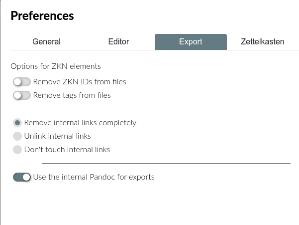

# Custom Templates

When you are done with the content of your paper, it is time to turn your attention to its aesthetics. Your ideas are valuable. However, to truly make them shine, you have to select the right layout and typography.

You want to use a specific font, good line spacing and maybe even colour. The [PDF Preferences](../reference/settings.md) allow you to customise general settings when for exporting a whole project or a single file. However, LaTeX typesetting has many more settings and options. If you are so inclined, you can make truly amazing looking documents, [like these examples](https://tex.stackexchange.com/questions/1319/showcase-of-beautiful-typography-done-in-tex-friends).

In addition to giving you the freedom to use tools like Pandoc and LaTeX, a core principle of Zettlr's philosophy is to makes these tools work _well_ for you. This page will introduce you to using custom LaTeX templates, so you can showcase your writing and the final product!

## Preconsiderations

The Zettlr exporting engine performs a variety of tasks before handing off your documents to Pandoc, which will use LaTeX to typset your document. Understanding these tasks is important to produce consistent output and prevent problems, especially when using more advanced templating.

### 1. Concatenate All Input Files (Only Applies to Projects)

When exporting a project, Zettlr concatenates and traverses all your files in the order they are displayed in the file list. During this process, Zettlr **will perform two operations on the Markdown source**:

1. Convert image paths to absolute image paths. This means you can use relative paths throughout your Markdown documents without having to worry what LaTeX will do to them.
2. Make footnotes unique to avoid missing or duplicated footnotes.

Zettlr then save the concatenated source file to a temporary directory and launch the exporter.

### 2. Read in the Source File

Zettlr reads in your source file, which is either a single file (using the `Share` feature) or a concatenated project file (as described above in step 1). For single files, Zettlr will first convert image paths to absolute image paths (for single files). 

Then, depending on whether it is relevant and also what is selected in the preferences' Export tab, Zettlr will:
* Remove tags.
* Process Zettelkasten links:
    * `Remove internal links completely`
    * `Unlink internal links` will strip the link formatting characters (`[[` and `]]` by default)
    * `Don't touch internal links` 
* Strip Zettelkasten IDs.
    * This feature is off by default because removing IDs generated in the default format (14 digits) may unintentionally break web links that also contain 14 consecutive digits.


Zettlr then saves the revised source file to a temporary directory.

### 3. Prepare the Template

Zettlr will read in the LaTeX template and replace the following variables:

- `$PAGE_NUMBERING$`: The page numbering you've chosen in the PDF preferences, e.g., Arabic Numbers.
- `$PAPER_TYPE$`: The paper you've chosen, e.g., `a4paper`.
- `$TOP_MARGIN$`: The top page margin you've provided (e.g., 3cm).
- `$RIGHT_MARGIN$`: The right page margin you've provided (e.g., 3cm).
- `$BOTTOM_MARGIN$`: The bottom page margin you've provided (e.g., 3cm).
- `$LEFT_MARGIN$`: The left page margin you've provided (e.g., 3cm).
- `$MAIN_FONT$`: The main font (for most text) you've provided (e.g., Times New Roman).
- `$SANS_FONT$`: The secondary font (mostly for headings) you've provided (e.g., Arial).
- `$LINE_SPACING$`: The line spacing you've provided (e.g., 150%).
- `$FONT_SIZE$`: The font size you've provided (e.g., 12pt).
- `$PDF_TITLE$`: The PDF title (either the filename or custom, if exporting a project).
- `$PDF_SUBJECT$`: The PDF subject.
- `$PDF_AUTHOR$`: The PDF author meta information.
- `$PDF_KEYWORDS$`: Keywords for the PDF file.
- `$TITLEPAGE$`: Either an empty string or `\\maketitle\n\\pagebreak\n`, if you're exporting a project with the titlepage option on.
- `\$GENERATE_TOC$`: Either an empty string or `\\setcounter{tocdepth}{<number>}\n\\tableofcontents\n\\pagebreak\n`, if you're exporting a project with the option checked to generate a table of contents. `<number>` will be replaced with the level (1 to 6).

Variables will be replaced globally. This means that, for example, if the variable `\$PDF_AUTHOR$` is found multiple times in the template, it will be replaced each time.

Zettlr then saves the revised LaTeX template to a temporary directory.

### 4. Prepare the PDF Export

With the source and template files prepared, Zettlr will prepopulate the Pandoc command variables. One of these commands tells Pandoc that the revised source file from step 3 is your input file. Another command adds the revised LaTeX template; if a custom template is not provided, Zettlr will use its [default template](https://github.com/Zettlr/Zettlr/blob/master/source/main/assets/export.tex). To maximise compatibility, this template is a simplified version of the [Pandoc default template](https://github.com/jgm/pandoc/blob/master/data/templates/default.latex).

> Many of the commands in the default Pandoc template require additional LaTeX packages. To not confuse users who only need the basics, Zettlr's default template strives for maximum compatibility, not perfect PDFs.

If you indicated in your project settings that you want a table of contents, the relevant command will be included in the Pandoc command variables. This will cause XeLaTeX to run **twice**: once to build the PDF and determine where the headings will be located, and once to build the PDF with the table of contents included.

> In general, you should keep the table of contents flag (i.e. `$toc$`) in the Pandoc command used by Zettlr (it can be edited in the Advanced tab in the Preferences). If you remove it, you will lose the ability to generate a table of contents (even if you indicate you want one).

### 5. Run the Command!

With all preconditions met, Zettlr will run the Pandoc command. If it runs successfully, your output file will open using your system's default application for your chosen output format (e.g. default PDF reader for a PDF document; default web browser for an HTML document). 

If Pandoc exited with an error, Zettlr will show you the error message, which you can cut-and-paste into Google to troubleshoot the problem. If the error occured in LaTeX, the full LaTeX console output will be displayed. This can be quite verbose and confusing for newcomers. For example, if a LaTeX package is missing, you need to spot the relevant error message (i.e. `File <package-name>.sty is missing`) amongst all the other output text.

> **Attention:**  If you use the default template and avoid using LaTeX commands in your Markdown file, you should not encounter any errors. If you do, it indicates there is a problem with the default template, which should be reported to Zettlr's maintainers. 

## Getting Started with Templating

Let's write your first LaTeX template, which can be done directly in Zettlr! When complete, your template file will be passed to Zettlr, Citeproc (if applicable), Pandoc, and then finally LaTeX. 


First, create a new file and **give it a `.tex` file extension**.  A small `TeX` indicator will appear beneath the filename in the file list (if file meta is turned on in the preferences).

<!-- There is no such option in the file meta data section in preferences; personally on Linux I do not see a TeX indicator when I create a LaTeX file. -->


Zettlr will automatically switch code highlighting from Markdown to LaTeX.

## Necessary Contents

While you could omit all Zettlr-specific variables, there is one Pandoc variable that needs to be present at all times:

```
$body$
```

Pandoc will replace this variable with the parsed contents of your Markdown file(s). If you leave it out, your content will not appear in the output file.

> The default Zettlr template does not include many of the variables from the default Pandoc template. However, you are free to re-introduce some or all of them. This ability to use a combination of Pandoc and Zettlr variables makes template files truly powerful!

## Hacking Your Templates!

In the preferences, you can you amend the default Pandoc command used to generate the output file. This gives you ultimate control over the the exporting process. For instance, you can bypass the default processing done by the export engine (except parsing the source file(s)) by deleting the relevant Pandoc command line option.

<!-- Needs an example. -->

You could also place Pandoc variables in your Zettlr variables (for instance setting the PDF author in your project preferences to something that includes a Pandoc variable). Then, once Zettlr has run over your file, Pandoc will replace its own variable after the Zettlr variable has been replaced.

<!-- Needs an example. -->

But what if you want to _really_ hack everything? Have a second look at the Pandoc command in the preferences. It's the **full console command that will be run**! This means you can run custom scripts or logic before and after the Zettlr calls Pandoc. For examples, imagine you want to pass the temporary Markdown file to a custom script to perform additional preprocessing, and afterwards, move the file to another location? This could be achieved by including the following Pandoc command in the preferences:

```shell
pandoc "$infile$" -f markdown $outflag$ $tpl$ $toc$ $tocdepth$ $citeproc$ $standalone$ --pdf-engine=xelatex -o "$outfile$" && cp "$outfile$" /Users/zettlr/Desktop/Final.pdf
```

This command would copy the final output file to the Desktop of the fictional user "zettlr" and name it "Final.pdf" (assuming you are using macOS). Instead of using a simple shell command like `cp`, you could also pass whole scripts that would run afterwards. The sky really is the limit!

## Final Thoughts

Zettlr strives to give you full command over what you can do with your files. What we've outlined on this page is only the start. How do you use Zettlr's possibilities to do weird things? Tell us on [Twitter](https://www.twitter.com/Zettlr), the [Forum](https://forum.zettlr.com/), or on [Reddit](https://www.reddit.com/r/Zettlr)!
