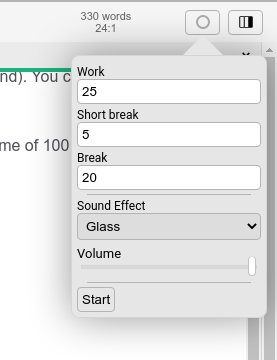
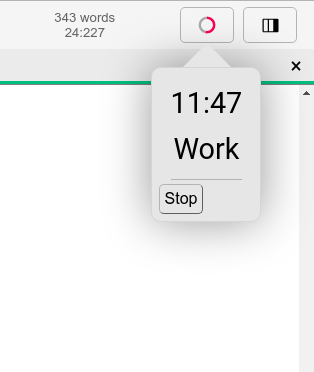

# Pomodoro Timer

If you write a lot, you likely have experienced writing fatigue due to excessive long hours of working. To combat this, Francesco Cirillo devised a technique called the [Pomodoro technique](https://francescocirillo.com/pages/pomodoro-technique) which breaks down long sessions into intervals (with breaks). This allows the brain to refresh itself and helps avoids burn-out. It works as follows:

1. Work (typically 25 minutes)
2. Short break (typically 5 - 10 minutes)
3. Repeat (3 times)
4. Long break (typically 25 - 30 minutes)
5. Repeat from Step 1

Zettlr simplifies this process with a built-in Pomodoro timer.

## Using the Pomodoro timer
Access the Pomodoro timer by clicking on the circle in the top right corner of the screen, inside the Toolbar.

The Pomodoro timer, has 3 core settings that can be altered.

- The length of the **Work**, **Short Break** and **Break** duration's can be adjusted by entering the time (in minutes) in their respective text boxes.
- After each phase, a **Sound Effect** is played, which can be chosen using the drop down menu (either Glass, Digital Alarm and Chime).
- The **volume of the chosen sound** is adjusted using the volume slider (fully left is no sound). You can either drag or click to choose the desired level (this will preview the sound).

> This is not your system volume, so if your system's volume is only at 20 percent, even a volume of 100 percent inside Zettlr will only sound as loud as 20 percent.

Start the timer by clicking the **Start** button. The circle is slowly filled (corresponding to the time remaining) with the colour of the current phase (red for work, yellow for a short break and green for a longer break). Once the circle is filled, the next phase begins and an alert is played (presuming the volume is up).

To **Stop** the timer or simply review the current **status** of the timer, click the circle. A small popup shows the remaining amount of time for the current phase, the type of the current phase and will give the option to stop session.

