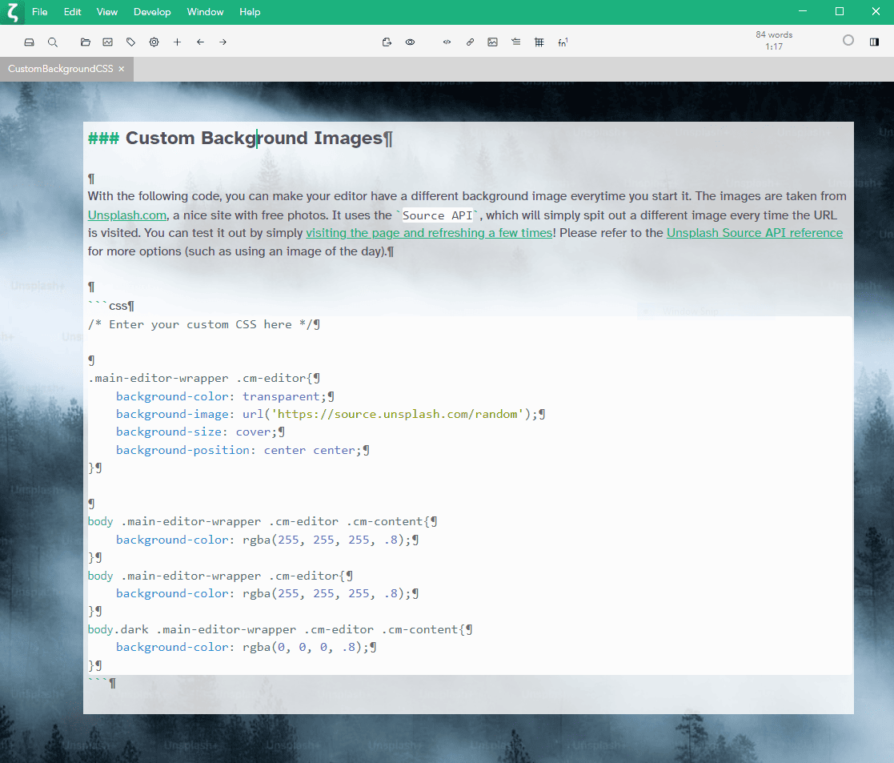
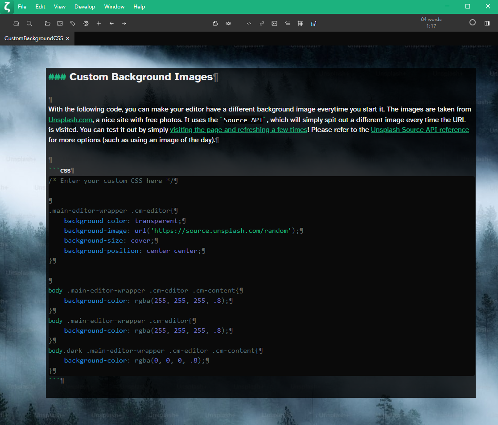
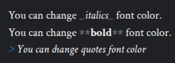
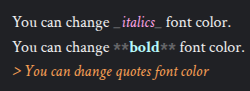
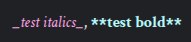
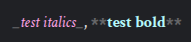
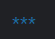
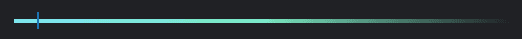
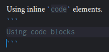
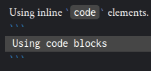

# Custom CSS

!!! warning

    Custom CSS is a feature for advanced users. There is no official support for customizations, and you perform any customizations at your own risk. In case something goes wrong, you can simply remove the `custom.css` from the Zettlr data directory to reset the custom CSS again.

It is possible to use custom CSS ([Cascading Style Sheets](https://en.wikipedia.org/wiki/Cascading_Style_Sheets)) to modify the complete appearance of the app. You can find the Custom CSS editor in the [assets manager](./assets-manager.md).

!!! warning

    The examples in this document haven't been updated in some time, so they may not work out of the box.

If you are unfamiliar with CSS, but don't want to simply copy & paste the guides on this page, you may choose to follow a short [tutorial on CSS](https://developer.mozilla.org/en-US/docs/Learn/CSS/Introduction_to_CSS). There are many on the internet, so a quick Google search can also provide you with video tutorials, if you prefer those.

## Writing CSS for Zettlr

The styles of Zettlr are divided into both geometry and the actual theme, so you may want to stick with only changing the design of elements _without_ changing **any** geometry. Playing around with the geometry may be fun, but it may yield completely random behaviour, as some parts of the app depend upon the correct sizes of elements. In case you made a mistake, don't worry: Simply remove the `custom.css` file from the data directory of Zettlr. You can find the data directory of your own system by looking at the paths provided in [the setup guide](../getting-started/setup.md).

Classes and IDs in Zettlr are always namespaced to the respective components (unless they're global), so to really override a rule you will have to use the complete namespace (you can also use the `!important` override rule, but this is widely regarded as bad practice).

Everything is always namespaced to the `body`, which has a class `.dark` if the app is currently in dark mode. So to make sure a certain rule only applies while the app is in dark mode, make sure to prefix it with `body.dark`!

## Tips for finding selectors

Zettlr's styles are subject to constant changes. While they should remain fairly stable, changes can be introduced in any version, and therefore, instead of providing you with ready-made examples, this page covers how you can find the correct selectors easily.

First of all, make sure to "Enable the debug mode" in the [Advanced preferences](../reference/settings.md#advanced) in order to enable the "Develop" menu. Next, open the developer tools from within this menu and make sure to select the "Elements" tab.


Then click the arrow in the top-left corner of the developer tools. Now you can click any element in the application to focus it in the developer tools. In the bottom area of the developer tools, you will then see the CSS directives used to style all elements of this particular shape.


The top rules always override the bottom rules, so what you are interested in is the following directive:

```css
body .cm-quote, body .cm-link, body .cm-strong, body .cm-em {
    color: var(--c-primary);
}
```

This is the selector you want to copy over to your custom CSS dialog and style to your liking. As you can see, it gives blockquotes, links, bold and italic text the primary color of the theme.

## CSS Code Snippets

### Using a Custom Font with Zettlr

In case you do not like the default font delivered with Zettlr, or need to change it, simply paste the following code snippet into the custom CSS editor. Replace `your-font-name` with the **full name** of the font you want to use for Zettlr. Please replace `placeholder` according to the font:

- In case you want to use a **serif** font, such as Times New Roman, or Georgia, please use `serif`
- In case your font is **sans serif**, such as Arial or Helvetica, please use `sans-serif`
- In case you want to switch to the classic **monospace**, please use the placeholder `monospace`

The placeholder will make sure that even if your font cannot be found, an equivalent font will be used. It serves as a fallback. Also, if your font name contains spaces, make sure to surround it with quotation marks, e.g., `"Times New Roman"`.

```css
body .main-editor-wrapper .cm-editor{
    font-family: '<your-font-name here>', <placeholder>;
}
```
### Custom Background Images

With the following code, you can make your editor have a different background image everytime you start it. The images are taken from Unsplash.com, a nice site with free photos. It uses the `Source API`, which will simply spit out a different image every time the URL is visited. You can test it out by simply [visiting the page and refreshing a few times](https://source.unsplash.com/random)! Please refer to the [Unsplash Source API reference](https://source.unsplash.com/) for more options (such as using an image of the day).

```css
.main-editor-wrapper .cm-editor{
    background-color: transparent;
    background-image: url('https://source.unsplash.com/random');
    /* or use a local image */
    /* background-image: url('file:////absolute/path/to/your/file.jpg');   */
    background-size: cover;
    background-position: center center;
}

body .main-editor-wrapper .cm-editor .cm-content{
    background-color: rgba(255, 255, 255, .8);
}
body .main-editor-wrapper .cm-editor{
    background-color: rgba(255, 255, 255, .8);
}
body.dark .main-editor-wrapper .cm-editor .cm-content{
    background-color: rgba(0, 0, 0, .8);
}
```

*Light Mode*


*Dark Mode*


### Visualising Line Endings

In case you want to see where your linefeeds are, you can display the pilcrow symbol (¶) at the end of your lines by using the following Custom CSS:

```css
.cm-line:not(:last-child)::after {
  content: "¶";
  color: #666;
}
```


### Change the Active Line Styling in Typewriter Mode

You can change the styling of the active line in Typewriter mode. Replace `top-border-hex-code`, `bottom-border-hex-code` and `background-hex-code` in the CSS snippets below with your preferred Hex colour codes, which you can choose from a website such as [HTML Color Codes](https://htmlcolorcodes.com/). You may want to have different colour styling for light and dark mode.

*Light mode*

```css
body .main-editor-wrapper .cm-editor .cm-content .typewriter-active-line {
  border-top: 2px solid <top-border-hex-code>;
  border-bottom: 2px solid <bottom-border-hex-code>;
  background-color: <background-hex-code>;
}
```

*Dark mode*

```css
body.dark .main-editor-wrapper .cm-editor .cm-content .typewriter-active-line {
  border-top: 2px solid <top-border-hex-code>;
  border-bottom: 2px solid <bottom-border-hex-code>;
  background-color: <background-hex-code>;
}
```

### Set a maximum width for the text

If you have a large screen, you may find that lines of your text are very long.
If you wish to have shorter lines in the editor, with margins on both sides, you can use the following CSS snippet:

```css
.main-editor-wrapper .cm-content {
  max-width: <preferred-line-width>;
  margin-right: auto;
}

.main-editor-wrapper .cm-gutters {
  margin-left: auto;
}
```


### Customize font colors

It's possible to change font colors of some markdown elements in other to make them more prominent.

```css
/* Quotes */
body.dark .cm-editor .cm-quote {
   color: rgba(250, 160, 85, 1);
}

/* Bold */
body.dark .cm-editor .cm-strong {
   color: rgba(182, 249, 250, 1);
}

/* Italics */
body.dark .cm-editor .cm-emphasis {
  color: rgba(255, 165, 230, 1);
}
```
(replace ``body.dark``with ``body`` to apply to light mode instead)

Before: ,
After: 

You can also change the color of markdown syntax elements, like the `_` for italics or the `*` for bold, making them closer to the background color to reduce distractions.

```css
/* Bold marks */
body.dark .cm-editor .cm-strong.cm-code-mark {
   color: rgba(204, 204, 204, 0.4);
}

/* Italic marks */
body.dark .cm-editor .cm-emphasis.cm-code-mark {
   color: rgba(204, 204, 204, 0.4);
}
```
(replace ``body.dark``with ``body`` to apply to light mode instead)

Before: ,
After: 

### Customize your tags

You can change the appearance of tags, adding custom colors for each different tag:

```css
/* Generic tags */
body.dark .cm-zkn-tag {
   background-color: rgba(200, 200, 200, 1);
   color: rgba(74, 74, 74, 1);
   padding: 2px;
   border-radius:5px;
}

/* Custom colors for custom tags */
body.dark .cm-zkn-tag-todo > .cm-zkn-tag {
  background-color: rgba(275,171,171, 1);
  color: rgba(138,0,0, 1);
}

body.dark :is(.cm-zkn-tag-done, .cm-zkn-tag-completed)  > .cm-zkn-tag {
  background-color: #d8ead2;
  color: #274e13;
}
```
(replace ``body.dark``with ``body`` to apply to light mode instead)

Before: ,
After: 

### Customize scroll bar

You can customize the scrollbar in order to minimize its size at rest, and expand it only when hovering over it.

```css
::-webkit-scrollbar {
  width: 12px;
  height: 12px;
}

::-webkit-scrollbar-thumb {
  background: #ababab;
  border-radius: 10px;
  border: 2px solid transparent;
  background-clip: padding-box;
}

::-webkit-scrollbar-thumb:hover{
  border: 0;
}

::-webkit-scrollbar-track {
  background: transparent;
}
```

### Customize horizontal ruler

You can modify the default horizontal ruler `***` to display an actual ruler that extends to the whole text width.

```css
body.dark .cm-editor .cm-hr {
    display: inline-block;
    width: 100%;
    line-height: 0.25;
    color: transparent;
    background: linear-gradient(90deg, #7fe5f5,  #7beac3, transparent);
}
```
(replace ``body.dark``with ``body`` to apply to light mode instead)

Before:  ,
After: 

### Customize code blocks

When using dark mode, code blocks might be harder to read. Therefore you can customize them to make them more appealing:

```css
body.dark .cm-editor .cm-monospace {
   color: rgba(255, 255, 255, 1);
   background-color: rgba(70, 70, 70, 1);
   padding: 2px;
   padding-right: 5px;
   padding-left: 5px;
   border-radius: 5px;
}

.code-block-line {
   background-color: rgba(70, 70, 70, 1);
}
```
(replace ``body.dark``with ``body`` to apply to light mode instead)

Before: ,
After: 
