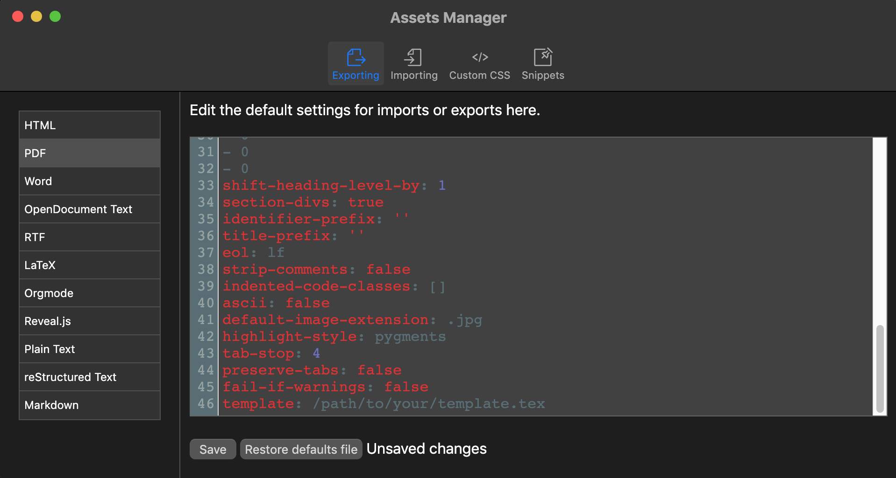

# Custom Templates

When you are done with the content of your paper, it is time to turn your attention to its aesthetics. Your ideas are valuable. However, to truly make them shine, you have to select the right layout and typography. For example, you may want to use a specific font, a different line spacing and maybe even colour. If you are so inclined, you can make truly amazing looking documents, [like these examples](https://tex.stackexchange.com/questions/1319/showcase-of-beautiful-typography-done-in-tex-friends).

In addition to giving you the freedom to use tools like Pandoc and LaTeX, a core principle of Zettlr's philosophy is to makes these tools work _well_ for you. This page will introduce you to using custom LaTeX templates, so you can showcase your writing and the final product!

## Getting Started with Templating

Let's write your first LaTeX template, which can be done directly in Zettlr! When complete, your template file will be passed to Zettlr, Citeproc (if applicable), Pandoc, and then finally LaTeX. 

First, create a new file (File -> New File…). This will automatically create a Markdown file (`.md`) with a unique identifier as its temporary name. Start writing your LaTeX template and then save your file (File -> Save). At this point, you will be able to provide your file an appropriate name and file extension. For example, `my-template.tex`. 


Zettlr will automatically switch code highlighting from Markdown to LaTeX, and a small `TeX` indicator will appear beneath the filename in the file list.


## Necessary Contents

You can use a lot of different variables, depending on your needs. The default templates of Pandoc already contain many useful variables which are documented here. However, you are free to not use variables which you deem not important, and you can even introduce your own variables using Pandoc's templating engine. For example, let's assume you want to add additional information to some, but not all of your exports. Then you could define a variable `my-variable` and define if in all YAML frontmatters where the exported files should contain that information:

```markdown
---
title: "My file title"
date: 2021-10-18
my-variable: "Some additional piece of information"
---
```

Inside your template, you would then need to do something with this variable:

```
$if(my-variable)$
This is some text that will only be contained if "my-variable" has been defined.

You can even insert the contents of the variable by typing $my-variable$
$endif$
```

!!! note

    Note that this is just an example. A more full-fledged example that arguably drives the principle of variables to the max, see [this template for a curriculum vitae](https://github.com/nathanlesage/cv).

While many variables are optional, there is one Pandoc variable that needs to be present at all times:

```
$body$
```

Pandoc will replace this variable with the parsed contents of your Markdown file(s). If you leave it out, your content will not appear in the output file.

## Citations and References

If you're using Zettlr's reference manager-integration to insert dynamic references from Zotero or another app into your article, you'll need to add the following code block to the preamble of your LaTeX template:

```latex
$if(csl-refs)$
% definitions for citeproc citations
\NewDocumentCommand\citeproctext{}{}
\NewDocumentCommand\citeproc{mm}{%
\begingroup\def\citeproctext{#2}\cite{#1}\endgroup}
\makeatletter
% allow citations to break across lines
\let\@cite@ofmt\@firstofone
% avoid brackets around text for \cite:
\def\@biblabel#1{}
\def\@cite#1#2{{#1\if@tempswa , #2\fi}}
\makeatother
\newlength{\cslhangindent}
\setlength{\cslhangindent}{1.5em}
\newlength{\csllabelwidth}
\setlength{\csllabelwidth}{3em}
\newenvironment{CSLReferences}[2] % #1 hanging-indent, #2 entry-spacing
{\begin{list}{}{%
	\setlength{\itemindent}{0pt}
	\setlength{\leftmargin}{0pt}
	\setlength{\parsep}{0pt}
	% turn on hanging indent if param 1 is 1
	\ifodd #1
	\setlength{\leftmargin}{\cslhangindent}
	\setlength{\itemindent}{-1\cslhangindent}
	\fi
	% set entry spacing
	\setlength{\itemsep}{#2\baselineskip}}}
{\end{list}}
\usepackage{calc}
\newcommand{\CSLBlock}[1]{\hfill\break\parbox[t]{\linewidth}{\strut\ignorespaces#1\strut}}
\newcommand{\CSLLeftMargin}[1]{\parbox[t]{\csllabelwidth}{\strut#1\strut}}
\newcommand{\CSLRightInline}[1]{\parbox[t]{\linewidth - \csllabelwidth}{\strut#1\strut}}
\newcommand{\CSLIndent}[1]{\hspace{\cslhangindent}#1}
$endif$
```

## Activate your template

In order to put your template to work, you must point Zettlr to it, via the PDF Defaults File in the Assets Manager. Navigate to the Assets Manager from Zettlr's Menu and select 'PDF' from the list of configurations ('Defaults Files') on the left. Next add `template: ` to the bottom of the configuration file. Note the space after the colon. Now Zettlr needs to know the path to your new template file. Locate your template file, which if you've created it in Zettlr, you may find by right-clicking on the file in Zettlr's file manager and select 'Show File'. Note that the name of the LaTeX file must end in `.tex`. Once you've found the file, you need to find it's location in your computer's directory structure – which is the file's 'path' or 'pathname'.

- On macOS, you can find the file's path by right-clicking the file in the Finder and hit the 'Option' key, which will change the 'Copy file' menu item to 'Copy as Pathname'. 
-  On Ubuntu Linux, using the File Browser, you can find the path of the currently selected file using the keystroke combo __CTRL__ + __L__, which displays the file's path in the location bar.
-  On Windows 10 and 11, select the file in File Explorer and use press and hold the __Shift__ on your keyboard while __Right-clicking__ on it. In the context menu that pops up, select “Copy As Path.” 

Copy the pathname and paste it into the PDF Default File thus: `template: /path/to/your/template.tex`. 



Remember to leave a space between the colon and your pathname. Save the changes and enjoy your LaTeX template.

## Final Thoughts

Zettlr strives to give you full command over what you can do with your files. What we've outlined on this page is only the start. How do you use Zettlr's possibilities to do weird things? Tell us on [Twitter](https://www.twitter.com/Zettlr), [Discord](https://discord.com/invite/PcfS3DM9Xj), or on [Reddit](https://www.reddit.com/r/Zettlr)!
