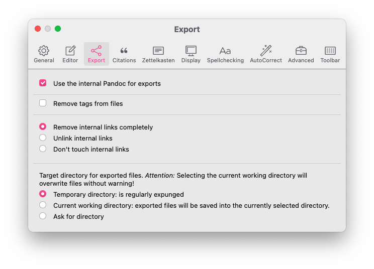

# Citations

Most texts will at some point need to reference source material. Zettlr aims to aid you as much as possible in doing so, and integrates with many reference managers such as Zotero, JabRef, Juris-M, or others.

## Enabling Citations

You'll need two steps to enable citations in Zettlr:

1. Export your references to a supported format: either CSL JSON or BibTeX
2. Point Zettlr to that exported file

Most reference managers allow you to export your library contents as either **CSL JSON** or **BibTeX**. Zettlr supports both. Internally, Zettlr will convert BibTeX to CSL JSON.

!!! note

    On this page, we will show you the process using the example of Zotero, as it is the most common reference manager. If you use another reference manager, please check its manual on how to export to either CSL JSON or BibTeX.

### Step 1: Install BetterBibTex

The first step is to install [the BetterBibTex plugin for Zotero](https://retorque.re/zotero-better-bibtex/installation/). Using BetterBibTex has two important benefits over not using it. First, it keeps all of your citation keys unique across your entire library. Second, it allows you to keep your exported library file up to date so you do not have to re-export it every time something changes.

!!! tip

    While it is not strictly necessary to use BetterBibTex, we do recommend it.

### Step 2: Export your library

The next step is to actually export your library. For this, right-click "My Library" at the top of the collection list, and select "Export Library …"


Select `Better CSL JSON` as the format. If you opted not to install BetterBibTex, choose `CSL JSON`. By checking "Keep updated", BetterBibTex will ensure every change in Zotero will automatically update your `CSL JSON` file. In this way, Zettlr will always use the most up-to-date citations.

!!! note

    If you checked "Keep updated", you can verify the status of the `CSL JSON` by opening the Zotero Preferences, selecting the `BetterBibTex` tab, and selecting `Automatic Export`. Here you can fine tune what is exported, and when.

### Step 3: Open your library in Zettlr

Now it is time to import your library to Zettlr. To do so, open Zettlr's preferences, go to the `Citations` tab and click the small file icon located to the right to the `Citation Database` input field. A dialog will appear that lets you navigate to your database file (i.e. `CSL JSON` or `BibTex`). Select your database file, save the preferences and Zettlr will automatically load the database. You are now ready to cite!



!!! note

    Please note that you can also add bibliography files to the defaults files. These, however, will not be loaded by Zettlr, so it will not preview any citekeys defined there.

If you need to use library files on a per-file-basis rather than globally, you can specify the file with the `bibliography` keyword in the YAML frontmatter. We have included instructions [further down on this page](#using-a-file-specific-library).

### Step 4: Enable *Render Citations*

To ensure that the citations are actually rendered while you type, go to settings → 'Display' and activate the option 'Render Citations'. Even if you disable that setting, Zettlr will use the citation library to generate a bibliography in the [sidebar](../core/sidebar.md).

## Writing Citations

Zettlr supports Pandoc's citeproc-syntax for writing citations. All citation keys begin with an `@` followed by the ID. Zettlr has an autocomplete feature that will prompt you with all available citation keys as soon as you type an `@` character.

After you type `@`, type a few characters to narrow down your search. Use the arrow keys to navigate to the entry you want to cite, and press `Tab` to insert it. When an entry is highlighted, a full bibliographic entry will be displayed as well.

!!! note

    If you are not presented with a list of possible references, there may be a problem with the database file you set up previously.

Depending on what style you need or want to cite in, you have three options:

1. `[@Author2015, p. 123]` will render as `(Author 2015, 123)`
2. `@Author2015` will render as `Author (2015)`
3. `@Author2015 [p. 123]` will render as `Author (2015, 123)`

You can select one of the three styles in the settings → 'Citations' to make it quicker for you to insert the correct syntax. If you, e.g., frequently cite in-text, option two will be great. If you need to frequently add page numbers, option 3 will insert the necessary square brackets on autocomplete and place the cursor between them so that it is easier for you to add the information as required.

!!! tip

    Please note that citation *styles* can sometimes further customize how citations are actually being rendered. For instance, some citation styles in the natural sciences require citations to be referred to only by number. This specific requirement will be applied once you export a file. **Zettlr itself will always use a default in-text citation style to preview your files. Your exports therefore may differ.**

For more information on how to use citations in line with Pandoc's citeproc engine, [please refer to the guide](https://pandoc.org/MANUAL.html#citations).

## Bibliography

As you cite, Zettlr will automatically generate a preview bibliography in the [Sidebar](../core/sidebar.md). You can open the sidebar with the right-most toolbar button and then navigate to the bibliography tab. This bibliography will be automatically appended to your document when you export it.

## Using a file-specific library

Sometimes you may want to add a few citation keys on a per-file basis. To do so, you must add the bibliography file to your file's [YAML frontmatter](../advanced/yaml-frontmatter.md). If Zettlr detects the `bibliography` property in a file's frontmatter, it will automatically load that file and offer you items from that file instead of your main library.

Example:

```yaml
---
title: "My document"
tags: tag1, tag2, tag3
bibliography: ./assets/references.json
---
```

!!! note

    Note that, while you can add multiple library files to this property, Zettlr can only handle one and therefore will only select the first bibliography file.

## Changing the citation style

Internally, Zettlr will always use the Chicago style to render citations. Therefore, your previewed citations will always be "in-text," and never in footnote-style. This is meant as a convenience and to confirm that everything is working.

But of course you can use different citation styles, depending on either the journal requirements for which you are writing, or your personal preferences. To change the citation style, you need to download the corresponding CSL file. A very good starting point is the [Zotero style repository](https://www.zotero.org/styles). There you can search for specific citation styles, preview them and download them. Another good option is the [Citation Style Language styles repository](https://github.com/citation-style-language/styles)

You can point Zettlr to a CSL file in two ways. First in the general preferences. In the `Export` tab, beneath the field for your citation database file, you can select your preferred CSL style. This will be used for all single-page exports using the toolbar button.

Second, you can set specify a CSL style for a specific project. With your project folder visible in the file manager, right-click on the project folder and select 'Properties' → 'Project Settings ...'.  Here you can specify the CSL file to use when exporting your project.

## Customizing the List of References

By default, Pandoc will simply append a list of references to the end of your documents without any decoration. Therefore, you need to perform a few housekeeping steps to ensure bibliographies are correctly rendered.

### Adding a Section Header

The simplest solution to displaying the bibliography correctly is to end your document with a heading that is called "References", "Bibliography", or similar. While this may look a little off when looking at the document in Zettlr, this will ensure that the bibliograhy has an appropriate heading on export.

To make this more explicit, notice that you can specify the precise location of where the references will be inserted with Pandoc's block syntax. By explicitly adding that block, you can visually indicate where the references will end up:

```markdown
## References

::: {#refs}
:::
```

Pandoc will replace the three-colon-curly-bracket construction with your list of references.

!!! tip

    This also means that you can embed your list of references at any point in your document. You could, e.g., add appendices after the `{#refs}`-block.

### Setting a Section Header in the YAML Frontmatter

If you do not want to always specify the section title manually, you can also automate this process. In your file's [YAML frontmatter](../advanced/yaml-frontmatter.md), you can add a property `reference-section-title: Bibliography`. Replace "Bibliography" with whatever the title should be called.

!!! note

    You can read more on placing the bibliography in the [Pandoc manual](https://pandoc.org/MANUAL.html#placement-of-the-bibliography).

### Formatting the List of References

When you add citations to your files, you sometimes need to adjust how they will be displayed on export. While exporting to Word or LibreOffice allows you to fine-tune your references afterwards, this is not possible if you export to PDF.

Thus you may need to add a few style directives to your file. Here we describe how to change the appearance of PDF files. To change the appearance of HTML exports, you can use CSS.

LaTeX uses lengths to determine the overall measurements of the exported PDF. These lengths are normally set globally, but they can be changed for different parts of document. One of these lengths is `parindent`, which controls the hanging indent of all paragraphs.

Whenever you use the command `\setlength` LaTeX will overwrite the specified length from wherever it encounters this command until you use `\setlength` again. Since the references section is formatted using paragraphs like the rest of the document, they will be formatted in this default style. To re-format the list of references, you should overwrite these just before the list of references.

The following code snippet gives you an example:

```latex
\setlength{\parindent}{-1cm} % Negative hanging indent
\setlength{\leftskip}{0.5cm} % Overall indentation
\setlength{\parskip}{0.1cm}  % Spacing between paragraphs
```

The above example would render the reference list with a negative indent of minus one centimeter. Additionally it will apply an overall indentation of half a centimeter relative to the page margins. For example, if your left page margin is set to three centimeters, the reference list paragraphs will be offset 3.5 centimeters. The last value (`parskip`) controls the spacing _between_ paragraphs, so there will be a gap of ten millimeters between paragraphs.

The above example is a good place to start. You can search for more lengths to tweak and adjust them to your liking.

!!! tip

    If you are submitting, e.g., to a STEM journal which provides its own LaTeX template, you can directly use that template to export your file, ensuring that everything already works as expected.

## Accessing a Reference's PDF From Zettlr

It will happen from time to time that you re-read something you have written and want to double-check a referenced work. You can do this by simply right-clicking a citation and opening the corresponding PDF file.

If you use a BibTeX-library, that one needs to include the paths to the files. Make sure to direct your reference manager to include that information when you export your library.

If you use a CSL JSON-library, information on PDF attachments is normally not contained. Therefore, if you use CSL JSON, you must use Zotero as your reference manager. In that case, Zotero needs to be running, as Zettlr will ask Zotero for the path to the attached PDF to open it for you. Furthermore, this requires BetterBibTex, as only this extension includes the necessary API endpoint.
