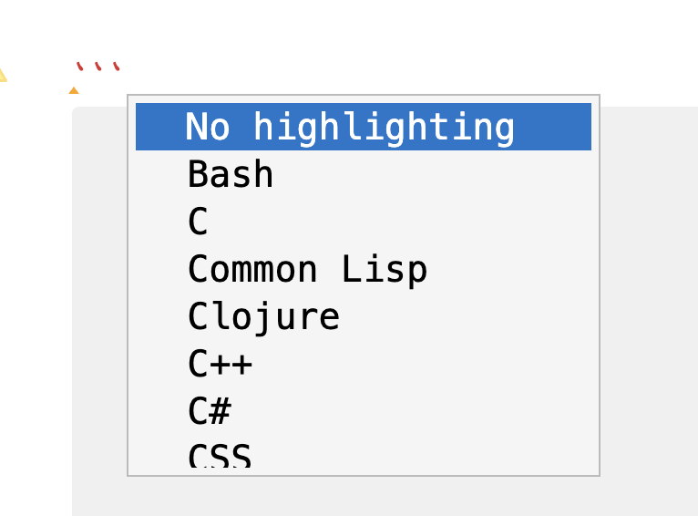

# Code Blocks

Like many other Markdown-based editors, Zettlr allows you to insert computer code into your documents. You can use this, e.g., to add code examples to guides or technical documentation, provide R or Python code for documenting CRAN or Python packages, or to add diagrams to it. Zettlr will treat your code blocks special and provide syntax highlighting to the code for easier readability.

## Inserting Code Blocks

Code blocks for Zettlr are simply [Fenced Code Blocks](https://spec.commonmark.org/0.31.2/#fenced-code-blocks) according to CommonMark. You can insert them using backticks (<code>\`</code>) or tildes (`~`):

<!-- Note: Indended to ensure the backticks are rendered -->
    ```typescript
    function myFunction (arg: string|number): boolean {
      return typeof arg === 'string'
    }
    ```

You need to use at least three backticks or tilde characters to start and end such a fenced code block. Please [refer to the specification](https://spec.commonmark.org/0.31.2/#fenced-code-blocks) to learn about all the various rules for creating code blocks.

## Providing a Language Hint in the Info String

As you can see in the example above, the beginning of the code block can be followed by a so-called "info string". This info string gives the app a hint as to which programming language the code block contains. This will enable syntax highlighting. If you provide no such info string, syntax highlighting will be turned off. Note, however, that depending on whether you use your documents outside of Zettlr, some systems will try to guess a code language if you do not provide such an info string. This means that, once you leave the context of Zettlr, other systems may try to enforce syntax highlighting.

In order to ensure your code is correctly highlighted, you will need to provide the correct language identifier in the info string. At the time of writing, Zettlr supports syntax highlighting of 53 different languages. This means it may be difficult to remember all the various info strings, especially since Zettlr sometimes supports multiple identifiers for a single language (e.g., `typescript` and `ts` for TypeScript).

To aid you in inserting code blocks, Zettlr provides all available programming languages you can use via an autocorrect menu. Whenever you start a fenced code block, Zettlr will automatically show a list of all available language identifiers. To filter the list, you can either start typing the actual language identifier, or the name of the language:



Once you select the correct language in the autocomplete, Zettlr will insert its identifier in the info string, and also automatically insert the closing characters for your code block, saving you a bit of time when inserting code.

### Info String Variant: Code Attributes

There is a variant of info strings that only Pandoc (and Zettlr) support, which gives you more freedom to adjust your text. For example, sometimes you might want to add additional attributes or classes to the code block. Depending on what you export your documents to, this can be helpful. This variant is called ["Fenced code attributes"](https://pandoc.org/MANUAL.html#extension-fenced_code_attributes). To use this info string variant, simply wrap it in curly brackets (`{}`) and use Pandoc's class syntax to provide your info string.

## Mermaid.js

Lastly, Zettlr supports adding diagrams using the Mermaid.js language. Mermaid.js is a simpler alternative to other diagram solutions, such as [UML](https://en.wikipedia.org/wiki/Unified_Modeling_Language), or [draw.io](https://www.drawio.com/).

To insert such a Mermaid.js diagram, you first start a fenced code block as usual. Then, you insert the code for creating your Mermaid.js diagram.

But here's the twist: Zettlr will automatically detect a Mermaid.js diagram code block and render it for you (using the info string `mermaid`). This means that you can write your diagram code into the fenced code block and directly get feedback on whether the diagram renders correctly, or if there are any errors.

At the time of writing, syntax highlighting for Mermaid.js diagrams is not supported, and the rendered diagram support is minimal (Zettlr only uses the basic theme to style your diagrams).

!!! note
    Mermaid diagrams need to be rendered using an engine. Zettlr ships with this engine, but Pandoc does not. This means that, whenever you export a file which contains Mermaid diagrams, Pandoc will treat the diagrams as what they are: sections of code. In order to render your Mermaid diagrams whenever you export a file, you will need a [Pandoc filter](https://pandoc.org/filters.html). This means that you will have to find a Mermaid filter for Pandoc (there is a variety of good options out there, and we do not wish to recommend any single one here), install it, and then provide it via the corresponding export profile you wish to use. Some of our community members have successfully done so. If you want to ask for help, please join [our community Discord server](https://go.zettlr.com/discord) or [ask on our community forum](https://forum.zettlr.com/).
