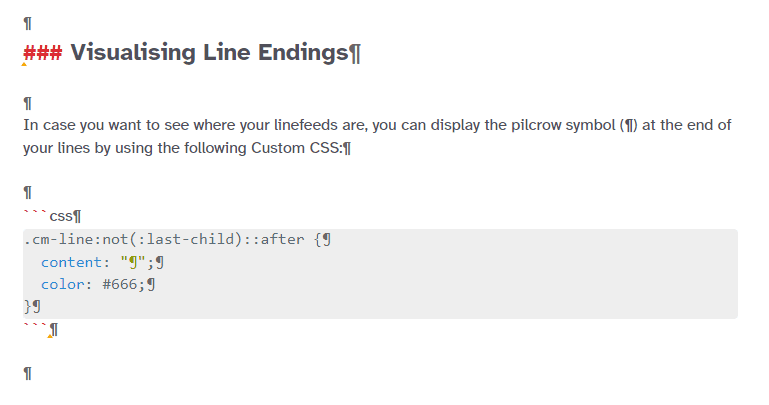

# Custom CSS

Since Zettlr version `1.1` it is possible to use custom CSS ([Cascading Style Sheets](https://en.wikipedia.org/wiki/Cascading_Style_Sheets)) to modify the complete appearance of the app. It's been a long requested feature, and it will open up many possibilities to customising the app (and maybe even the first truly user-generated content of the app?)

You can find the Custom CSS editor under `Zettlr->Custom CSS…` (macOS) or under `File->Custom CSS…` (Windows and Linux)

If you are unfamiliar with CSS, but don't want to simply copy & paste the guides on this page, you may choose to follow a short [tutorial on CSS](https://developer.mozilla.org/en-US/docs/Learn/CSS/Introduction_to_CSS)! There are many on the internet, so a quick Google search can also provide you with video tutorials, if you prefer those!

Below you can first find a general introduction in writing CSS, before I will list some examples that you can easily copy & paste to adapt your app to look differently. At the end of the page you may find a **complete class reference**.

## Writing CSS for Zettlr

If you don't want to write CSS for yourself and are only looking to **change the font**, head over to the next section!

Zettlr comes with a lot of predefined classes and IDs. It follows the generally-acknowledged wisdom not to make use of `style`-tags to directly define properties. Therefore, you can use classes for literally anything.

The styles of Zettlr are divided into both geometry and the actual theme, so you may want to stick with only changing the design of elements _without_ changing **any** geometry. Playing around with the geometry may be fun, but it may yield completely random behaviour, as some parts of the app depend upon the correct sizes of elements. In case you made a mistake, don't worry: Simply remove the `custom.css`-file from the data directory of Zettlr. You can find the data directory of your own system by looking at the paths provided in [the install documentation](../install.md).

Classes and IDs in Zettlr are always namespaced to the respective components (unless they're global), so to really override a rule you will have to use the complete namespace (or, if you don't want to add many rules and are lazy, use the `!important` override rule).

Everything is always namespaced to the `body`, which has a class `.dark` if the app is currently in dark mode. So to make sure a certain rule only applies while the app is in dark mode, make sure to prefix it with `body.dark`!

At the bottom of this page you may find a full class and ID reference so that you don't have to poke around in the app forever! (I already apologise, for it is only a simple dump generated from Zettlr's precompiled CSS files.)

## CSS Code Snippets

### Using a Custom Font with Zettlr

In case you do not like the default font delivered with Zettlr, or need to change it, simply paste the following code snippet into the custom CSS editor. Replace `your-font-name` with the **full name** of the font you want to use for Zettlr. Please replace `placeholder` according to the font:

- In case you want to use a **serif** font, such as Times New Roman, or Georgia, please use `serif`
- In case your font is **sans serif**, such as Arial or Helvetica, please use `sans-serif`
- In case you want to switch to the classic **monospace**, please use the placeholder `monospace`

The placeholder will make sure that even if your font cannot be found, an equivalent font will be used. It serves as a fallback.

Zettlr already ships a serif font, a sans-serif font and a monospace font! To use the bundled fonts, you can use `Crimson` for a modern serif font or `Liberation Mono` for a nice looking monospace font. (Lato is the default, so you probably don't want to put it there.)

```css
#editor * {
    font-family: '<your-font-name here>', <placeholder>;
}
```

### Random Unsplash Background Images

With the following code, you can make your editor have a different background image everytime you start it. The images are taken from Unsplash.com, a nice site with free photos. It uses the `Source API`, which will simply spit out a different image every time the URL is visited. You can test it out by simply [visiting the page and refreshing a few times](https://source.unsplash.com/random)! Please refer to the [Unsplash Source API reference](https://source.unsplash.com/) for more options (such as using an image of the day).

```css
/* Enter your custom CSS here */

#editor {
    background-color: transparent;
    background-image: url('https://source.unsplash.com/random');
    background-size: cover;
    background-position: center center;
}

body #editor .CodeMirror-sizer, body #editor .CodeMirror-gutter {
    background-color: rgba(255, 255, 255, .8);
    height: 100%;
}

body.dark #editor .CodeMirror-sizer, body.dark #editor .CodeMirror-gutter {
    background-color: rgba(0, 0, 0, .8);
}

#editor .CodeMirror {
    background-color: transparent;
}
```


### Visualising Line Endings

In case you want to see where your linefeeds are, you can display the pilcrow symbol (¶) at the end of your lines by using the following Custom CSS:

```css
.CodeMirror-line:not(:last-child)::after {
  content: "¶";
  color: #666;
}
```



### Hide the Toolbar in Distraction Free

Some people prefer the distraction free mode to be _really_ distraction-free. Zettlr does not hide the toolbar by default, because most people want to have access to all the tools and buttons even when writing distraction free. Still, if you belong to the group of people who prefer distraction free to be only the editor itself, rejoice! Hiding the toolbar in distraction free mode is as easy as one single line of CSS!

Simply paste the following line of CSS into the Custom CSS dialog, and from then on the toolbar will always be hidden:

```css
#editor.fullscreen, .CodeMirror-fullscreen { top: 0px; }
```

### Your Ideas

Do you have nice ideas for how to style Zettlr even more? If you have a good CSS snippet that works out of the box, feel free to [share it with us](mailto:info@zettlr.com) so that we can feature it here!

## Complete CSS Class and ID Reference

Below you can find the full and non-abbreviated list of *all* CSS classes and IDs. We've counted, it's over 300 at the moment.

Please note that we used an external package to extract the class names. We have already removed most of non-classes (such as colours and "dot-noted" values such as `.5%`) but we do not give any guarantee that we found all.

**Warning: The following list of reference may change in the future! So a class that has worked in one version of Zettlr may stop to work in another, because of changes to either the DOM or the class/ID name.**

```css
.eot
#iefix
.ttf
.woff2
.otf
.woff
.dragger
.popup
.clearfix
.modal
.dialog
.uuid
.image-preview
#app-lang
.inline
.time
.info
.button
.request-file
.file-select-group
.changelog
.code
.clear
.box-left
.box-right
.paper
.a4paper
.set-target
.bmargin
.lmargin
.rmargin
.tmargin
.image-size
.image
.png
#file-list
#imageWidth
#imageHeight
#preview-image-sizes
.pdf-preview
.error
.projects
#prefs-taglist
.flex
#next-sheet
#prev-sheet
.ui-tabs-nav
.ui-tabs-tab
.dicts-list
.user-dict
.dicts-list-item
.user-dict-item
.dicts-list-search
.selected-dict
.clusterize-scroll
.clusterize-extra-row
.clusterize-keep-parity
.clusterize-content
.clusterize-no-data
.hidden
.list-item
.meta
.date
.directories
.files
.id
.tags
.tex-indicator
.virtual-directories
.target-progress-indicator
.filename
.taglist
.tag
.tagspacer
.directory
.virtual-directory
.sorter
.sortName
.sortTime
.empty-directory
.empty-file-list
#file-tree
#directories-dirs-header
#directories-files-header
.collapse-indicator
.collapsed
.dead-directory
.project
.display-search-results
.empty-tree
#editor
#sidebar
#component-container
.expanded
#arrow-button
#sidebar-inner-resizer
#sidebar-resize
.fullscreen
.ui-resizable-handle
.ui-resizable-autohide
.ui-resizable-disabled
.ui-resizable-w
.CodeMirror
.CodeMirror-code
.mute
.CodeMirror-scroll
.CodeMirror-fullscreen
.cm-readability-0
.cm-readability-1
.cm-readability-2
.cm-readability-3
.cm-readability-4
.cm-readability-5
.cm-readability-6
.cm-readability-7
.cm-readability-8
.cm-readability-10
.cm-readability-9
.CodeMirror-vscrollbar
.CodeMirror-sizer
.CodeMirror-empty
.svg
.search-result
.cm-table
.size-header-1
.pomodoro
.CodeMirror-gutter-elt
.size-header-2
.size-header-3
.size-header-4
.size-header-5
.size-header-6
.cm-comment
.cm-fenced-code
.cm-formatting-task
.CodeMirror-cursor
.cm-escape-char
.cm-formatting-code
.cm-formatting-code-block
.cm-formatting-em
.cm-formatting-quote
.cm-formatting-strong
.cm-formatting-list-ol
.cm-formatting-list-ul
.cm-link
.cm-url
.cm-zkn-link
.meta-key
.cm-zkn-tag
.cma
.CodeMirror-gutters
.CodeMirror-foldgutter
.CodeMirror-foldgutter-folded
.CodeMirror-foldgutter-open
.heading-tag
.CodeMirror-foldmarker
.CodeMirror-hints
.CodeMirror-hint
.cm-hint-colour
.sk-circle
.sk-child
.sk-circle2
.sk-circle3
.sk-circle4
.sk-circle5
.sk-circle6
.sk-circle7
.sk-circle8
.sk-circle9
.sk-circle10
.sk-circle11
.sk-circle12
.sk-three-bounce
.sk-bounce1
.sk-bounce2
.print-window
.quicklook-standalone
#init-print
.title
.find
.body
#toolbar
.content
.darwin
.win32
.linux
.file-info
.searchbar
#search-progress-indicator
.menu-popup
.dir-open
.file-new
.stats
.tag-cloud
.preferences
.file-save
.file-delete
.file-rename
.formatting
.readability
.share
.show-toc
.toggle-attachments
.spacer
.separator
.end-search
.notify
.popup-arrow
.down
.up
.left
.right
.toc-link
.small
#header-formatting
.row
.table-generator
.cell
.btn-share
.htm
.pdf
.docx
.odt
.plain
.tex
.revealjs
.revealjs-beige
.revealjs-black
.revealjs-league
.revealjs-moon
.revealjs-serif
.revealjs-sky
.revealjs-solarized
.revealjs-white
.rst
.rtf
.org
.textbundle
.textpack
#reveal-themes
.markdownHeading1
.markdownHeading2
.markdownHeading3
.markdownHeading4
.markdownHeading5
.markdownHeading6
.markdownBlockquote
.markdownLink
.markdownImage
.markdownCode
.markdownComment
.markdownMakeOrderedList
.markdownMakeUnorderedList
.markdownMakeTaskList
.markdownInsertTable
.markdownDivider
.insertFootnote
.markdownBold
.markdownItalic
.removeFootnote
.search
.footnote-edit
.regexp
#searchNext
#replaceNext
#replaceAll
#attachments
#open-dir-external
.csl-bib-body
.csl-entry
.cb-toggle
.radio-toggle
.toggle
.cb-group
.linux-window-controls
.windows-window-controls
.close
.minimise
.resize
.maximise
.theme-container
.theme-container-item
.theme-mockup
.traffic-lights
.traffic-light-close
.traffic-light-full
.traffic-light-min
.toolbar
.file-list
.file-list-item
.editor
#theme-berlin-mockup
#theme-frankfurt-mockup
#theme-bielefeld-mockup
#theme-karl-marx-stadt-mockup
.cm-meta
.cm-def
.sb-annotation
.alert
.success
.warning
.quicklook
.cm-stex-mode
.cm-css-mode
.cm-attribute
.cm-builtin
.cm-string
.cm-string-2
.cm-variable
.cm-variable-2
.cm-keyword
.cm-property
.cm-type
.cm-atom
.cm-number
.CodeMirror-focused
.CodeMirror-selected
.cm-formatting
.cm-tag
.cm-bracket
.cm-formatting-header-1
.cm-formatting-header-2
.cm-formatting-header-3
.cm-formatting-header-4
.cm-formatting-header-5
.cm-formatting-header-6
.cm-quote
.cm-strong
.cm-em
.cm-spell-error
.cm-zkn-id
.citeproc-citation
.cm-hr
.CodeMirror-guttermarker-subtle
.CodeMirror-hint-active
.selected
.alias
.file
.highlight
.dir
.root
.active
#searchWhat
.not-found
#replaceWhat
.pomodoro-task
.pomodoro-short
.pomodoro-long
.pomodoro-meter
.pomodoro-value
.task
.short
.long
.indicator-meter
.indicator-value
.error-info
.has-error
.form-inline-buttons
.prefs-submit-group
.ui-tabs-active
.tippy-popper
.table-helper-align-button-container
.table-helper-remove-button-container
.table-helper-add-button
.table-helper-align-button-line
.table-helper-remove-button-line
.table-helper
.dark
.container
.cm-formatting-escape
.maximise-svg
```
