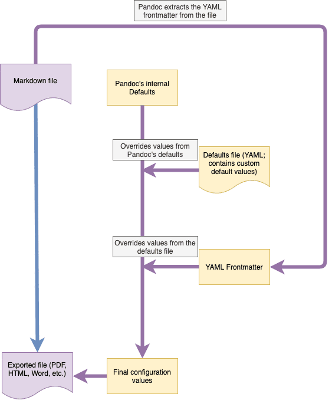

# Defaults Files

Defaults files are a way to define default values for many of the variables that Pandoc uses internally to facilitate both your imports and exports. Defaults files resemble [YAML frontmatters](yaml-frontmatter.md), but are more powerful and apply to all your files instead of just a single one.

Previously, Zettlr would use defaults files internally, but Zettlr 2.0 finally gives you the ability to edit these files yourself.

> Editing these files can be a little bit tricky, so expect to export a test file multiple times before you have got it right. It is a trial & error process. However, Zettlr ships with reasonable default settings, so if you do not have special requirements, you can leave these files as they are.

## What are Defaults Files?

Defaults files, also known as profiles, are YAML files which contain settings that control the Pandoc behaviour for a given export or import format. They reside in your user data folder and can be edited in the [assets manager](assets-manager.md).

Zettlr requires a certain set of defaults files. You can identify these files in the assets manager by their lock icon that indicates their status as "protected". Whenever you rename such a protected file, Zettlr will immediately recreate it. You can leverage this behavior to effectively make a copy of one of these default files. Likewise, when you delete a protected file, Zettlr will recreate it, which allows you to effectively reset the file to default.

Aside from these protected files, you can add as many additional files as you wish. Give them notable names so that you can find them in the export format dropdown list later on.

> The full documentation for what you can do with defaults files can be found in the [Pandoc manual](https://pandoc.org/MANUAL.html#default-files). Make sure to refer to that manual when you edit defaults files.

## Requirements for Defaults Files

The defaults files (also called "profiles") as used by Zettlr have a certain set of requirements which you must keep in mind when editing them.

Each defaults file must have a `writer` and a `reader` property. These tell Zettlr the capabilities of the profile and also determine if a profile is considered an import profile or an export profile.

If the `writer` property is a Markdown-compatible writer, this means that the profile will be considered an import profile, as the result of the conversion is Markdown. Likewise, if the `reader` property is a Markdown-compatible reader, this means that the profile is considered an export profile.

If those properties are missing, Zettlr will indicate that the profile is invalid and you'll need to fix it before you can use it.

> Similarly, if your profile contains a syntax error, it will also be indicated to you so that you can fix it. The defaults file editor contains a so-called "linter" that highlights where the error is.

Pandoc supports Markdown extensions (i.e. for smart quotes, emojis, etc.). These are specified by adding them after the `reader` or `writer` properties using `+`-signs. So if you require extensions to the standard Markdown reader, you can add these to the `reader` or `writer` properties. Similarly, if an extension is enabled by default, you can use a `-`-sign to disable it.

For example: `reader: markdown+definition_lists+mmd_title_block+bracketed_spans+fenced_divs`. This will use the Markdown reader and configure it to additionally use definition lists, multi-markdown title blocks, bracketed spans, and fenced divs. The various extensions are described [in the Pandoc documentation](https://pandoc.org/MANUAL.html#extensions).

## Which Variable Overwrites Which?

One problem you may encounter when exporting files is that sometimes variables that you define in your YAML frontmatter are ignored, while the same variable works in defaults files, and vice versa.

It is paramount to understand how Pandoc determines the final and effective set of parameters which it will use to facilitate your import or export. In below's graphic, you can see how each import or export is being done.

First, Pandoc will load its own internal defaults which are hard-coded into the binary. Any variable that you do not define yourself will be set to some default Pandoc defines.

Then, Pandoc will load in the defaults file Zettlr provides. Every variable defined in there will replace the default inside Pandoc's configuration.

Lastly, Pandoc will parse the YAML frontmatter(s) of the file(s) you are currently trying to import or export. These variables can replace those set by the defaults files, but usually not all. You may notice that defaults files can contain a metadata field, and any value in there can generally be replaced by a YAML frontmatter property. Please see the documentation on [YAML frontmatters](yaml-frontmatter.md) for more information.

**Example**: Let us assume you have defined a `title` for all your Word exports in the defaults file for the `docx` writer. If you do not use any frontmatter, this variable will be used for each and every export to Word. But if you specify the `title` property inside a YAML frontmatter, this file – when exported to Word – will have its own title set.

> One common use-case for defining variables inside a defaults file which you could also define on the level of YAML frontmatters would be the `lang`-property. By default, Pandoc sets the language of each import and each export to `en-US`, yielding US-American number delimiters and quotes. If you regularly export into, say, French, it might make sense to set the `lang` property directly in your defaults files to `fr` so that files are being exported using that locale by default. Then you can still overwrite the property to something different within individual files by setting the corresponding YAML frontmatter variable.
