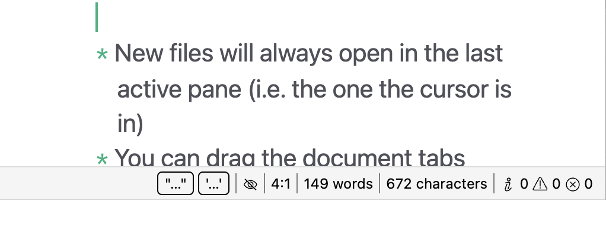
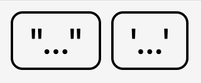

# Statusbar

The statusbar is a component that displays contextual information for each open document, and allows you to quickly change certain settings that make sense on a file-by-file basis.

By default, the statusbar is not enabled to keep the initial appearance minimalistic. However, if you need to work productively with text and don't mind another element in the editor, we highly recommend to enable the statusbar in the **preferences &rarr; editor &rarr; "Enable statusbar"**.

## Overview

The statusbar resides at the bottom of each editor view and shows you information for each individual file. Some elements allow you to quickly (and globally) change certain settings.

Some elements show conditionally (for example, the LanguageTool item does not show if you did not enable LanguageTool), some are purely informational, some are interactive.

In the following, we explain every available statusbar item **from left to right**, under which circumstances it will appear, and how you can interact with it. All statusbar items are separated by a vertical line.

## Magic Quotes Status

The very first item on the statusbar indicates the current status of your MagicQuotes setting. We have figured that for some workflows, quickly changing the locale of these quotes can improve productivity (specifically if you are working bilingually).

It displays first the primary and then the secondary quote settings within small boxes. You can click on it to summon a contextual menu that lets you switch both primary and secondary pairs for a given locale.

> Depending on which language you select, the context menu will have more than one checked entry. Many countries use the same set of primary and secondary quotes.

Displays

: Always

Interaction

: Left-click to summon a MagicQuotes selection menu.

## Readability Mode

The second item shows you the status of the readability mode. Click on it to enable or disable the readability mode. The icon will toggle between a crossed eye (readability mode off) and an eye (readability mode on).

Keep your mouse cursor over the icon to view the currently active readability mode.

Displays

: Always

Interaction

: Left-click to toggle the readability mode.

## Cursor position, word and character counters

The next three elements are entirely informational and replicate information that you know from the toolbar.

The first element shows you the position of your (main) cursor or the beginning of your (main) selection head in the format `Line number: Column/Character`.

The second and third elements display the current word and character counts for the document.

Displays

: Always

Interaction

: This element is non-interactive.

## Input Mode

The input mode element tells you what editor input mode is currently active. It does not show while you're in the normal mode, only in the Emacs and Vim modes.

Displays

: Only when you use the vim or emacs input mode.

Interaction

: This element is non-interactive.

## LanguageTool Status

The second-to-last element displays the current status of the LanguageTool linter. It only shows when you have activated the LanguageTool integration in the settings, and will cycle through the various status it may have:

* When LanguageTool is idling, it will show a checkmark to indicate that it has finished checking your text, and next to it the current language.
* When LanguageTool is currently checking your text, the icon will change to an hourglass to indicate that it currently processed your text.
* If there has been an error, the icon will change to an error symbol and a short error message will explain what is wrong.

When you open a file, LanguageTool will start with the idle status and display "auto" as the language. This indicates that LanguageTool first needs to detect the language in your text. After the first check, it won't show "auto" anymore but only the language it is checking for.

While LanguageTool is very good at detecting the language of your text automatically, there may be errors. In that case, you can click the LanguageTool statusbar item to override the automatically detected language.

Since space on the statusbar is limited but the potential for various errors is large, the statusbar item will only give you a short feedback that something is wrong (e.g., "offline", if Zettlr could not connect to the service, which may have a variety of causes). If you are not sure why it did not work, have a look in the logs, which will contain the (technical) precise error message.

Displays

: When LanguageTool is active in the settings.

Interaction

: Click to summon a menu to select the language to check for.

## Diagnostics

The final statusbar element displays a list of diagnostical messages. As we outline in the [Style and Grammar](style-and-grammar.md) section, Zettlr runs a variety of different linters that can all flag potential problems, style issues, and suggestions. The diagnostics counter gives you a comprehensive overview over how good you are doing.

The counter displays the total of all three types of issues: informational messages (the "i" icon), warnings (the triangle with exclamation mark), and errors (the circled "x").

A handy function of the diagnostics counter is that you can open a panel below the statusbar when you click on it.

This diagnostics panel gives you every message as a list which you can navigate easily. While you can scroll the document to find each of these messages, there may be instances where you may find it easier to work with a list of issues, rather than having to search for faint, squiggly lines in your document.

Displays

: Always

Interaction

: Click to open the diagnostics panel.
