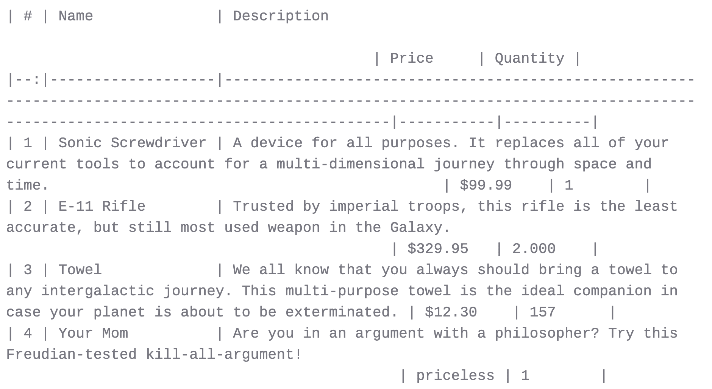
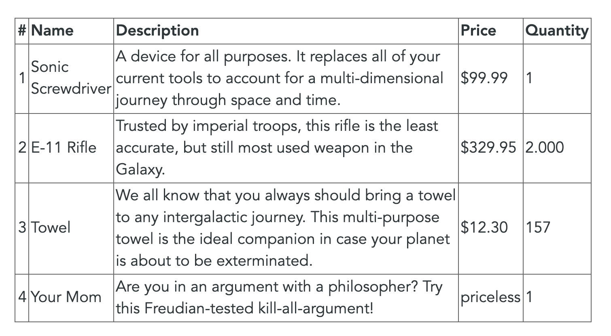
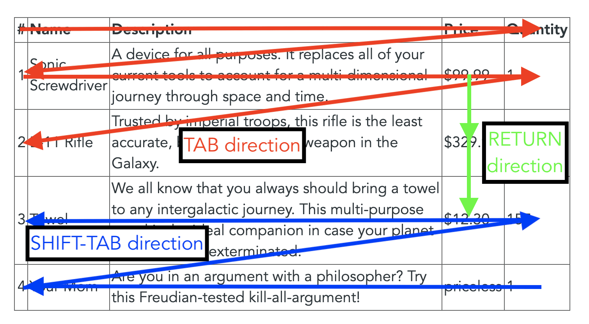
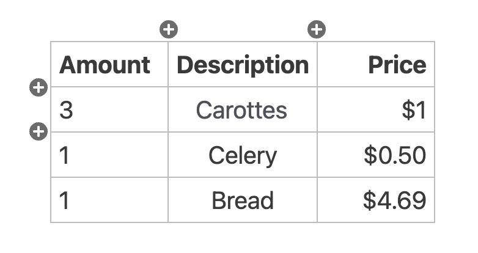

# Tables in Zettlr

Markdown tables are a notoriously difficult thing. Due to the nature of Markdown to be as simple as possible, complexity is what suffers most. Markdown is the perfect choice for writing text and most of what we use during writing (e.g., links, images, headings, or quotes) is handled perfectly in Markdown. Yet, from time to time, we also want to include some data in our works, or tables are simply a better way of visualising ideas.

## Introduction to Tables

Tables in Markdown are written using a very basic syntax -- each line resembles one row and the table cells are encapsulated with pipe-characters:

```
| Cell A:A | Cell A:B |
| Cell B:A | Cell B:B |
```

Optionally, you can also add a heading row, which may also indicate the alignment using colons (left, right, or center):

```
| Left aligned | Centered content | Right aligned |
|--------------|:----------------:|--------------:|
| Lorem        | Ipsum            | Dolor         |
```

Note that it doesn't matter how you align the table's contents in your documents, as long as the colons are placed accordingly. The table will be exported using the correct alignment later on.

But as you can see, even with only two words per column, the Markdown table tends to get rather long. As you cannot use multiple rows for cells, here's where you tend to get into serious problems when you need to insert a whole sentence in each cell. Take for instance the following example:

```
| # | Name              | Description                                                                                                                                                                     | Price     | Quantity |
|--:|-------------------|---------------------------------------------------------------------------------------------------------------------------------------------------------------------------------|-----------|----------|
| 1 | Sonic Screwdriver | A device for all purposes. It replaces all of your current tools to account for a multi-dimensional journey through space and time.                                             | $99.99    | 1        |
| 2 | E-11 Rifle        | Trusted by imperial troops, this rifle is the least accurate, but still most used weapon in the Galaxy.                                                                         | $329.95   | 2.000    |
| 3 | Towel             | We all know that you always should bring a towel to any intergalactic journey. This multi-purpose towel is the ideal companion in case your planet is about to be exterminated. | $12.30    | 157      |
| 4 | Your Mom          | Are you in an argument with a philosopher? Try this Freudian-tested kill-all-argument!                                                                                          | priceless | 1        |
```

In Zettlr, it would look like the following:




Even though the table cells are each aligned to fit the total width of each column, you cannot make out the fact that this is indeed a valid Markdown table, as each line gets wrapped and the table structure is impossible to see. Without the counter in the first column, you would even have a hard time making out the number of rows in it.

## The Table Editor

Obviously, writing Markdown tables is sometimes unavoidable, but always painful. It would be great if you could simply edit the table like you are used to from, e.g., Word processors, right? That's where Zettlr's built-in **table editor** (available from `1.4`) comes into play!

While Zettlr maintains a strict policy on [WYSIWYG](https://en.wikipedia.org/wiki/WYSIWYG) ("What You See Is What You Get"), as it tends to blur your perception of what you are actually writing, tables are exempt from this policy. Because even though the [WYSIWYM](https://en.wikipedia.org/wiki/WYSIWYM) ("What You See Is What You Mean") approach is superior to WYSIWYG, there's simply no use in applying this to tables.

Therefore, to aid you with writing tables, Zettlr is now shipping with a powerful table editor that brings to you everything you need to not completely lose your mind while creating tables in your documents. With the table editor, the above mentioned table looks like this:



Much better, am I right? Zettlr's table editor takes all Markdown tables found in your document, converts them into an HTML representation with editable content cells, and displays these instead of the underlying Markdown. This completely hides the Markdown source, but as we said, in this case this approach is much more favourable.

Table editor needs to be enabled in Preferences, under the `Editor` tab. When enabled, it will recognize the tables in the active document and make them easily editable. You can **enter the editing mode** simply by clicking into any of the cells inside the table and adding your content. The active cell will be highlighted for you. Additionally, the keyboard navigation that you know from famous word processors has also been implemented so that you can use `Tab`, `Return`, and the Arrow keys to navigate the table. Additionally, adding and removing columns and rows is also possible with the table editor's **edge buttons**. These are buttons that will appear when you hover over the table and let you perform various actions on the table.

> Attention! When you activate the table by clicking inside one of the cells, you are entering the edit mode. To save your changes, make sure to **click outside of the table once you are done**, to exit the editing mode! Only then will the changes you've made to the table be applied to the underlying Markdown table.

## Keyboard Navigation

But let us first turn to the keyboard navigation. You have the following shortcuts at your disposal:

- `Tab`: Move to the next cell. If the last column is active, move to the first cell in the next row. If your cursor was in the last column of the last row, a new row will be added automatically.
- `Shift-Tab`: Move to the previous cell. If your cursor was in the first column, move to the last cell in the previous column.
- `Return`: Move to the same column in the next row. If your cursor was in the last row, a new row will be added automatically.
- `Arrow Up/Arrow Down`: Move to the same column in the previous/next row. No new rows will be added if you are in the first or last row.
- `Arrow Left/Arrow Right`: Move the cursor left/right. If the cursor is at the beginning/end of the cell's contents, move to the previous/next cell.

With these shortcuts, you can easily enter content into your tables using natural movements. You would first want to fill out the table header and afterwards you want to add one set of data per line. Therefore, `Tab` is your friend here:



## The Edge Buttons

Another goodie of the table editor are its so-called **edge buttons**. These are two groups of buttons and four directional buttons that will appear once you hover over a table:



They are transparent at the beginning to not cover up the content of your table. Move your cursor over an edge button to make it opaque. The buttons should be rather self-explanatory. The four `(+)` buttons at the center of the edges of the table will **add a row or column respectively** at the indicated position. So click the left add button to prepend a column to the left side of the currently active cell, and click the bottom add button to append a row below the currently active cell.

At the top of each table, there are two additional button groups. The left button group contains three buttons that **align the currently active table column** left, center or right. Click one of the buttons to apply the alignment. The change will be displayed immediately for your visual confirmation.

The right button group contains two buttons for **removing the currently active table row or column**. Simply place your cursor inside any cell inside the row or column you wish to remove and hit one of the buttons.

> Always make sure to place your cursor in the correct cell before removing columns or rows to save you pain in having to exit table editing, and applying the "Undo" command.


## Complex tables

Until now we've only covered basic tables. But what if you need to display more complex tables? Then, even the table editor is at its end. Cells spanning multiple rows or columns are simply impossible given the limited syntax of Markdown tables. To add these, you'll have to use native HTML or LaTeX commands. These give you the maximum amount of freedom to do whatever you like.

Always remember: Tables in Markdown are used as an _aid_ to your _writing_. This means if you are dealing with complex datasets which you need to add to a paper, e.g., in the sources section, there are great tools out there to [transform your RDataset](https://tex.stackexchange.com/questions/364225/export-tables-from-r-to-latex) or Stata datafile into LaTeX or HTML.

One idea to insert datasets into your papers without much copying and pasting would be to combine several features of Zettlr:

- Create a project for your paper
- Create the necessary files to structure your paper (e.g., `01 - Chapter 1.md`, `02 - Chapter 2.md`, `03 - Chapter 3.md`, `04 - Chapter 4.md`)
- Inside your R-Project or Stata project, add a command that exports your data to a file `05 - Data.md` in your project directory whenever something changes.
- As soon as you export your paper, the externally managed file `05 - Data.md` will be automatically appended, making sure your data is shipped with your document.