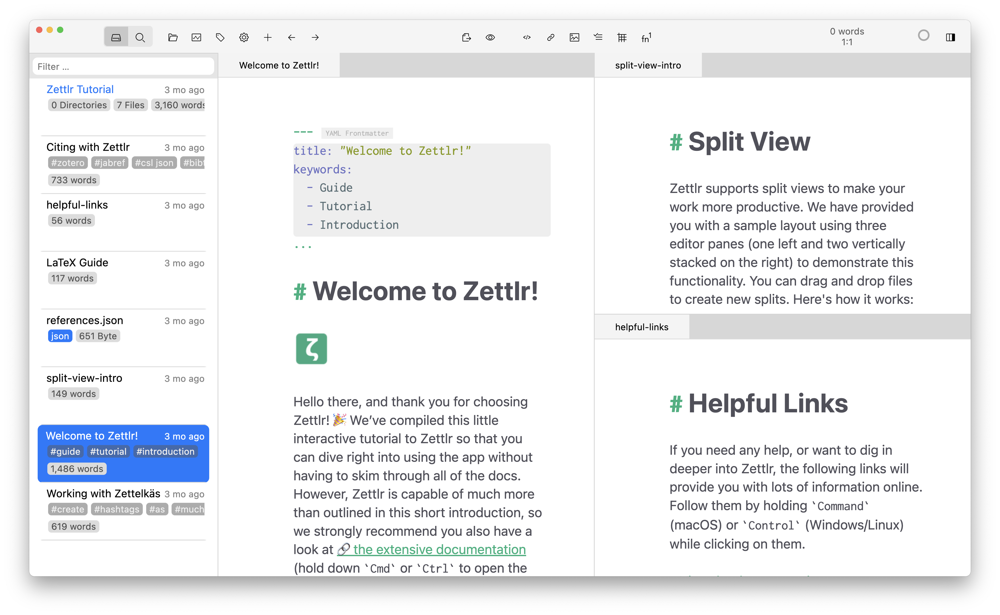

# User Interface

After you have installed and started Zettlr for the very first time, you will be greeted with the main application window, which will show you a tutorial and also display some of the advanced features so that you can experience them right from the start.

On this page we want to introduce you to the user interface of the application.

!!! note

    Within this documentation, you will mostly find screenshots of only one operating system. While the buttons and elements look differently depending on the platform, their location will always be the same. In case of serious deviations, we will note them as appropriate.

## The Main Application Window

Let us first have a look at the main application window. The screenshot shows the layout on macOS, but the position of the elements is the same on all other platforms.

Let us introduce the various components one by one.

### Toolbar

At the top, you can see the **toolbar** that contains the window buttons ("traffic lights") on the top right, and a series of buttons. On **Windows** and **Linux**, there are no traffic lights, and above the toolbar you will see the menu bar and a title bar with the window controls. The toolbar contains general controls for quick access to frequently used elements and commands.

There are a few important controls which we want to introduce. First the left-most control element, which is a three-way-toggle. You can see that the left button of this element is highlighted, indicating that the **file manager** is currently visible (the left pane in the window). If you click the right button, this will exchange the file manager with the **full-text search** panel. If you click the button for one of the panels again, it will entirely hide the left panel of the window.

The next button allows you to open new [**Workspaces**](workspaces.md) which will then show up in the file manager. The third button shows you some writing statistics. If you click on it, a small popup will show you a summary of your writing behavior, and if you click the button within this popup, it will open the statistics window, that also contains the **graph view**.

The button that looks like a cog will open the [**preferences**](../reference/settings.md). The **share** button allows you to [**export**](export.md) individual files.

The next set of buttons apply only to the currently focused document, and can be used to insert various elements, such as links, images, lists, tables, or footnotes.

To the right of the toolbar, you will see a word counter and position info. This display can be adapted to show character counts of your files instead.

Next, you will see the [**pomodoro**](../advanced/pomodoro.md) counter that you can use to time your work sessions.

The last button will open the [**sidebar**](sidebar.md) that contains information on the current document, such as a table of contents, a list of references, and related files.

!!! note

    You can enable or disable most of the buttons that will be shown here in the preferences to tailor the toolbar to your needs.

### File Manager

The next big element that you will see here is the file manager to the left side of the main window. The file manager shows you all workspaces you have loaded and all files. We have a [dedicated page to explain it in more detail](../core/file-manager.md).

The file manager has three modes that you can choose in the preferences:

* **Thin**: The thin mode, which is the default, shows either a tree of your folders, or a list of files within the currently selected folder. When you start Zettlr for the first time, you can see the file list. Switch to the folder list by moving your mouse to the top of the file manager and click the appearing arrow button. You can also horizontally scroll if your mouse or trackpad supports that.
* **Expanded**: Same as the thin mode, but both the folder and file lists will be shown at the same time. Makes most sense if you have a wide monitor.
* **Combined**: This is a more classic mode that will show both folders and files interleaved. It shows you less file information at a glance, but is much faster to navigate.

At the top of the file manager, you can find a filter textbox that you can use to quickly search for files and folders inside your workspaces. You can search for any metadata here, including the file or folder name, the file title, or keywords you use inside your files. You can focus the textbox by pressing `Cmd/Ctrol+Shift+T`.

!!! tip

    When the filter textbox is focused, you can use the arrow keys to navigate through your files. Once the correct file or folder is highlighted, press Enter to select or open it. You can quickly navigate through longer lists by holding down `Ctrl` or `Cmd`, or `Shift`.

### The Editor Area

Now let's head over into the main area: The editor area. The main part of the application window is occupied by your documents. When you first start Zettlr, you will see three documents open: To the left, you can see the introduction to our tutorial, to the top-right you can see a small introduction to the split view (which the process of splitting up the editor area into multiple smaller parts is called), and to the bottom-right we have collected a set of useful links.

When you open files, they will be opened as **tabs** inside the last active editor area ("pane"). If you do not want to have too many files open, you can also activate the setting to "Avoid opening files in new tabs", which will try to replace open documents instead of opening new ones.

Once you have several documents open, you can **drag and drop** the tabs onto other areas, to move the documents there, or drag them to the **corners** of one of the editor panes to split that pane into two along the given direction.

Editor panes will automatically close once you have closed the last open document in them. If no documents are open at all, the window will be greyed out and a faint Zettlr-logo will show in the background.

## Opening new Windows

You can not only split the editor area into multiple parts to view several documents at once, but you can also create additional windows. For this, simply press `Cmd/Ctrl+Shift+N`. You can open as many windows as you like, and split their editor area as finely grained as you want.

There are other windows, too, which are introduced in the corresponding sections:

* The [**settings window**](../reference/settings.md)
* The [**assets manager**](../advanced/assets-manager.md)
* The [**statistics window**](#TODO)
* The [**tag manager**](#TODO)

This concludes the introduction to the user interface. We recommend you follow the guides in the tutorial to learn and experience Zettlr's UI more practically. After you are done going through the tutorial, you can come back here and learn about the various functions in the "Basic Usage" section.
