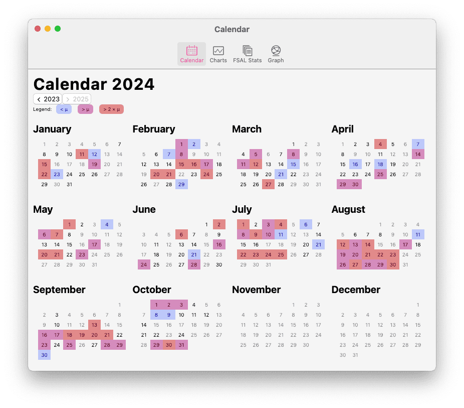

# Writing Statistics

Zettlr offers a set of basic writing statistics that can help you understand the way you write. There are statistics based on how much you write day to day as well as general statistics on the Workspaces and files you have open in the app.

The app continuously tracks how many words and characters you type throughout the day. These statistics are relatively simple and are not intended to be precise. They merely serve as indicators for your broad writing behavior and should not be taken as anything more than that.

## How Zettlr Tracks Your Writing

Zettlr uses a very simple algorithm to remember how many words and characters you write throughout the day. It starts when you open a document. As the app opens a document, it calculates how many words and characters are contained therein and notes these numbers. Then, when you save a document – either using autosave or manually pressing <kbd>Cmd</kbd>/<kbd>Ctrl</kbd>+<kbd>S</kbd> – the app will calculate the new word and character counts. What it will track is the difference between these two numbers. It records only positive values, so if you deleted more words than you added, it will not subtract any values from the recorded ones.

This strategy is fairly simple and straight forward, but comes with some caveats:

* If you paste large amounts of text, this can inflate your statistics unnaturally
* The counters are designed to be fast, not precise, so they employ very basic heuristics and may not accurately reflect especially character counts in non-latin scripts such as Arabic, Tamil, Chinese, or Japanese.
* Up until November 2024, Zettlr only tracked word counts, not character counts, so there will be a difference in historic data

!!! tip

    If you want to adapt your writing statistics manually after the fact, you can modify the file `stats.json` in the app's data directory. Note that Zettlr must be closed before you can adapt the file, otherwise the app will overwrite your changes. You can find the data directory in the [setup instructions](../getting-started/setup.md).

## Viewing Writing Statistics

To access the writing statistics, click the "View Stats" button in the left section of the toolbar. This will open a popover that contains several pieces of information. First a few counts: the amount of words you have written in the last 30 days, your rolling daily average over the past 30 days, and the amount of words you have written today.

As an additional motivation to get writing, the popover also includes a message indicating if you haven't gotten close to your own rolling average, getting close, or if you have surpassed your average writing statistics.

Lastly, the popover contains a small graph that plots the amount of words over the past 30 days to give you a visual impression of your writing performance. Next to this graph, you will find a button that when clicked will open the full statistics window.

## The Stats Window

The statistics window contains a lot of comprehensive data on your files and your writing process. It is also the window that includes the [graph view](../advanced/graph.md).

The first view of the statistics window shows the calendar. It is focused on the running year and gives you an overview over your entire year of writing. It shows you days on which you have not opened the app in gray, and then uses colors to convey the amount of words you have written. Zettlr uses light blue for days on which you have written less than your daily average, purple for days where you have surpassed the daily average, and red for days where you managed to write more than double the amount of daily average words.

Using the buttons below the heading, you can navigate through all the years for which there is data.

The second view in the window includes the same information, but as graphs, indicating either per month or per year how much you have written.

The third view contains data on the files you have loaded into the app. It shows you a variety of summary statistics on the files, folders, and your largest and smallest files.

The fourth view contains the graph view. [Refer to its dedicated section in this documentation to learn more](../advanced/graph.md).
