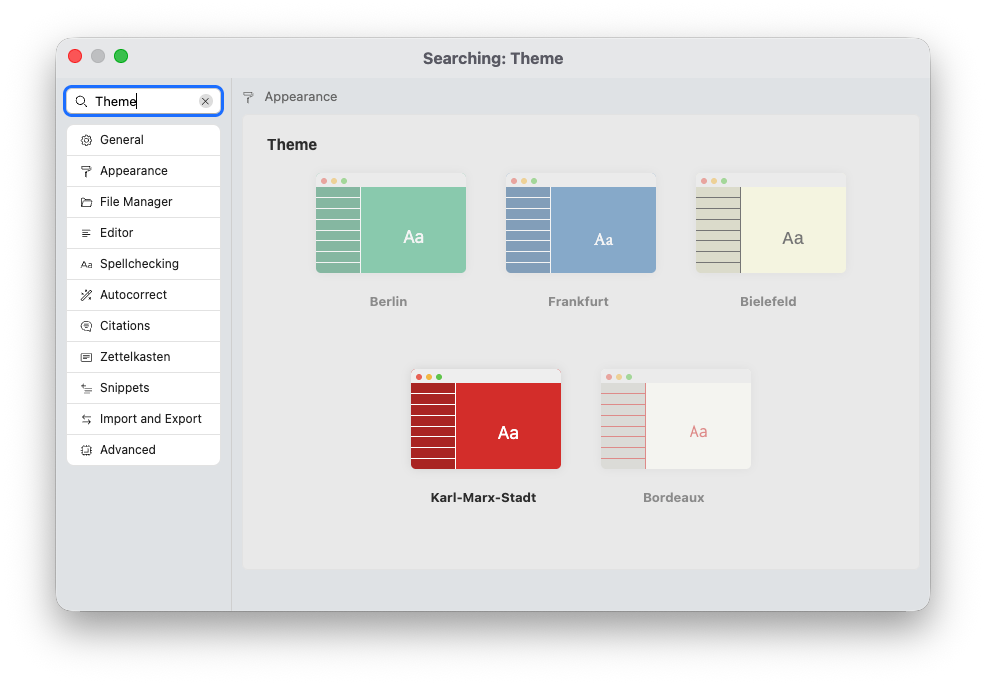
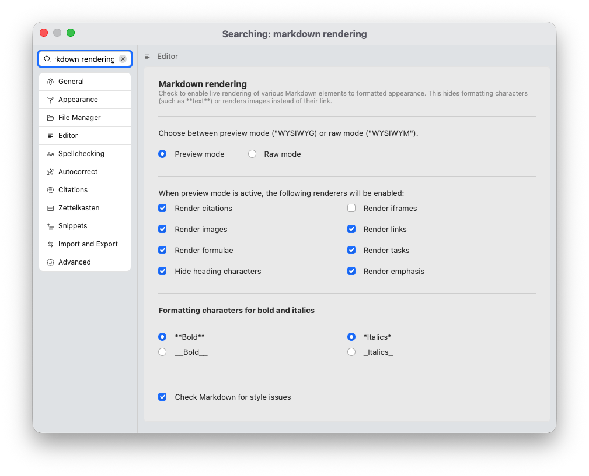
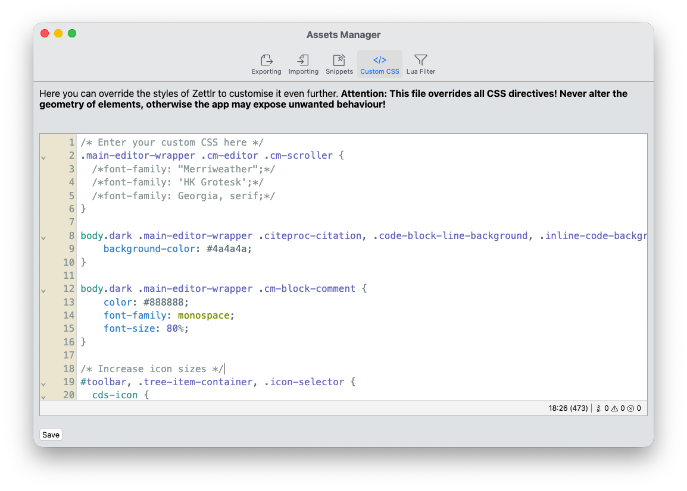

# Appearance

As the most powerful component, the editor offers a plethora of appearance choices. In this section, we describe them:

* Editor Theme
* WYSIWYG vs. WYSIWYM (or: preview vs. raw)
* Custom CSS

## Editor Theme

The simplest way of changing the appearance of the editor is to select a different editor theme.

To select the theme, open the preferences and navigate to “Appearance” → “Theme.” Currently, Zettlr ships with five themes that all change the appearance of the editor:

* **Berlin**: This is the default theme. It uses a green accent color and features sans-serif font.
* **Frankfurt**: This theme features a blue accent color and a serif font.
* **Bielefeld**: This theme features a yellow accent color and a monospaced font.
* **Karl-Marx-Stadt**: This theme looks like the Berlin theme, but uses a red accent color.
* **Bordeaux**: This theme is similar to Bielefeld. However, it uses both a red and cyan accent color, and a different monospaced font.

Each theme comes with both a light and dark color palette, and switches it according to the appearance settings of the app.

## Preview and Raw Modes

The next level of customization concerns *how* the Markdown is displayed to you. Markdown itself is a form of “source code” that needs to be converted before you can distribute any text written in it.

In the early days of writing Markdown, all apps would only display the actual Markdown source in its raw state. However, soon, people started demanding a more user-friendly way to view Markdown documents. And this is reasonable: For example, there is a huge difference in readability if you see just the syntax declaring an image, or if the actual image shows up. The latter makes understanding your document much simpler. Additionally, even though Markdown syntax is designed to be out of your way when writing, hiding the syntax completely can improve the legibility of your documents as you author them.

Today, there are two ways of pre-rendering Markdown for preview purposes. Many apps will provide a separate pane in which your Markdown is displayed in a rendered state next to the Markdown source code. Some apps, however, will render the Markdown in-place. Zettlr does the latter.

To configure whether and which elements will be replaced with rendered versions for easier readability, you can use the “Markdown rendering” setting in the “Editor” section of the preferences.

This section gives you many options for how Markdown is rendered. First, you can in general choose between **WYSIWYG** (What You See Is What You Get) and **WYSIWYM** (What You See Is What You Mean). The former is called “preview,” and the latter is called “raw.”

This setting determines if Markdown rendering is enabled at all. If you select the “Preview mode” you can then, in a next step, specify which elements shall be pre-rendered. Some people, for example, may prefer to only render images and links, but not citations. To get the “full” rich text-experience, check all boxes.

!!! tip

	You do not have to use the preferences to toggle between preview and raw mode. If you activate the editor's statusbar, you can click the "Rendering" statusbar item to switch between the two modes immediately.

!!! note

	Even the preview rendering mode is only an approximation of how your document will look like when you export it to Word, HTML, or PDF. This has two reasons. First, each export format has its own styles that it will apply. Headings in a Word document *will* look different from headings in a PDF file. And this becomes even more true if you utilize export profiles with your own custom templates. The second reason is that you still need to be able to edit the file. If we were to produce a truthful representation of the Markdown document in an exported state, we would also need to sometimes collapse linebreaks, move elements around, and so on. We can't do this without introducing the risk of potential data loss or other glitches.

## Custom CSS

The final stage of customizing your editor is to use custom CSS. CSS, or Cascading Style Sheets, is a layouting language that can be used to style websites. And, since Zettlr is built upon web-technologies, you can also use CSS to customize the editor appearance.

Many of our users are using custom CSS to individualize their experience. This starts with custom font selection, and goes to implementing some advanced style changes.

!!! danger

	Custom CSS is very powerful, but this also means that you can literally break the app, if you are not careful. We recommend you only implement subtle changes and abstain from changing margins, sizes, or positions. In case you accidentally do break the app, you can fix it by quitting the app, and removing the `custom.css` file from your app data directory. See the [troubleshooting guide](../getting-started/troubleshooting.md) for more information.