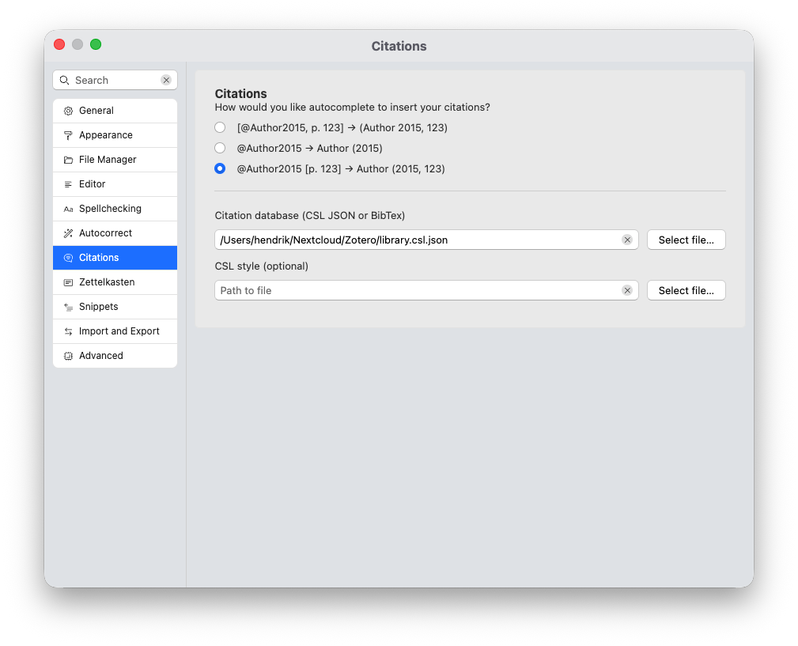
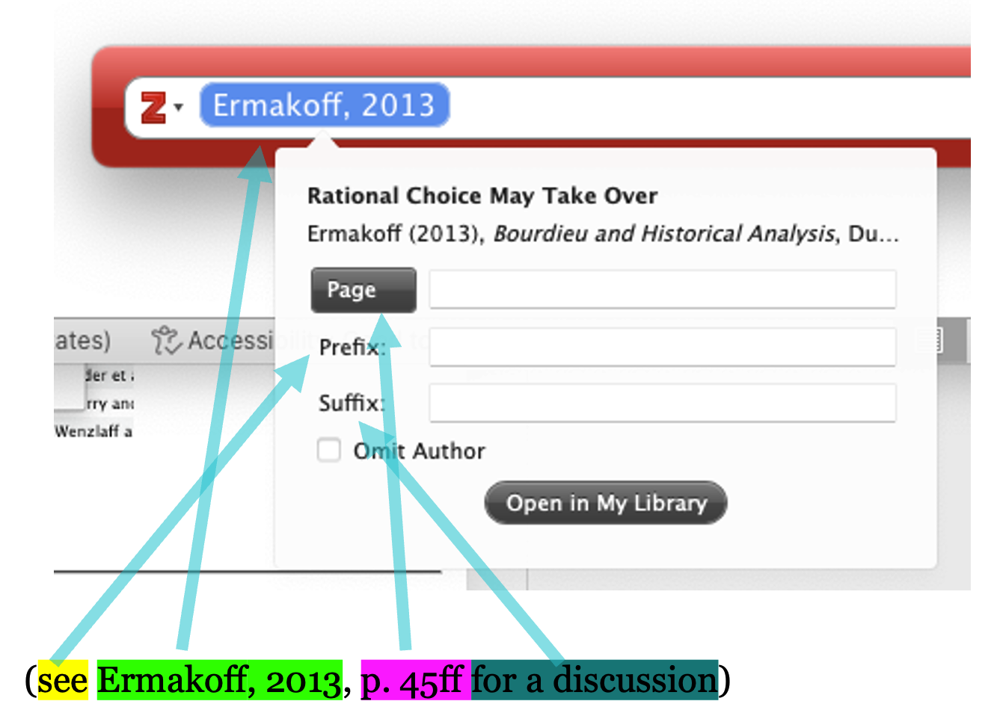
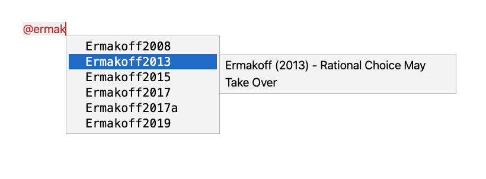
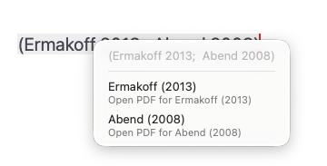

# Citations

A central feature of Zettlr is its tight integration with citations. Zettlr directly integrates with your favorite reference manager. Supported reference managers include, e.g., Zotero, JabRef, Juris-M, and plain BibTeX or BibLaTeX library files.

## Integrating with Reference Managers

Before Zettlr can access your references, you will need to export your library into a file that Zettlr can read. To learn how that works, we have [compiled a comprehensive guide on doing so with Zotero](../guides/reference-manager-integration.md).

!!! tip

	If you are already using BibTeX or BibLaTeX reference libraries, you don't need to do anything except load the file into Zettlr. If you use Zotero, EndNote, or a reference manager that doesn't work directly with files, you will need to export it first.

## Enabling Citations

Once you have a file with your library at hand, you can enable citations. Doing so is as simple as pointing Zettlr to your library file.

To do so, open Zettlr's preferences, navigate to “Citations” and locate your library file.



!!! tip

    If you need to use library files on a per-file-basis rather than globally, you can specify the file with the `bibliography` keyword in the YAML frontmatter. We have included instructions [further down on this page](#using-a-file-specific-library).

### Enable “Render Citations” Setting

From now on, Zettlr will autocomplete any citation that you type. However, to ensure that the citations are also pre-rendered inside your editor, make sure that Zettlr renders citations to begin with. For this, you will need to be in the “Preview” rendering mode, and have the “citations” renderer active. To learn more, see [the guide on the editor appearance](./appearance.md#preview-and-raw-modes).

## Anatomy of a Citation

Every citation consists of **four part**, only one of which is mandatory:

* a **prefix** that precedes the citation
* a **citekey** that specifies the piece of work that shall be cited
* a **locator** that specifies the exact location within the work cited
* a **suffix** that includes further information



The screenshot demonstrates this with the Zotero picker that you may be familiar with if you have ever used Zotero together with Word or LibreOffice to create citations.

You can see the prefix in yellow, the actual citation in green, the locator in pink, and the suffix in teal.

!!! note

	Only the citekey is required to create a citation. All other parts are optional.

The first thing to recognize is that **Zettlr does not use Zotero’s citation picker**. Instead it utilizes Pandoc’s citation syntax. Pandoc’s citation syntax is equivalent to the citation picker, but instead of using a graphical interface to modify your citation, you write out all the parts of your citation directly. This can be much faster once you are attuned to the syntax.

The syntax for writing a citation using Pandoc syntax is almost the same as what it will look like when rendered:

```markdown
This is some text [see @Ermakoff2013, p. 45ff for a discussion].
```

As you can see, the citation syntax exactly mirrors how regular in-text citations are written. The benefit? Zettlr and Pandoc are smart enough to take these pieces of information and format them **regardless of which citation style you use**!

!!! tip

	While the Zotero picker offers a checkbox to "omit the author" of a work (that is, only display the year), you can achieve the same functionality by prepending the citationkey with a hyphen (`-`).

    Example: The citation `[-@Ermakoff2013]` would render as `(2013)` without the author.

## Types of Citations

Besides this general anatomy of how citations work, you have three ways of citing a piece of work:

1. `[@Author2015, p. 123]` will render as `(Author 2015, 123)`
2. `@Author2015` will render as `Author (2015)`
3. `@Author2015 [p. 123]` will render as `Author (2015, 123)`

The **first option** is the default one and is recommended. However sometimes you build a citation into your sentence. For example, you may want to write something like this:

```markdown
… and as Ermakoff (2013, p. 45ff) has pointed out …
```

This won’t work with option one, as that one will place the author surname into brackets. Fortunately, you don’t have to implement any hacks. Instead, if you place the citation key somewhere into your text **without brackets**, this will automatically enable you to write:

```markdown
… and as @Ermakoff2013 has pointed out …
```

This will immediately render as `Ermakoff (2013)`. However, we do have a page number that we would like to include. This is where the **third option** comes into play. By writing the following:

```markdown

… and as @Ermakoff2013 [p. 45ff] has pointed out …
```

…we get everything.

To make this process easier for you, Zettlr allows you to specify how you wish to insert citations if you auto-complete a citation.

## Inserting Citations

Provided you have pointed Zettlr to a file that contains your citations, you can insert citations easily with the help of autocompletion. Start by typing an `@`-symbol in a valid position. A “valid position” means: the `@` is at the beginning of a line, preceded by whitespace, or directly after an opening square bracket.

In this case, Zettlr will automatically suggest citekeys from your library to autocomplete to. Simply start typing letters from the citation key (i.e., of the author name or the year) to have Zettlr remove non-matching citation keys until the key you need is visible. Then, navigate with the arrow keys through the list until the correct entry is highlighted, and press <kbd>Enter</kbd>.



As you can see in the screenshot, as you move through the entries, Zettlr shows you the bibliographic information in an additional tooltip next to the entry. This helps you verify that you have the correct entry, especially in instances (as you can see in the screenshot) where you have multiple publications per year.

!!! note

    If you are not presented with a list of possible references, there may be a problem with the database file you set up previously.

One the autocomplete completes the citekey, it will use your preferred syntax to insert the citation. This includes inserting a closing square bracket, if necessary, or adding square brackets behind the citekey, depending on your setting.


You can change how Zettlr autocompletes citekeys by navigating into the preferences → “Citations” section. Here you can choose one of the three types of citations that have been introduced above. This is helpful especially if you usually use in-text references.

!!! tip

    Please note that citation *styles* can sometimes further customize how citations are actually being rendered. For instance, some citation styles in the natural sciences require citations to be referred to only by number. This specific requirement will be applied once you export a file. **Zettlr itself will always use a default in-text citation style to preview your files. Your exports therefore may differ.**


For more information on how to use citations in line with Pandoc's citeproc engine, [please refer to the guide](https://pandoc.org/MANUAL.html#citations).

## Bibliography

As you cite, Zettlr will automatically generate a preview bibliography in the [Sidebar](../core/sidebar.md). You can open the sidebar with the right-most toolbar button and then navigate to the bibliography tab. This bibliography will be automatically appended to your document when you export it.

!!! note

	Just with in-text citations, the bibliography will be rendered with a simple style in the sidebar. Whenever you export your file, the bibliography will also be formatted properly using your citation style of choice.

## Using a file-specific library

Sometimes you may want to add a few citation keys on a per-file basis. To do so, you must add the bibliography file to your file's [YAML frontmatter](../advanced/yaml-frontmatter.md). If Zettlr detects the `bibliography` property in a file's frontmatter, it will automatically load that file and offer you items from that file instead of your main library.

Example:

```yaml
---
title: "My document"
tags: tag1, tag2, tag3
bibliography: ./assets/references.json
---
```

!!! note

    Note that, while you can add multiple library files to this property, Zettlr can only handle one and therefore will only select the first bibliography file.

## Changing the Citation Style

Internally, Zettlr will always use the Chicago style to render citations. Therefore, your previewed citations will always be “in-text,” and never in footnote-style. This is meant as a convenience and to confirm that everything is working.

But of course you can use different citation styles, depending on either the journal requirements for which you are writing, or your personal preferences. To change the citation style, you need to download the corresponding CSL file. A very good starting point is the [Zotero style repository](https://www.zotero.org/styles). There you can search for specific citation styles, preview them and download them. Another good option is the [Citation Style Language styles repository](https://github.com/citation-style-language/styles)

You can point Zettlr to a CSL file in two ways. First in the general preferences. In the `Export` tab, beneath the field for your citation database file, you can select your preferred CSL style. This will be used for all single-page exports using the toolbar button.

Second, you can set specify a CSL style for a specific project. With your project folder visible in the file manager, right-click on the project folder and select “Properties” → “Project Settings….” In the “Files” tab you can specify the CSL file to use when exporting your project.

## Customizing the List of References

By default, Pandoc will simply append a list of references to the end of your documents without any decoration. Therefore, you need to perform a few housekeeping steps to ensure bibliographies are correctly rendered.

### Adding a Section Header

The simplest solution to displaying the bibliography correctly is to end your document with a heading that is called “References,” “Bibliography,” or similar. While this may look a little off when looking at the document in Zettlr, this will ensure that the bibliography has an appropriate heading on export.

To make this more explicit, notice that you can specify the precise location of where the references will be inserted with Pandoc's block syntax. By explicitly adding that block, you can visually indicate where the references will end up:

```markdown
## References

::: {#refs}
:::
```

Pandoc will replace the three-colon-curly-bracket construction with your list of references.

!!! tip

    This also means that you can embed your list of references at any point in your document. You could, e.g., add appendices after the `{#refs}`-block.

### Setting a Section Header in the YAML Frontmatter

If you do not want to always specify the section title manually, you can also automate this process. In your file’s [YAML frontmatter](../advanced/yaml-frontmatter.md), you can add a property `reference-section-title: Bibliography`. Replace “Bibliography” with whatever the title should be called.

!!! note

    You can read more on placing the bibliography in the [Pandoc manual](https://pandoc.org/MANUAL.html#placement-of-the-bibliography).

### Formatting the List of References

When you add citations to your files, you sometimes need to adjust how they will be displayed on export. While exporting to Word or LibreOffice allows you to fine-tune your references afterward, this is not possible if you export to PDF.

Thus, you may need to add a few style directives to your file. Here we describe how to change the appearance of PDF files. To change the appearance of HTML exports, you can use CSS.

LaTeX uses lengths to determine the overall measurements of the exported PDF. These lengths are normally set globally, but they can be changed for different parts of document. One of these lengths is `parindent`, which controls the hanging indent of all paragraphs.

Whenever you use the command `\setlength` LaTeX will overwrite the specified length from wherever it encounters this command until you use `\setlength` again. Since the references section is formatted using paragraphs like the rest of the document, they will be formatted in this default style. To re-format the list of references, you should overwrite these just before the list of references.

The following code snippet gives you an example:

```latex
\setlength{\parindent}{-1cm} % Negative hanging indent
\setlength{\leftskip}{0.5cm} % Overall indentation
\setlength{\parskip}{0.1cm}  % Spacing between paragraphs
```

The above example would render the reference list with a negative indent of minus one centimeter. Additionally, it will apply an overall indentation of half a centimeter relative to the page margins. For example, if your left page margin is set to three centimeters, the reference list paragraphs will be offset 3.5 centimeters. The last value (`parskip`) controls the spacing _between_ paragraphs, so there will be a gap of ten millimeters between paragraphs.

The above example is a good place to start. You can search for more lengths to tweak and adjust them to your liking.

!!! tip

    If you are submitting, e.g., to a STEM journal which provides its own LaTeX template, you can directly use that template to export your file, ensuring that everything already works as expected.

## Accessing a Reference’s PDF From Zettlr

It will happen from time to time that you re-read something you have written and want to double-check a referenced work. You can do this by simply right-clicking a citation and opening the corresponding PDF file.



When you work with BibLaTeX or BibTeX, the paths to the PDF files need to be embedded in the file. When you export CSL JSON from Zotero, these paths will not be embedded in the file. If you use a CSL JSON database, Zotero needs to run in the background so that Zettlr can query Zotero for the correct PDF path, and open it for you.