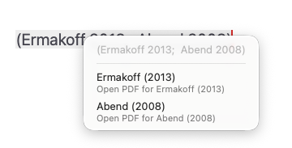

# Citations

A central feature of Zettlr is its tight integration with citations. Zettlr directly integrates with your favorite reference manager. Supported reference managers include, e.g., Zotero, JabRef, Juris-M, and plain BibTeX or BibLaTeX library files.

> [!tip]
> We have documented all features of citation syntax in the [corresponding documentation section](../syntax/citations-and-crossref.md).

## Integrating with Reference Managers

Before Zettlr can access your references, you will need to export your library into a file that Zettlr can read. To learn how that works, we have [compiled a comprehensive guide on doing so with Zotero](../guides/reference-manager-integration.md).

::: tip
If you are already using BibTeX or BibLaTeX reference libraries, you don't need to do anything except load the file into Zettlr. If you use Zotero, EndNote, or a reference manager that doesn't work directly with files, you will need to export it first.
:::

## Enabling Citations

Once you have a file with your library at hand, you can enable citations. Doing so is as simple as pointing Zettlr to your library file.

To do so, open Zettlr's preferences, navigate to “Citations” and locate your library file.


::: tip
If you need to use library files on a per-file-basis rather than globally, you can specify the file with the `bibliography` keyword in the YAML frontmatter. We have included instructions [further down on this page](#using-a-file-specific-library).
:::

### Enable “Render Citations” Setting

From now on, Zettlr will autocomplete any citation that you type. However, to ensure that the citations are also pre-rendered inside your editor, make sure that Zettlr renders citations to begin with. For this, you will need to be in the “Preview” rendering mode, and have the “citations” renderer active. To learn more, see [the guide on the editor appearance](./appearance.md#preview-and-raw-modes).

## Bibliography

As you cite, Zettlr will automatically generate a preview bibliography in the [Sidebar](../sidebar/index.md). You can open the sidebar with the right-most toolbar button and then navigate to the bibliography tab. This bibliography will be automatically appended to your document when you export it.

::: note
Just with in-text citations, the bibliography will be rendered with a simple style in the sidebar. Whenever you export your file, the bibliography will also be formatted properly using your citation style of choice.
:::

## Using a file-specific library

Sometimes you may want to add a few citation keys on a per-file basis. To do so, you must add the bibliography file to your file's [YAML frontmatter](../syntax/yaml-frontmatter.md). If Zettlr detects the `bibliography` property in a file's front matter, it will automatically load that file and offer you items from that file instead of your main library.

Example:

```yaml
---
title: "My document"
tags: tag1, tag2, tag3
bibliography: ./assets/references.json
---
```

::: note
Note that, while you can add multiple library files to this property, Zettlr can only handle one and therefore will only select the first bibliography file.
:::

## Changing the Citation Style

Internally, Zettlr will always use the Chicago style to render citations. Therefore, your previewed citations will always be “in-text,” and never in footnote-style. This is meant as a convenience and to confirm that everything is working.

But of course you can use different citation styles, depending on either the journal requirements for which you are writing, or your personal preferences. To change the citation style, you need to download the corresponding CSL file. A very good starting point is the [Zotero style repository](https://www.zotero.org/styles). There you can search for specific citation styles, preview them and download them. Another good option is the [Citation Style Language styles repository](https://github.com/citation-style-language/styles)

You can point Zettlr to a CSL file in three ways. First in the general preferences. In the `Export` tab, beneath the field for your citation database file, you can select your preferred CSL style. This will be used for all exports.

Second, you can set specify a CSL style for a specific project. With your project folder visible in the file manager, right-click on the project folder and select “Properties” → “Project Settings….” In the “Files” tab you can specify the CSL file to use when exporting your project.

Third, you can specify a CSL style only for one particular file, by providing it in the file’s YAML front matter. For example:

```yaml
csl: ./styles/acta-philosophica.csl
```

## Customizing the List of References

By default, Pandoc will simply append a list of references to the end of your documents without any decoration. This is usually not desirable, especially since reference lists should have at least a heading.

### Adding a Section Header

The easiest way to add a section header to your list of references is to append a heading called “References,” “Bibliography,” or similar to the end of your document. While this may look a little off when viewing the document in Zettlr, this will ensure that the bibliography has an appropriate heading on export. Since Pandoc will simply append the rendered bibliography to your document, this “lone” heading will then become the heading for your list of references upon export.

However, this can quickly become cumbersome, as you create more and more files. It would be great if you could automate this process. Fortunately, you can do so.

Instead of specifying the heading section every time, you can provide a default name for each export profile. To do so, head into the [Assets Manager](../export/assets-manager.md), e.g., by pressing <kbd>Cmd/Ctrl</kbd>+<kbd>Alt</kbd>+<kbd>,</kbd>. In the “Export” tab, select the profile you wish to provide a default reference section for, and add the following code:

```yaml
metadata:
  reference-section-title: "References"
```

Customize “References” to your liking (e.g., “Bibliography,” or a translation thereof). If the profile already has the property `metadata`, place the `reference-section-title` in there instead of duplicating the property. Ensure proper indentation.

### Customizing the `reference-section-title` on a per-file basis

Specifying the `reference-section-title` in an export profile will apply this title to all files. But what if you want certain files to have a different section header? Pandoc allows you to also provide this label using the [YAML frontmatter](../syntax/yaml-frontmatter.md). To do so, simply place the `reference-section-title` on its own line (not indented) within a file's YAML front matter.

::: warning
The export profile overwrites the `reference-section-title` from the frontmatter. This means, if you specify `reference-section-title: Bibliography` in your frontmatter, but have placed a `reference-section-title: References` in the `metadata` property of your export profile, Pandoc will use the latter, and not the former. This is why Zettlr's built-in profiles do not ship with a default for `reference-section-title` built-in. For some use-cases, it may be easier to leave out the `reference-section-title` from the export profile entirely and specify it manually for each file. You can also use [Snippets](./snippets.md) to provide templates for various types of reports that come with the correct `reference-section-title`.
:::

### Specifying the Location of the List of References

By default, Pandoc will append the rendered reference section to your document, which in almost all cases is sufficient. However, in some rare circumstances, this is not ideal. For example, imagine you are writing a report with a few appendices. Usually, you want the list of references to appear after the main body of the report, but before any of the appendices.

To do so, you can tell Pandoc explicitly where to place the list of references. You do so by creating a container with the ID `#refs`. Pandoc recognizes this, and will place the bibliography into this container, instead of just appending the list. For example:

```markdown
## Conclusion

Some concluding thoughts ...

## References

::: {#refs}
:::

## Appendix A

Some appendix information...
```

Pandoc will replace the three-colon-curly-bracket construction with your list of references.

::: warning
If you explicitly specify the location of your references by placing a `#refs`-container, Pandoc will ignore your `reference-section-title`. In this case, you must specify the heading manually (as shown in the example).
:::

::: tip
This also implies that you can provide the list of references multiple times. Pandoc will place the list of references into any container with the ID `#refs`. You can read more on placing the bibliography in the [Pandoc manual](https://pandoc.org/MANUAL.html#placement-of-the-bibliography).
:::

### Formatting the List of References

Most of the formatting of the list of references will be derived from the specific citation style that you use. These citation styles will, for example, specify whether the list of references should use a hanging indent, how much the entries should be spaced, and more. However, often, these provided formatting rules are very spacious, and sometimes you need to make the layout of the reference section tighter. To do so, you effectively have two common routes available.

The first one is to override the basic styling of the list. You do so by providing certain attributes to the `#refs`-container (meaning that to format the list of references, you will have to explicitly specify the location of the list of references). This is only sparsely documented by Pandoc, and support is somewhat lackluster, but you can provide the following attributes:

```md
:::{#refs .hanging-indent entry-spacing="0" line-spacing="2"}
:::
```

The class `hanging-indent` will forcefully enable a hanging indent even for citation styles that do not prescribe it. It is automatically added when the citation style demands it.

The attributes `entry-spacing` and `line-spacing` respectively determine how much space there should be between individual entries, and lines. They are provided in percentage points, where `1` equals 100%. So, an entry-spacing of `0` will ensure that the individual entries are back-to-back, while an entry-spacing of `2` will mean that there are two lines of distance between each entry.

::: note
Support for these formatting rules is not fully clear. Some citation styles and some export profiles appear to be impervious to changing the line-spacing. Use these with caution. To better control formatting, continue reading.
:::

The second route to adjust the formatting of the list of references is to directly overwrite the styles. This gives you more control over the list of references, but depending on how you do it, you may restrict yourself to only a single export target. For example, to change how the references are displayed in HTML, you will need to use CSS. To change how they are displayed in PDF files, you will need to use LaTeX directives (or Typst or tectonic directives, depending on which engine you utilize).

When you use CSS, you can target some CSS classes:

* `.references`, `.csl-bib-body`: These classes are applied to the surrounding container of each list of references.
* `.hanging-indent`: This class is also appended to the container, either if the CSL style requires it, or if you explicitly specified it.
* `.csl-entry`: This class is applied to an individual entry, and allows you to change properties of the individual entries.

***

LaTeX, on the other hand, uses lengths to determine the overall measurements of the exported PDF. These lengths are normally set globally, but they can be changed for different parts of document. One of these lengths is `parindent`, which controls the hanging indent of all paragraphs.

Whenever you use the command `\setlength` LaTeX will overwrite the specified length from wherever it encounters this command until you use `\setlength` again. Since the references section is formatted using paragraphs like the rest of the document, they will be formatted in this default style. To re-format the list of references, you should overwrite these just before the list of references.

The following code snippet gives you an example:

```latex
\setlength{\parindent}{-1cm} % Negative hanging indent
\setlength{\leftskip}{0.5cm} % Overall indentation
\setlength{\parskip}{0.1cm}  % Spacing between paragraphs
```

The above example would render the reference list with a negative indent of minus one centimeter. Additionally, it will apply an overall indentation of half a centimeter relative to the page margins. For example, if your left page margin is set to three centimeters, the reference list paragraphs will be offset 3.5 centimeters. The last value (`parskip`) controls the spacing _between_ paragraphs, so there will be a gap of ten millimeters between paragraphs.

The above example is a good place to start. You can search for more lengths to tweak and adjust them to your liking.

::: tip
If you are submitting, e.g., to a STEM journal which provides its own LaTeX template, you can directly use that template to export your file, ensuring that everything already works as expected.
:::

## Accessing a Reference’s PDF From Zettlr

It will happen from time to time that you re-read something you have written and want to double-check a referenced work. You can do this by simply right-clicking a citation and opening the corresponding PDF file.



When you work with BibLaTeX or BibTeX, the paths to the PDF files need to be embedded in the file. When you export CSL JSON from Zotero, these paths will not be embedded in the file. If you use a CSL JSON database, Zotero needs to run in the background so that Zettlr can query Zotero for the correct PDF path, and open it for you.
