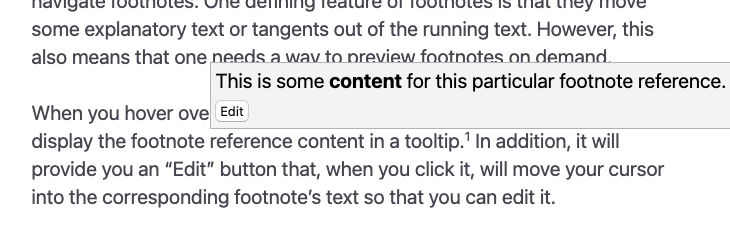

# Footnotes

Footnotes are a crucial part of any serious writing workflow. Zettlr utilizes Pandoc’s syntax to enable footnote support. In addition, Zettlr provides some convenience features to make working with footnotes easier.

## Anatomy of a Footnote

Unless you use inline-footnotes, each footnote consists of two elements: A footnote, and a reference text. You usually place the footnote itself at the position in the text which you want to attach the footnote to. The reference of the footnote commonly goes at the bottom of the Markdown document.

See the following example:

```markdown
This is some text.[^1]

This is some more text afterward.

[^1]: This is a footnote reference text.
```

For more information, refer to the [Markdown compendium](./markdown-compendium.md#footnotes) on how to write footnotes.

## Inserting Footnotes

Since you are working with Markdown, the simple way is to simply write out the syntax to first define the footnote, and later provide the footnote reference text.

However, this can quickly become cumbersome, especially if you’re in a field that lives off of footnotes. Therefore, the first quality-of-life feature Zettlr provides is an automated way to insert footnotes.

To insert a footnote, simply press <kbd>Cmd</kbd>+<kbd>Alt</kbd>+<kbd>R</kbd> (macOS) or <kbd>Ctrl</kbd>+<kbd>Alt</kbd>+<kbd>F</kbd> (Windows/Linux).

This will direct Zettlr to create a footnote at the current cursor position, and at the same time insert a corresponding reference at the bottom of your current document. At the same time, it will place your cursor at the start of the footnote reference so that you can immediately start writing your footnote body.

## Viewing and Navigating Footnotes

The next quality-of-life feature Zettlr provides is a way to quickly read and navigate footnotes. One defining feature of footnotes is that they move some explanatory text or tangents out of the running text. However, this also means that one needs a way to preview footnotes on demand.

When you hover over a footnote with your mouse, Zettlr will automatically display the footnote reference content in a tooltip. In addition, it will provide you an “Edit” button that, when you click it, will move your cursor into the corresponding footnote’s text so that you can edit it.



At the same time, when you are at the bottom of the document, you can move back up to the definition of the footnote by clicking the round arrow-icon next to the footnote reference in the gutter.


## Types of Footnote Labels

A few final words on the types of available footnote labels. When you create a footnote using Zettlr’s shortcut, it will always use numerical footnotes, starting from 1 and counting up.

Zettlr will also ensure that, if you insert footnotes in between two existing footnotes, that the new footnote number will be one bigger than the first, and that the second footnote will be automatically increased for you. In addition, Zettlr also ensures that the newly created footnote reference will be placed in between the correct existing references.

However, you do not have to use numbers. The only hard requirement for a footnote label is that it is unique. This means you can also provide keywords to your footnotes. Zettlr will leave such non-numerical footnotes alone when you insert a new numerical footnote with the shortcut.

!!! note

	Whenever you export your document(s), regardless of whether the footnotes use character or numerical labels, these footnotes will be exported using numerical labels.

!!! warning

	Especially for projects where you have multiple independent documents that are exported together, you will end up in a situation where footnote labels are duplicated after the documents are concatenated. Pandoc supports an option called `file-scope` that ensures that all footnotes are made unique before the documents are concatenated together.