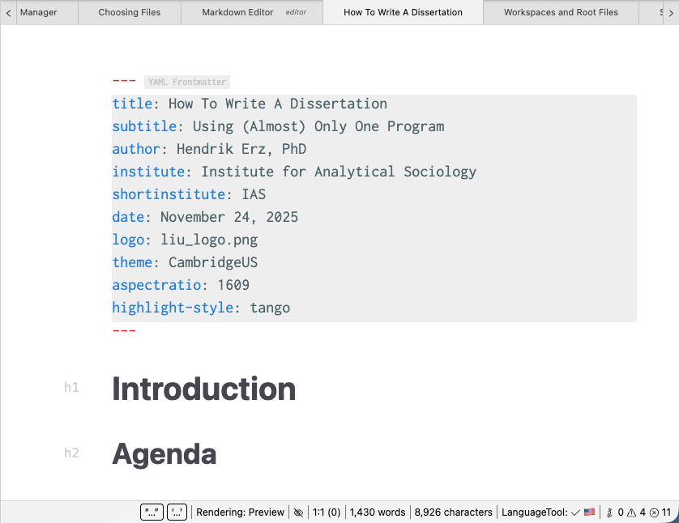

# Markdown Editor

At the heart of Zettlr sits its most powerful component: The Markdown editor.

The Markdown editor allows you to write entire papers or even books within the app. It comes with a host of features that all focus on making the writing experience as seamless as possible.

In this section of the documentation, we introduce all these features to you, and explain how you can use them to your advantage.