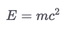

# Markdown Compendium

This section is a continuation from the first-time-user’s guide. It contains a more comprehensive introduction to the Markdown Syntax and introduces special elements that Markdown supports.

## What is Markdown?

Markdown is a very simple markup language that uses formatting symbols to format text instead of having you click around a formatting toolbar. You already know many of the conventions of Markdown. For example, to emphasize text, you simply need to surround it with `*` or `_` symbols. In fact, many applications that you may already know use Markdown, such as Slack, Discord, Microsoft Teams, and more.

!!! note

    Despite its simplicity, Markdown contains all formatting conventions you need to write full-fledged research articles. And, should you ever miss something, you can always drop in a few LaTeX commands or HTML tags.

The two main benefits of Markdown are that you can format your entire document without using your mouse or trackpad and that it separates content from layout.

!!! note

    To learn how to customize how your documents look once you export them, head over to the [defaults files](../export/defaults-files.md) documentation.

## Formatting Markdown

To format Markdown documents, there are a few basic formatting rules that you should know and which we list here:

| Formatting         | Syntax                        | Output                                |
|--------------------|-------------------------------|---------------------------------------|
| Emphasis           | `_italics_` or `*italics*`    | _italics_                             |
| Bold               | `__bold__` or `**bold**`      | **bold**                              |
| Strikethrough      | `~~text~~` | <span style="text-decoration: line-through;">text</span> |
| Link               | `[Text](www.example.com)`     | [Text](#)                             |
| Image              | ``   |  |
| Heading            | `# Heading`                   | **Heading**                           |
| Heading 2          | `## Heading 2`                | **Heading 2**                         |
| Heading 3          | `### Heading 3`               | **Heading 3**                         |
| Heading 4          | `#### Heading 4`              | **Heading 4**                         |
| Heading 5          | `##### Heading 5`             | **Heading 5**                         |
| Heading 6          | `###### Heading 6`            | **Heading 6**                         |
| Bullet list        | `* List item` (or `+` or `-`) | &bullet; List item                    |
| Item list          | `1. List item` (or `1)`)      | 1. List item                          |
| Footnotes          | `Some text[^1].`              | Some text&sup1;.                      |
| Footnote reference | `[^1]: Footnote text.`        | &sup1; Footnote text.                 |
| Comment            | `<!-- Commented out -->`      | (Not visible)                         |
| Inline math        | `$E = mc^2$`                  |           |
| Block math         | `$$\nE = mc^2\n$`             |           |
| Horizontal line    | `***` or `---`                | <hr>                                  |
| Block quote        | `> Some quote`                | &nbsp;&nbsp;&nbsp;&nbsp;*Some quote*  |

!!! note

    This list is not exhaustive. There are some more formatting symbols which can be enabled either with extensions or which will be introduced at a later stage of this documentation, for example citations.

If you want to learn even more about Markdown, there are many good resources out there. A good starter is the Markdown guide on [Learn X in Y minutes](https://learnxinyminutes.com/docs/markdown/).

## Keyboard Shortcuts

Zettlr offers a plethora of keyboard shortcuts that make writing Markdown even more efficient, as it will spare you oftentimes from having to write formatting characters altogether.

You can think of Zettlr’s keyboard shortcuts as being divided into two logical groups. The first group contains **common shortcuts** that most other apps also incorporate — it follows conventions such as using <kbd>Cmd/Ctrl</kbd>+<kbd>B</kbd> to make text bold. The second group however comes from **writing code** — it allows you to both move around your text, and move your text around much more efficiently than most word processors.

!!! note

    Across this documentation, you will often see the "key" <kbd>Cmd/Ctrl</kbd>. By that we mean that you'll need to press the Command-key on macOS, and the Control-key otherwise.

* <kbd>Cmd/Ctrl</kbd>+<kbd>B</kbd>: Make text **bold**
* <kbd>Cmd/Ctrl</kbd>+<kbd>I</kbd>: _Emphasize_ text
* <kbd>Cmd/Ctrl</kbd>+<kbd>K</kbd>: Create a new link. Selected text (if any) will become the link text. If there is a URL in the clipboard, Zettlr automatically uses it as the link target.
* <kbd>Cmd/Ctrl</kbd>+<kbd>Shift</kbd>+<kbd>I</kbd>: Insert an image. Selected text (if any) will become the image title. If there is a URL in the clipboard, Zettlr automatically uses it as the image source.
* <kbd>Tab</kbd>: Indent any given list one level. If there is no list, insert a tab character. (If you are using a screen reader and need to use the keyboard to move around the app, press <kbd>Esc</kbd> before pressing <kbd>Tab</kbd> to un-focus the editor.)
* <kbd>Shift</kbd>+<kbd>Tab</kbd>: Un-indent a list one level.
* <kbd>Cmd/Ctrl</kbd>+<kbd>C</kbd>: Copy text as plain
* <kbd>Cmd/Ctrl</kbd>+<kbd>Alt</kbd>+<kbd>C</kbd>: Copy text with formatting (e.g., to paste formatted text into Microsoft Word)
* <kbd>Cmd/Ctrl</kbd>+<kbd>X</kbd>: Cut text. If there is no selection, this command cuts the entire line.
* <kbd>Cmd/Ctrl</kbd>+<kbd>V</kbd>: Paste text (if you copied formatted text, this will convert it to Markdown before insertion)
* <kbd>Cmd/Ctrl</kbd>+<kbd>Shift</kbd>+<kbd>V</kbd>: Paste text as plain
* <kbd>Cmd/Ctrl</kbd>+<kbd>Z</kbd>: Undo
* <kbd>Cmd/Ctrl</kbd>+<kbd>Shift</kbd>+<kbd>Z</kbd>: Redo
* <kbd>Alt</kbd>+<kbd>ArrowUp</kbd>: Swap current line with the previous
* <kbd>Alt</kbd>+<kbd>ArrowDown</kbd>: Swap current line with the next
* <kbd>Alt</kbd>+<kbd>Shift</kbd>+<kbd>ArrowUp</kbd>: Copy the current line above
* <kbd>Alt</kbd>+<kbd>Shift</kbd>+<kbd>ArrowDown</kbd>: Copy the current line above
* <kbd>Alt</kbd>+<kbd>L</kbd> (<kbd>Ctrl</kbd>+<kbd>L</kbd> on macOS): Select the current line
* <kbd>Cmd/Ctrl</kbd>+<kbd>F</kbd>: Open the search panel
* <kbd>Cmd/Ctrl</kbd>+<kbd>G</kbd>: Next occurrence
* <kbd>Cmd/Ctrl</kbd>+<kbd>Shift</kbd>+<kbd>G</kbd>: Previous occurrence
* <kbd>Cmd/Ctrl</kbd>+<kbd>D</kbd>: Select next occurrence

!!! note

    Zettlr also offers two advanced writing modes: Emacs and Vim. Whenever you activate one of these modes, they will change many keybindings and offer new ones. Those settings are recommended for advanced users only.

## Multi-Cursor Editing

To save time during the editing process, you can use multi-cursor editing to make concurrent changes across your document. Then, your keystrokes apply simultaneously to all active cursors or selected areas.

To add cursors, hold down either the <kbd>Cmd</kbd> (macOS) or <kbd>Ctrl</kbd> (Windows/Linux) keys while clicking inside your text.

To create multiple selections from the cursors, additionally hold down <kbd>Shift</kbd>, and any of the arrow keys.

## Zettlr’s Markdown Dialect

Unfortunately, there is not “one” Markdown specification that would define every element you may ever need. Historically, different companies and software products have adopted Markdown at various time points throughout history, and implemented custom elements wherever necessary.

This has led to the formation of various so-called “dialects” of Markdown. For example, there is [GitHub Markdown](https://docs.github.com/en/get-started/writing-on-github/getting-started-with-writing-and-formatting-on-github/basic-writing-and-formatting-syntax), there is [CommonMark](https://spec.commonmark.org/current/) (an attempt at standardizing the syntax), and there is [Pandoc Markdown](https://pandoc.org/MANUAL.html#pandocs-markdown).

Zettlr supports one of the most comprehensive and all-encompassing dialects: Pandoc Markdown. In comparison to other dialects, the Pandoc dialect includes out-of-the-box support for many elements that academics need, including, but not limited to:

* Complex tables
* Figures
* Footnotes
* Citations and cross-references
* … and more

!!! warning

	While Markdown dialects are, for the most part, compatible with each other, this is not always the case. Some dialects may, for example, not support citation syntax, or use a slightly different way to create tables. If you want to write Markdown for a specific system, always make sure to check which elements that system supports.

## Special Elements in Zettlr Markdown

In this section we introduce you to special syntax that works in Zettlr (and, by extension, Pandoc), but not necessarily in other dialects.

### Footnotes

The most important addition to the common Markdown syntax are footnotes. Footnotes heavily borrow from the syntax for defining links.

To define a regular footnote, you would do the following:

```markdown
This is some text.[^1]

[^1]: And this is the footnote text.
```

Instead of numbers, you can also use letters and words, e.g., `[^a custom label]`. However, Zettlr assumes that, most of the time, you want simple numerical footnote labels. Therefore, when you stick to a simple footnote numbering scheme, Zettlr will automatically ensure that all your footnotes remain correctly numbered.

!!! tip

	Regardless of what labelling system you choose for your footnotes, the only important part is that each label must be unique. Whenever you export your files, the footnotes will be correctly numbered ascending, regardless of what your labels look like.

You can also define footnotes inline, if you don’t want to create two elements. To do so, you would place the circumflex symbol (`^`) in front of the square bracket:

```markdown
This is some text.^[I am an inline footnote.]
```

As you can see, the primary difference to regular links is the usage of circumflex symbols.

### Citations

The second-most significant custom element that is not necessarily supported by other Markdown dialects are citations. Zettlr is an academic Markdown editor and as such treats citations as first-class citizens.

Inserting citations is straight forward:

```markdown
This is some text [see @Citekey, p. 123].
```

As you can see, adding citations involves merely writing out what you wish to cite, with one crucial difference: Instead of literally typing “Author, Year” you need to provide a citation ID, or Citekey. For more information on what Citekeys are, and how to connect your reference manager with Zettlr, please [see the documentation page on citations](./citations.md).

### Element Attributes

A third custom element supported by Zettlr is element attributes. Zettlr allows you to specify a bunch of additional properties for any element. Some of those will be directly parsed and applied by Zettlr (such as image heights and widths), while others are merely used to apply custom styles during export.

To add attributes, you’ll need to add them surrounded by curly brackets *after* the element. Often, the attributes need to follow immediately to the element, sometimes a space between the element and its attributes is required. For more information on which elements support attributes, please see [the Pandoc documentation](https://pandoc.org/MANUAL.html#extension-attributes).

For example, take the following example that restricts the size of an image:

```markdown
This is some text.

{width=50% height=700px}
```

Various elements support various attributes. In all cases, you can add arbitrary attributes that will be passed to the exported file. But some attributes have special meanings.

Below, we show some common attributes and their use-cases:

```markdown
# Heading {-}

A heading with the attribute "-" will not be numbered, even if
the exporter is configured as such.

{width=50% height=700px}

Any image supports "width" and "height" properties.
These properties are supported by Zettlr directly.

You can also apply attributes to arbitrary text using
"bracketed spans" (see below):

This text contains [an underline]{.underline}.

The following is only valid for Beamer slides to create
a two-column layout. It uses Pandoc Divs (see below
for an explanation).

:::::::::::::: {.columns}
::: {.column width="40%"}
Slide contents on the left side
:::
::: {.column width="60%"}
Slide contents on the right side
:::
::::::::::::::
```

### Native Spans and Containers

Zettlr also allows the specification of arbitrary spans and containers so that you can supply custom elements with unusual styles. Any content in brackets that is neither a valid footnote nor a valid link will be treated as a span of text if you provide attributes.

For example, you can underline text by using the following syntax: `[underlined text]{.underline}`. Likewise, you can use small caps: `[SMALL CAPS]{.smallcaps}`.

To style entire blocks of text, you can use what Pandoc calls “Native Divs.” Native divs are simply containers that can be used to provide styling to your blocks in output. Above, we have shown you how use them in order to provide a two-column layout for Beamer slides.
