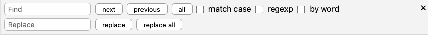
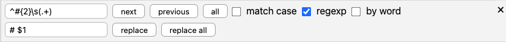

# Search

You can quickly search through the contents of your current document by pressing <kbd>Cmd/Ctrl</kbd>+<kbd>F</kbd>. This will open up the editor search panel.

!!! tip

	If you need to search several files simultaneously, use the global [full-text search](../file-manager/search.md) instead.

## Searching for Terms

To start a search, simply start typing. The editor will immediately start the search and highlight all matches for you. Press <kbd>Enter</kbd> to select the first match after your cursor position. Continue to press <kbd>Enter</kbd> to move through the search results. Press <kbd>Shift</kbd>+<kbd>Enter</kbd> to cycle backwards through the results. You can also use the “next” and “previous” buttons.

Click “all” to select all matches at once.

!!! note

	There is a difference between "highlighting" and "selecting" search results. By default, your search results are only highlighted, meaning that the editor shows you where they are. But if you start typing, nothing will change. Once you select a result, though, you will overwrite it. Selecting "all" matches effectively means that you can start writing to replace all matches at the same time.

By default, the search will be case-insensitive (so that the term “search” will highlight any occurrence of “search,”“Search,” or “SeArCh”). To ensure that it only matches the exact term, enable “match case.”

Furthermore, the search will also match partial words, so a search for “match” will highlight both “match” and the first part of “matches.” Enabling “by word” ensures that only exact matches are highlighted (“match” but not “matches”).

## Replacing Search Results

Besides highlighting search results, you can also use the panel to replace the search results with something else. Focus the “Replace” text field to start replacing. You can leave the field empty to remove all results. Once you press <kbd>Enter</kbd>, this will select the next match. Only when you press <kbd>Enter</kbd> while a match is selected will it perform the replacement.

You can also click the “replace” button. If you click “replace all,” this will immediately replace all matches with whatever is in the “Replace” text field.

## Regular Expressions (regexp)

By default, all your searches are quite literal. The editor will work with what literally looks like your search term. However, you can also peruse regular expressions to search and replace.

The editor search supports JavaScript Regular Expression syntax. [Learn more about JavaScript regular expressions here](https://codeburst.io/javascript-learn-regular-expressions-for-beginners-bb6107015d91).

To make the editor interpret your query not literally, but as a regular expression, check the “regexp” checkbox. Now, it will perform regular pattern matching instead of exact matching. This means that, instead of searching for individual occurrences, you can search for patterns (e.g., you can search for four digits instead of individual years).

!!! warning

	If you are already familiar with JavaScript regular expressions, you may know that these are usually written within forward-slashes, e.g.: `/\d{4}/`. For using the regular expression search in the editor, leave off these forward slashes, otherwise you will yield unexpected results.

Some examples of regular expressions to give you an impression of how they work:

* `\d{4}`: Searches for four consecutive digits
* `^#{2}\s(.+)`: Matches headings level 2. In addition, it contains a “capturing group” that matches the heading content.

## Replacing with Regular Expressions

That latter example already hints at the power of regexp searches. It contains a “capturing” group.

When you perform replacement with regular expressions, you can replace just as you have seen with simple searches (for example, you could replace all four digit-strings with “YYYY”). But when you activate Regular Expressions, you can also *use capturing groups within the Replace field*! To do so, simply provide the number of the capturing group with a leading dollar-sign (the first capturing group is `$1`, the second is `$2`, and so on).

A concrete example: To convert all headings level 2 in the current document into headings level 1, you can use the following search- and replace strings while the “regexp” option is enabled (see also the screenshot):

* Search for: `^#{2}\s(.+)`
* Replace with: `# $1`

