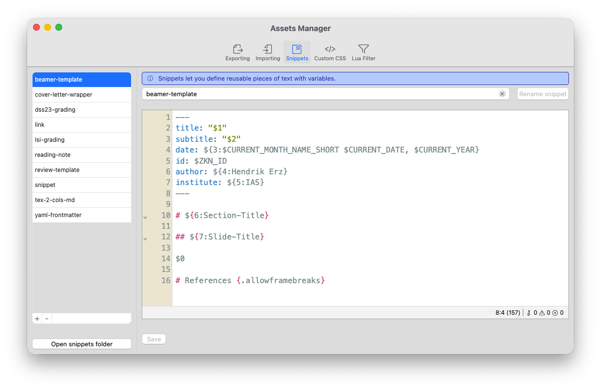
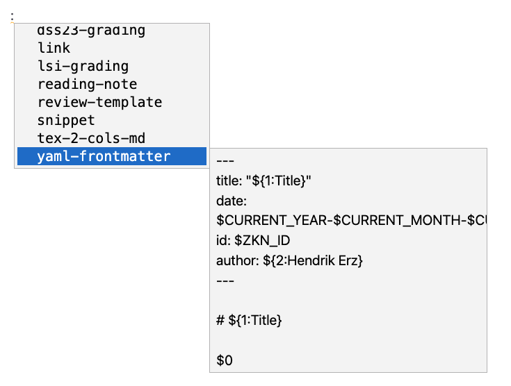
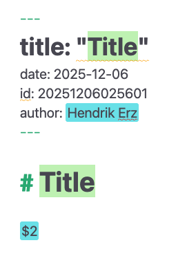
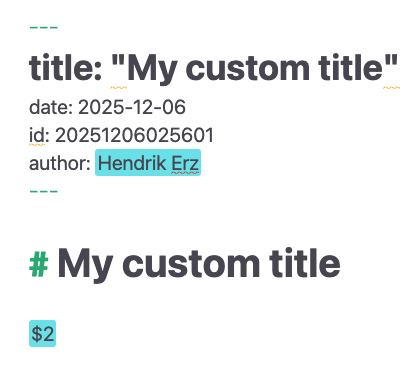
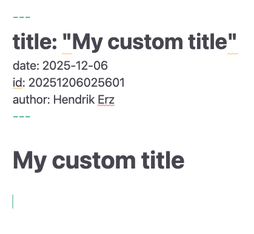

# Snippets

Snippets are re-usable pieces of Markdown code of varying length. They allow authors to define blocks of text they need to insert frequently. Moving such repeating blocks of text into Zettlr’s snippets-system ensures a consistent look and structure. By defining snippets, authors can automate the production of formal documents and ensure they always include the relevant information.

Snippets support variables, which means that you can define places within the snippets whose contents change based on context. This way, you can automatically insert a document structure, and fill in your content at the correct places.

But the use-cases for snippets go beyond this. Snippets can be defined to accompany a LaTeX template, ensuring that users of a template are able to peruse the correct variables, and utilize valid syntax. Please refer to the corresponding section below for some inspiration. In addition, our guide on setting up a custom LaTeX template includes an in-depth description of setting up a snippet to accompany your custom template.

!!! tip

	Zettlr's snippets-system is based on the TextMate syntax and as such to a certain degree interoperable with snippets from other supporting apps, such as Visual Studio Code.

## Managing Your Snippets

You can manage your snippets in the [assets manager](../advanced/assets-manager.md). Open the assets manager by selecting “File” → “Preferences” → “Assets Manager” (macOS: “Zettlr” → “Assets Manager”) or by pressing <kbd>Cmd/Ctrl</kbd>+<kbd>Alt</kbd>+<kbd>,</kbd>.

!!! tip

	See below for an explanation of the supported snippet syntax.



The snippets tab is built analogously to the other available tabs in the assets manager: To the left, you have a list of your defined snippets; to the right you can edit the current snippet.

You can add or remove snippets from Zettlr using the “+”- and “-“-buttons at the bottom of the list. When you press “+”, Zettlr will ask you for a snippet name. Provide a usable name, and press <kbd>Enter</kbd> to create your snippet.

!!! note

    Snippet names can only contain the letters A to Z, numbers, hyphens, and underscores. The reason is that the snippet name is used for the autocompletion in the editor. If you type other letters, they will be replaced with a hyphen.

Like import and export profiles, snippets are simply Markdown files. These files must have the filename extension `.tpl.md` to be recognized by Zettlr as templates. You do not need to edit these files in Zettlr, albeit using Zettlr has the benefit that it supports correct syntax highlighting for the snippet syntax.

!!! tip

	To the bottom under the list of snippets, you will find a button that directly opens the snippets' folder. This allows you to copy and paste snippets in bulk.

After you have made changes to the snippet, make sure to click “Save” or press <kbd>Cmd/Ctrl</kbd>+<kbd>S</kbd> to persist your changes. To rename a snippet, simply type the new name into the name text field above the snippet editor and click the button.

## Using Snippets

Snippets can be inserted into any Markdown document at any point by triggering the autocomplete feature. To do so, insert a colon character (`:`). The colon must be preceded by a space or be inserted at the beginning of a line. This will summon the snippet autocompletion.



You can use the keys <kbd>ArrowDown</kbd> and <kbd>ArrowUp</kbd> to navigate through the list. In order to limit the available snippets, you can start typing the name of the snippet you are searching for.

!!! tip

	The list will provide you with a preview of the snippets' contents to help you identify the correct snippet to insert.

To insert the snippet and begin the process of filling in the template, confirm your selection with <kbd>Tab</kbd>.

This will start the “filling in”-process of snippets. Once you insert a snippet, Zettlr will scan it to determine where to place tab stops. Tab stops are variables defined within these snippets that you can navigate through, and fill with content.

!!! note

	While a snippet insertion process is active, <kbd>Tab</kbd> will always navigate to the next snippet, instead of performing its default behavior (such as indenting a list item).

    You can abort the snippet insertion process at any time by pressing <kbd>Esc</kbd>.

## Filling in a Snippet

In the following, we outline an exemplary process of filling in a snippet that defines a standard Markdown document structure with a YAML front matter. The snippet makes some decisions that you do not have to follow; this example merely serves illustrative purposes.

The following example uses a snippet named “yaml-frontmatter” with the following contents:

```
---
title: "${1:Title}"
date: $CURRENT_YEAR-$CURRENT_MONTH-$CURRENT_DATE
id: $ZKN_ID
author: ${2:Hendrik Erz}
---

# ${1:Title}

$0
```

When you insert the snippet by selecting it from the autocomplete list and pressing <kbd>Tab</kbd>, Zettlr will scan the snippet for all occurrences of variables (see below for an explanation of the syntax), and replace them with special, interactive elements, so-called tab stops.

After insertion, it will find the first tab stop, and place your cursor there:



Please note a few things:

* The first tab stop to select is the one with number `1`.
* The snippet in this example defines this tab stop twice, which instructs Zettlr to select all occurrences of it at the same time. This allows you to insert repeating content just once.
* The snippet contained a few variables without tab stops. These have been simply interpolated by Zettlr and replaced with the correct values. For example, the sequence `$CURRENT_YEAR-$CURRENT_MONTH-$CURRENT_DATE` have been appropriately replaced with `2025-12-06`. The variable `$ZKN_ID` has been replaced with a newly generated Zettelkasten-ID.
* You can see the next tab stops highlighted in cyan.
* Tab stops with default content will preview the default content.

Now, you can start typing a title. Note how the title will be inserted in both locations at the same time.



After you are done inserting your title, press <kbd>Tab</kbd> to move to the next tab stop.


Again, a few things to note:

* Since the next tab stop contained default text, Zettlr has inserted the default text at the tab stop position, but selected it for you. This way, you can quickly overwrite the default text if it is not fitting.
* The final tab stop, which had the number `2` in the first step now has the number `1`. Zettlr automatically updates the tab stop numbers. The tab stop with number `1` will always be the next tab stop that will get activated once you press <kbd>Tab</kbd>.

Press <kbd>Tab</kbd> once more to move the cursor to the final tab stop:



Since this was the last tab stop, the snippet insertion process is now over. The key <kbd>Tab</kbd> now performs as usual.

!!! tip

	You can abort the snippet insertion process at any time by pressing <kbd>Esc</kbd>. Zettlr will then remove all remaining tab stops and restore the default behavior of the <kbd>Tab</kbd> key.

## Snippet Syntax

The snippets follow a simple syntax:

* Snippets are in and of itself Markdown files, so Markdown syntax is entirely valid.
* `$[1-9]`: Define a new tab stop by placing a dollar-sign followed by one or more digits.
* `$0`: The zero is a special tab stop. By default, Zettlr will place your cursor after the final position of the snippet once you are done moving through the tab stops. By placing the `$0` tab stop anywhere inside your snippet, you control this end position.
* `${[0-9]:[.]}`: By surrounding the tab stop with curly brackets and adding a colon, you can define default text that will be placed at this position. As soon as you get to the specified tab stop, this text will be inserted at the position and selected.
* `$[A-Z_]`: If you use uppercase Latin letters instead of numbers after the dollar sign, you define a variable that can be replaced when you insert a snippet. Variables consist only of uppercase characters and underscores.
* `${[A-Z_]:[.]}`: Just like with tab stops, you can define default text for variables, which will be inserted if the variable cannot be inserted (e.g., the `CLIPBOARD` variable can be empty if no text is in the clipboard). This only applies to variables that can be empty. Zettlr will ignore the default text for variables that cannot be empty, such as the date or year.

## Supported Variables

The following variables are currently supported by Zettlr's snippet system:

* `CURRENT_YEAR`: The current year (4 digits)
* `CURRENT_YEAR_SHORT`: The current year (2 digits)
* `CURRENT_MONTH`: The current month (2 digits)
* `CURRENT_MONTH_NAME`: The full name of the month (localized according to your app settings)
* `CURRENT_MONTH_NAME_SHORT`: The short month name (localized according to your app settings)
* `CURRENT_DATE`: The current day of the month (2 digits)
* `CURRENT_HOUR` The current hour (24-hour format; 2 digits)
* `CURRENT_MINUTE`: The current minute (2 digits)
* `CURRENT_SECOND` The current second (2 digits)
* `CURRENT_SECONDS_UNIX`: The current UNIX timestamp in seconds
* `UUID`: A UUID version 4
* `CLIPBOARD`: The contents of your clipboard (text only)
* `ZKN_ID`: Generate a Zettelkasten ID (according to your pattern)
* `CURRENT_ID`: Holds the currently assigned Zettelkasten ID to the file
* `FILENAME`: Holds the filename of the current file
* `DIRECTORY`: Holds the directory path for the current file
* `EXTENSION`: Holds the file extension for the current file

## Usage Examples

Over the years, more and more examples for using snippets have been discovered. Here follows an incomplete overview over some examples which you may draw upon for inspiration.

### YAML Front Matters for Templates

The standard and possibly most useful case for snippets is the automation of the insertion of YAML front matters that contain the correct variables in the correct format for various Pandoc templates. This example constructs a new Markdown Document for a Beamer presentation. Please note that it includes some variables that are only defined in the standard template for Beamer slides that Pandoc provides, such as “institute” and “shortinstitute.” It additionally provides some defaults, e.g., for the “theme” or the “aspectratio.”

This type of snippet can be quickly adapted for many templates to make creation of a document for usage with that template simple.

```
---
title: $1
subtitle: $2
author: $3
institute: $4
shortinstitute: $5
date: ${6:\today}
logo: my_logo.png
theme: ${7:CambridgeUS}
aspectratio: ${8:1609}
highlight-style: ${9:tango}
---

# $1

$0
```

### Slides Columns

When you use Zettlr to create presentation slides with reveal.js or LaTeX Beamer, you may find the need to insert content side-by-side instead of below one another. To create such two-column layouts, you can use Pandoc’s native divs, which will be correctly interpreted when you export the slides.

However, the syntax is very complex, and typing it out correctly every time can be cumbersome. The following snippet inserts the correct syntax for two columns, and then allows you to insert first the content in the forst column, then the content in the second one. This example can easily be expanded upon to incorporate three or more columns.

```
::: {.columns .onlytextwidth align=center}
:::: {.column width=50%}

${1:Col 1}

::::
:::: {.column width=50%}

${2:Col 2}

::::
:::
```

### Grading Rubric

Another (academic) common use-case is grading rubrics for courses. For example, some may wish to provide students with written feedback on how they have been doing, and do so in a standardized manner.

This example uses a table to grade one student across various dimensions. The tab stops include the possible grades for each dimension, making the snippet self-documenting.

```
## ${1:Student Name}

Essay title: $2

| Dimension     | Score           |
|---------------|-----------------|
| Writing Style | ${3:1, 2, or 3} |
| Form          | ${4:1, 2, or 3} |
| Argumentation | ${5:1, 2, or 3} |
| Length        | ${6:1, 2, or 3} |
| Comments      | $7              |
| Final Grade   | ${8:A-F}        |
```