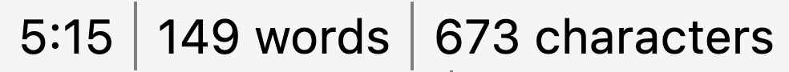
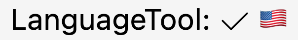
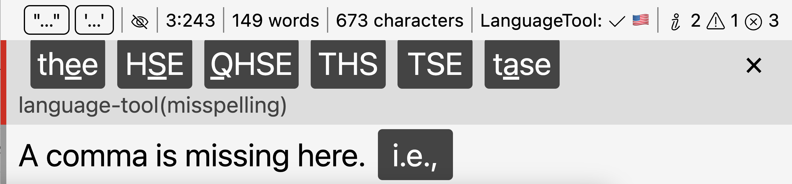

# Status Bar

The status bar is a component that displays contextual information for the current open document, and allows you to quickly change certain settings that make sense on a file-by-file basis.

To enable the status bar, go to the preferences → “Appearance” → “Status bar.” The status bar is available in all editable text documents, including Markdown, LaTeX, and the various code editors across the app.

!!! note

	The amount of available items in the status bar varies by file type and is context-sensitive.

## Overview

The status bar resides at the bottom of an editor view. It allows quick access to some useful actions and shows contextual information. Some elements allow you to quickly change certain settings, both locally and globally.

Some elements show conditionally (for example, the LanguageTool item only shows if you activate the service), some are purely informational, some are interactive.

## Magic Quotes

Magic Quotes is a setting that controls which quotation marks the editor will insert when you type the `"` or `'` key on your keyboard. You can change this setting in your preferences. However, especially for bilingual writers, it makes sense to have that settings available faster.

The status bar control for your Magic Quotes is not as flexible as the preferences setting, since it only allows you to select predefined quotation symbols, but this allows you to quickly change them during a writing session.

!!! note

    Depending on which language you select, the context menu will have more than one checked entry. Many countries use the same set of primary and secondary quotes.

Displays

: Always

Interaction

: Left-click to change your Magic Quotes.

## Rendering Mode

This control allows you to toggle the rendering mode between “preview” (WYSIWYG) and “raw” (WYSIWYM). This allows you to quickly switch between pure Markdown syntax, and seeing pre-rendered elements.

Displays

: Always

Interaction

: Left-click to toggle between Preview and raw.

## Readability Mode

The “eye”-icon allows you to turn the readability mode on. The icon will toggle between a crossed eye (readability mode off) and an eye (readability mode on).

Keep your mouse cursor over the icon to view the currently active readability mode.

Displays

: Always

Interaction

: Left-click to toggle the readability mode.

## Cursor position, word and character counters

These elements show you some contextual information for the file. For every file (both code and Markdown files), it shows your current cursor position (line and column) as well as the absolute document position.

For Markdown files, the elements also include the current file’s word- and character-count.

Displays

: Always

Interaction

: This element is non-interactive.

## Input Mode

The input mode control tells you what editor input mode is currently active. It does not show while you're in the normal mode, only in the Emacs and Vim modes.

Displays

: When you use the vim or emacs input mode.

Interaction

: This element is non-interactive.

## LanguageTool Status

This control shows the current status of the LanguageTool linter. It only shows when the LanguageTool integration is active, and will cycle through the various status it may have:

* When LanguageTool is idling, it will show a checkmark to indicate that it has finished checking your text, and next to it the current language.
* When LanguageTool is currently checking your text, the icon will change to an hourglass to indicate that it currently processed your text.
* If there has been an error, the icon will change to an error symbol and a short error message will explain what is wrong.

When you open a file, LanguageTool will start with the idle status and display “auto” as the language. This indicates that LanguageTool first needs to detect the language in your text. After the first check, it won't show “auto” anymore but only the language it is checking for.

To manually change the language that LanguageTool uses, click the icon. This will override the automatically detected language.

Displays

: When the LanguageTool integration is active.

Interaction

: Click to summon a menu to select the document language.

## Diagnostics

This control displays a list of diagnostic messages. As we outline in the [Language & Style](../language-style/index.md) section, Zettlr runs a variety of different linters that can all flag potential problems, style issues, and suggestions. The diagnostics counter gives you a comprehensive overview over how you are doing.

The counter displays the total of all three types of issues: informational messages (the “i” icon), warnings (the triangle with exclamation mark), and errors (the circled “x”).

You can toggle the diagnostic panel by clicking on the control. This will open the diagnostic panel below the status bar.

This diagnostics panel lists every diagnostic message chronologically. You can use the keyboard to navigate through the diagnostics panel.

Displays

: Always

Interaction

: Click to toggle the diagnostics panel.
