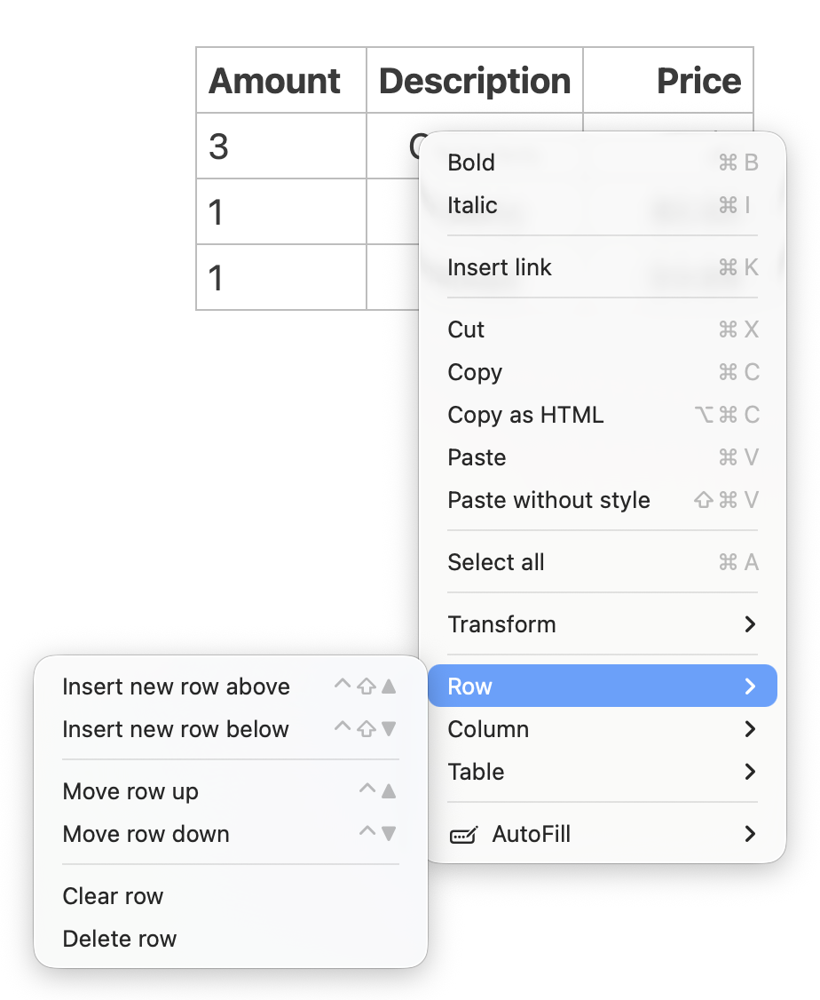

# Table Editor

On this page, we first introduce the anatomy of tables, and then the primary tool for working with Markdown tables: the Table Editor.

## Introduction to Tables

Tables in Markdown can be written in one of two styles: there are **grid** tables and there are **pipe** tables. These names refer to how the table will look.

A grid table looks like this:

```markdown
+----------+----------+
| Cell A:A | Cell A:B |
+==========+==========+
| Cell B:A | Cell B:B |
+----------+----------+
```

Result:

<!-- NOTE: MkDocs doesn't support grid tables -->

| Cell A:A | Cell A:B |
|----------|----------|
| Cell B:A | Cell B:B |

The same table can be produced with pipe characters:

```markdown
| Cell A:A | Cell A:B |
|----------|----------|
| Cell B:A | Cell B:B |
```

Result:

| Cell A:A | Cell A:B |
|----------|----------|
| Cell B:A | Cell B:B |

!!! note

    The entire syntax for grid tables can be found in the [Pandoc manual](https://pandoc.org/MANUAL.html#extension-grid_tables). The syntax for pipe tables are located [here](https://pandoc.org/MANUAL.html#extension-pipe_tables).

Specify the alignment of the table columns with colons (`:`). A single left colon or none specifies the default left-alignment, whereas a right colon specifies right alignment, and two colons specify centered alignment:

```markdown
| Amount | Description | Price |
|:-------|:-----------:|------:|
| 3      | Carottes    | $1    |
| 1      | Celery      | $0.50 |
| 1      | Bread       | $4.69 |
```

Result:

| Amount | Description | Price |
|:-------|:-----------:|------:|
| 3      | Carottes    | $1    |
| 1      | Celery      | $0.50 |
| 1      | Bread       | $4.69 |

It doesn't matter how you align the table's contents in your documents, as long as the colons are placed accordingly. The table will be exported using the correct alignment later on.

Markdown tables tends to get rather wide due to the many characters involved and the fact that pipe tables do not support multiple lines per cell. Take for instance the following example:

```markdown
| # | Name              | Description                                                                                                                                                                     | Price     | Quantity |
|--:|-------------------|---------------------------------------------------------------------------------------------------------------------------------------------------------------------------------|-----------|----------|
| 1 | Sonic Screwdriver | A device for all purposes. It replaces all of your current tools to account for a multi-dimensional journey through space and time.                                             | $99.99    | 1        |
| 2 | E-11 Rifle        | Trusted by imperial troops, this rifle is the least accurate, but still most used weapon in the Galaxy.                                                                         | $329.95   | 2.000    |
| 3 | Towel             | We all know that you always should bring a towel to any intergalactic journey. This multi-purpose towel is the ideal companion in case your planet is about to be exterminated. | $12.30    | 157      |
| 4 | Your Mom          | Are you in an argument with a philosopher? Try this Freudian-tested kill-all-argument!                                                                                          | priceless | 1        |
```

In Zettlr, it would look like the following:


Even though the table cells are each aligned to fit the total width of each column, it is difficult to work with such a table.

## Inserting Tables

Since creating the basic structure of a table can be cumbersome, Zettlr includes a feature that can generate the correct syntax. To insert a table in your document, click on the corresponding toolbar button that looks like a table.

A pop-up will open that shows you a grid. When you move your mouse over the grid, the top-left cells of this grid will be highlighted. Move the mouse cursor until the correct amount of columns and rows are highlighted, and click. Zettlr will then insert the basic scaffold for a pipe table of that size.

## The Table Editor

To make creating tables easier, Zettlr ships with a table editor. The table editor will detect Markdown pipe tables in your document and render them as actual tables that support line wrapping and contain less cluttered borders.

With the table editor, the above-mentioned table looks like this:


!!! note

	Due to the complexity of grid tables, and especially the ability to produce very complex layouts, the table editor only supports pipe tables.

### Editing Tables

To edit tables with the table editor, click into any of the cells of the table and begin writing. Regular Markdown syntax is supported.

Whenever a cell is currently active, you will see the Markdown source of the cell. Every cell that is not active will be rendered as HTML to make the display less cluttered.

## Keyboard Navigation

While editing a table, the following keyboard shortcuts are available:

- <kbd>Tab</kbd>: Move to the next cell. If the last column is active, move to the first cell in the next row. If your cursor was in the last column of the last row, a new row will be added automatically.
- <kbd>Shift</kbd>+<kbd>Tab</kbd>: Move to the previous cell. If your cursor was in the first column, move to the last cell in the previous column.
- <kbd>Return</kbd>: Move to the same column in the next row.
- <kbd>Shift</kbd>+<kbd>Enter</kbd>: Move to the same column in the previous row.
- <kbd>Arrow Up</kbd>/<kbd>Arrow Down</kbd>: Move to the same column in the previous/next row. No new rows will be added if you are in the first or last row.
- <kbd>Arrow Left</kbd>/<kbd>Arrow Right</kbd>: Move the cursor left/right. If the cursor is at the beginning/end of the cell's contents, move to the previous/next cell.

With these shortcuts, you can easily enter content into your tables using natural movements. You would first want to fill out the table header and afterwards you want to add one set of data per line. Therefore, <kbd>Tab</kbd> is your friend here:


## Adding Rows and Columns

The table editor also features a set of buttons at the edge of the table. These allow you to add a new row or column at the specified location.


These buttons will always appear at the edge of the currently active cell. Click into any cell in the row or column to which you wish to add a new row or column to move these buttons there.

## Removing Rows and Columns

To remove a row or column, simply right-click any cell in the row or column that you want to remove. Then, select the correct context-menu item.



Through this context menu, you can add or remove rows and columns, swap rows and columns, or clear them out (remove their contents). You can also clear out or delete the entire table.

## Keyboard Shortcuts

You have several keyboard shortcuts available that will make working with tables easier and allow you to avoid opening the context menu in several instances:

| Keyboard Shortcut | Function |
|-|-|
| <kbd>Tab</kbd> | Move to the next cell (<kbd>Shift</kbd> for previous cell) |
| <kbd>Enter</kbd> | Move to the next row (<kbd>Shift</kbd> for previous row) |
| <kbd>Alt</kbd>+<kbd>Shift</kbd>+<kbd>ArrowUp</kbd><br>(macOS: <kbd>Ctrl</kbd>+<kbd>Shift</kbd>+<kbd>ArrowUp</kbd>) | Add a row before the current one |
| <kbd>Alt</kbd>+<kbd>ArrowUp</kbd><br>(macOS: <kbd>Ctrl</kbd>+<kbd>ArrowUp</kbd>) | Swap the current row with the previous one |
| <kbd>Alt</kbd>+<kbd>Shift</kbd>+<kbd>ArrowDown</kbd> <br>(macOS: <kbd>Ctrl</kbd>+<kbd>Shift</kbd>+<kbd>ArrowDown</kbd>) | Add a row after the current one |
| <kbd>Alt</kbd>+<kbd>ArrowDown</kbd> <br>(macOS: <kbd>Ctrl</kbd>+<kbd>ArrowDown</kbd>) | Swap the current row with the next one |
| <kbd>Alt</kbd>+<kbd>Shift</kbd>+<kbd>ArrowRight</kbd><br>(macOS: <kbd>Ctrl</kbd>+<kbd>Shift</kbd>+<kbd>ArrowRight</kbd>) | Add a new column to the right of the current one |
| <kbd>Alt</kbd>+<kbd>ArrowRight</kbd><br>(macOS: <kbd>Ctrl</kbd>+<kbd>ArrowRight</kbd>) | Swap the current column with the next one |
| <kbd>Alt</kbd>+<kbd>Shift</kbd>+<kbd>ArrowLeft</kbd><br>(macOS: <kbd>Ctrl</kbd>+<kbd>Shift</kbd>+<kbd>ArrowLeft</kbd>) | Add a new column to the left of the current one |
| <kbd>Alt</kbd>+<kbd>ArrowLeft</kbd><br>(macOS: <kbd>Ctrl</kbd>+<kbd>ArrowLeft</kbd>) | Swap the current column with the previous one |
| <kbd>Shift</kbd>+<kbd>Cmd/Ctrl</kbd>+<kbd>K</kbd> | Delete the current column |
| <kbd>Cmd/Ctrl</kbd>+<kbd>Backspace</kbd> | Clears out the current column (i.e., inserts whitespace) |
| <kbd>Shift</kbd>+<kbd>Cmd/Ctrl</kbd>+<kbd>Backspace</kbd> | Clears out the current row (i.e., inserts whitespace) |
| <kbd>Alt</kbd>+<kbd>Shift</kbd>+<kbd>Cmd/Ctrl</kbd>+<kbd>Backspace</kbd> | Clears out the entire table |
| <kbd>Ctrl</kbd>+<kbd>C</kbd> | Aligns the current column center |
| <kbd>Ctrl</kbd>+<kbd>L</kbd> | Aligns the current column left |
| <kbd>Ctrl</kbd>+<kbd>R</kbd> | Aligns the current column right |
| <kbd>Cmd/Ctrl</kbd>+<kbd>Shift</kbd>+<kbd>A</kbd> | Aligns the table at the main selection head (not left/right/center, but adds the appropriate padding so that it is formatted nicely. Requires a monospaced font for proper visuals.) |

## Complex tables

Sometimes, you will find the need to insert more complex tables with cells spanning multiple columns and/or rows. In this case, the table editor is not available.

You can either use grid tables. Zettlr supports syntax highlighting of these, even though the table editor cannot handle them. Some keyboard shortcuts will still work, even in grid tables.

If grid tables are insufficient, you can insert tables also in another language, such as HTML or LaTeX, depending on where you wish to export the document to.

What you can do in this case is to include such tables as raw LaTeX or HTML source code. There are great tools out there to [transform your RDataset](https://tex.stackexchange.com/questions/364225/export-tables-from-r-to-latex) or STATA datafile into LaTeX or HTML and include complex regression tables via raw markup syntax.

To include such a file in a larger research project, you can make use of Zettlr's [project feature](../file-manager/projects.md).
