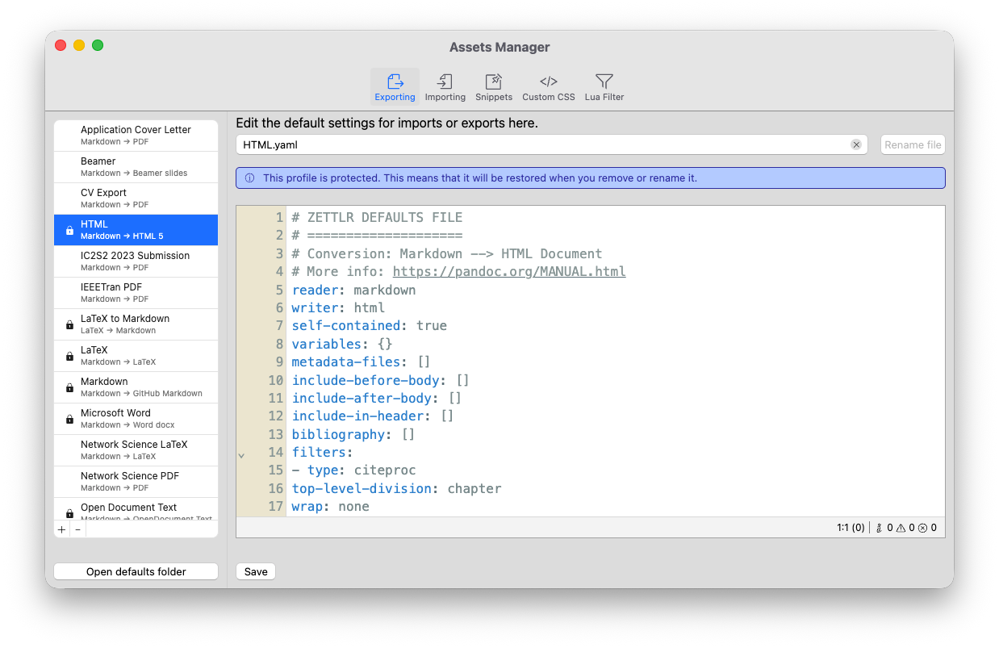

# Assets Manager

The assets manager allows you to directly edit many of the files that are required to import and export files. It can be opened either via “File” → “Preferences” → “Assets Manager” (macOS: “Zettlr” → “Assets Manager”) or by pressing <kbd>Cmd/Ctrl</kbd>+</kbd><kbd>Alt</kbd>+<kbd>,</kbd>.

The assets manager provides five tabs which allow you to edit various types of files:

1. Exporting and importing profiles ([see our guide](./defaults-files.md))
2. Snippets ([see our guide](../editor/snippets.md))
3. Your Custom CSS ([see our guide](../guides/custom-css.md))
4. Lua Filters ([see our guide](./lua-filters.md))

## Using the Assets Manager

Except for the custom CSS view, all tabs feature the same basic structure. To the left, you will always see a list of all relevant files. Below this list you can find a button that will open the corresponding folder, if applicable. On the right-hand side, you will first see a text field allowing you to rename a file. Below that, you will see a code editor that allows you to directly edit this file, using proper syntax highlighting and a linter to check your code for errors.