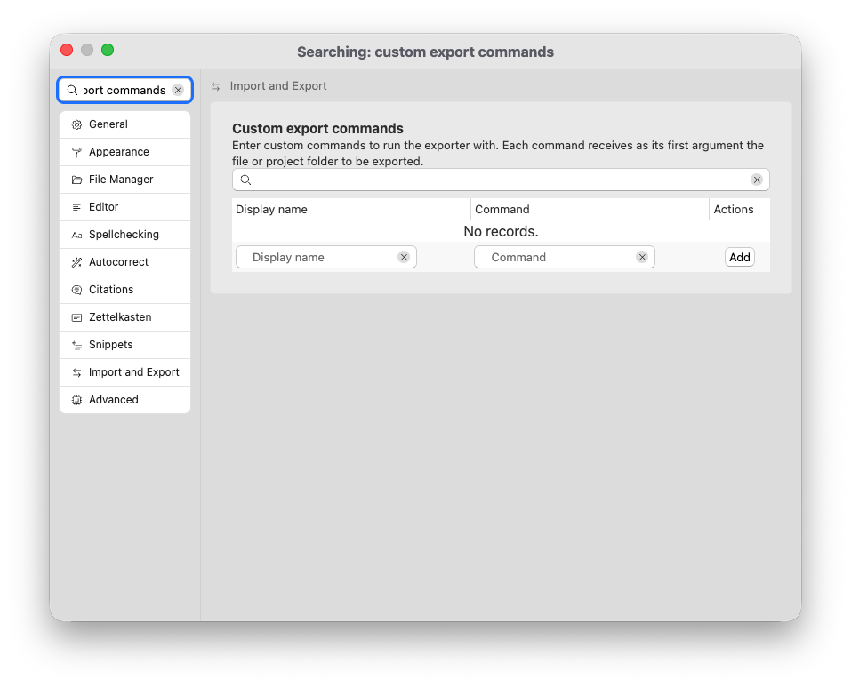

# Custom Commands

For some workflows, it is necessary to treat your files differently than what the built-in exporting engine is capable of. For this, you can specify custom commands.

To add custom commands to the available list of exporting options, open the preferences → “Import and Export” → “Custom export commands.”

Choose a “Display name” that will be shown in the single-file exporter and the project properties, and define a command. This command must be in your PATH, or be specified with an absolute path. This path should not contain any spaces.

## How Custom Export Commands Work

When you select a custom export command to export your Markdown documents, Zettlr will not start its own export engine. Instead, it will call your command and pass it the absolute path to the files that should be selected. Your command is responsible for treating the files accordingly, perform the export, and any other necessary actions.