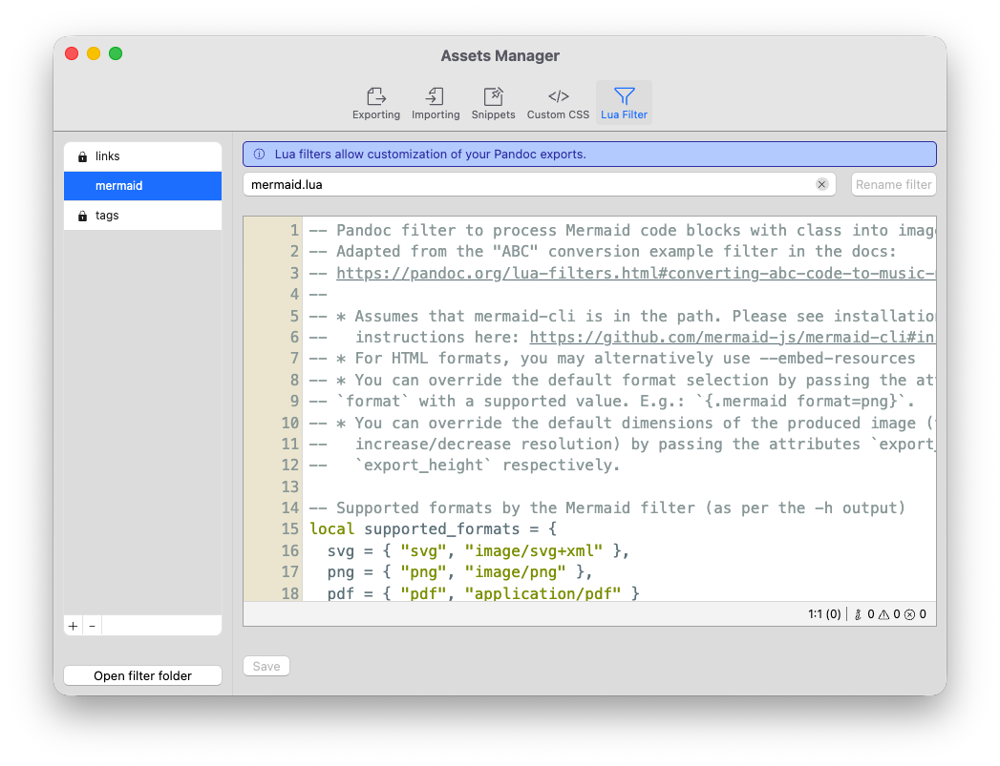

# Lua Filters

The final component that can help you customize your experience with Zettlr are custom Lua Filters. You can view and modify Lua filters in the [assets manager](./assets-manager.md).



## What is a Lua Filter?

A Lua Filter is a small program that you can write to customize how Pandoc exports your documents. They are written using the Lua scripting language and Pandoc supports them natively.

Indeed, Zettlr already ships with two built-in filters – one for wiki links, and one for tags!

Lua filters run during the export stage and can modify any document before Pandoc actually writes the file contents to disk. This can allow you to customize how your documents are transformed from simple additions (e.g., removing tags) to large changes to the syntax tree (e.g., by transforming Mermaid code blocks to actual Mermaid diagrams).

Lua is a powerful language, and Pandoc’s integration with them is deep. This documentation is not the right place to explain everything about Lua to you.

Instead, we kindly refer you to Pandoc’s [extensive documentation on how to write your own Lua filters](https://pandoc.org/lua-filters.html).

## Lua Filters for Zettlr: Best Practices

While Zettlr is happy about any Lua filter written for Pandoc, there are a few caveats to consider. First, Zettlr will always run *all* filters in your filter directory. So every filter you can see in the assets manager will always run for every export.

This means that, instead of assuming a certain document structure, Zettlr’s Lua filters are intended to run conditionally.

In fact, the [workflow guide](./workflow.md) already gives a hint at how this works: Upon export, Zettlr will write into your profile’s metadata some configuration settings that the two built-in filters for links and tags read.

Whenever the metadata of any document includes the option `zettlr.strip_links`, for example, the filter will read this setting, and transform the document as applicable.

In the link filter, for example, this is how it looks:

```lua
Meta = function (meta)
  -- Retrieve the option required for this filter if they exist.
  if meta.zettlr then
    if meta.zettlr.strip_links then
      strip_links = meta.zettlr.strip_links
    end
  end
  return meta
end
```

The filter will then check every link and either do nothing (if you set your preference to leave wiki links as they are in your settings), or adjust the link according to your preference. This way, the filter can run every time, but depends on your settings.

You may want to do something similar for your filters: Define a configuration option that must be set in order for the filter to run. This way, your program can decide if it needs to run based on an entry in your YAML front matter.

If you were to manually set the option strip links in your front matter, it might look as follows:

```yaml
---
zettlr:
  strip_links: "no"
---
```