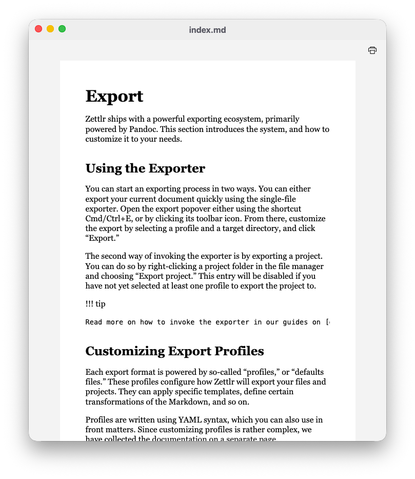

# Printing and Previewing

While most exports are intended to end up as files on your computer, you may, at times, want to preview or even print a document. This can help you preview what the document may look like once exported, and it can allow you to quickly print out a draft to read it on paper, rather than on your computer.

You can open the print preview for any document by pressing <kbd>Cmd/Ctrl</kbd>+<kbd>P</kbd>.

This will internally export your document to HTML and display the results in a new window.

!!! note

	The print preview does not actually use Pandoc. Instead, it uses Zettlr's internal Abstract Syntax Tree representation of your document. This means that there might be some differences in how Pandoc vs. Zettlr will export a document. However, Zettlr aligns as closely as possible with Pandoc's default styles for an HTML export.

Click the print icon to actually print out the HTML file. This will call Chrome’s built-in printing dialog and allow you to print out the document directly from within Zettlr.

If you want a more customizable layout of your document, exporting the file first to, say, PDF, and then printing from that application is the right way to go.