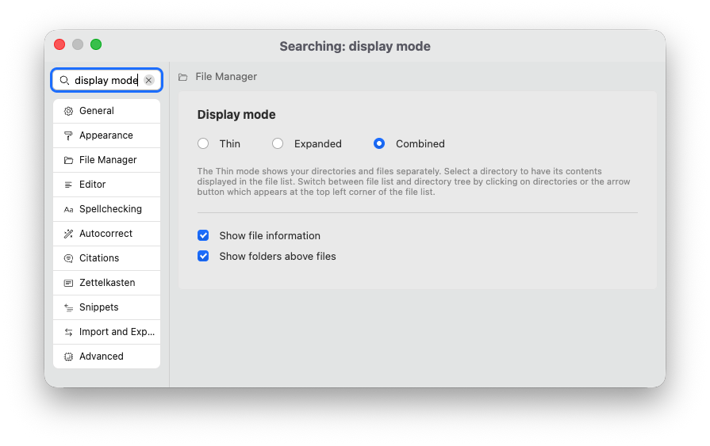
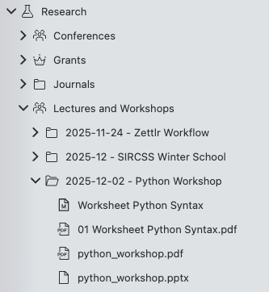
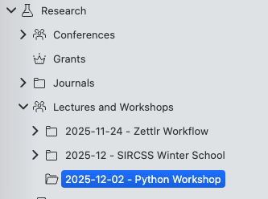
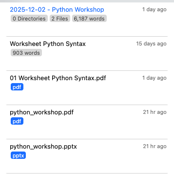
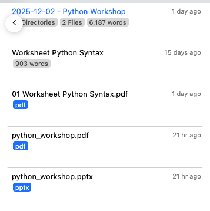

# File Manager Appearance (Modes)

You can also control the appearance of the Zettlr file manager to adapt it to how you like to work. There are three available display modes that change its appearance.

In the preferences, the “file manager mode” setting controls how the file manager displays your files:

You have three settings, or modes, that control how your file manager works:

* **Combined**: This is the default setting. In the combined mode, the file manager essentially looks like a tree of all your files and folders, and both your files and your folders are shown together in one view. We recommend this setting.
* **Thin**: The thin mode separates your files from your folders. In this mode, there is still a tree view, but that one only includes your folders. As soon as you select a folder here, the file manager will switch to a list that shows a list of all your files within this folder.
* **Expanded**: The expanded mode works like the thin view. The difference is that the thin mode moves between folder view and file list, while in the expanded mode, both are shown side-by-side.

### The Combined Mode

The combined mode is the closest mode to how your computer itself will display all your files. It contains all files and folders in one, unified view. See the screenshot for an example:

In this example, you can see a workspace, “Research” and a series of sub-folders. In the folder “Lectures and Workshops” → “2025-12-02 - Python Workshop” you can see a set of files belonging to that folder; such as a PowerPoint presentation, a PDF export of said presentation, and a worksheet, both as Markdown and exported PDF.

### The Thin and Expanded Modes

The Thin and expanded modes draw folders and files apart from each other.  Some people may find it simpler to work with a list of files instead of a folder structure. If you turn on the “thin” file manager mode, your files will disappear from the file tree.

The screenshot shows the same folder as above, but this time with the “thin” file manager mode active.

As you can see, all the folders are still there, but the files are gone.

To see the files, you need to click on a folder which you want to view. Once you do, the file manager will move from this tree view to a new view, the file list:

As you can see, the containing folder – “2025-12-02 - Python Workshop” is shown in color on the top, and all files that are contained inside this folder are listed below.

In the “expanded” mode, both views are shown at the same time. In the thin mode, you can move back and forth between both views by scrolling horizontally. If you do not have the ability to scroll horizontally, you can also navigate between the two modes by clicking. When you see the folder tree, clicking on any folder will move to the file list. When you see the file list, move your mouse to the top-left corner. Once you reach it, an arrow-button will appear that allows you to move back to the folder tree.

See the screenshot to see what this arrow looks like:

