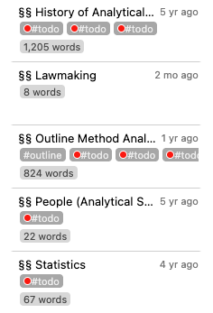
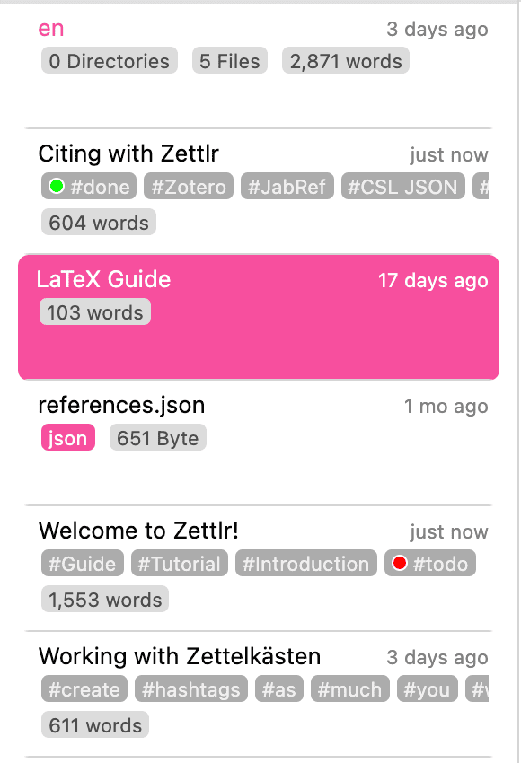
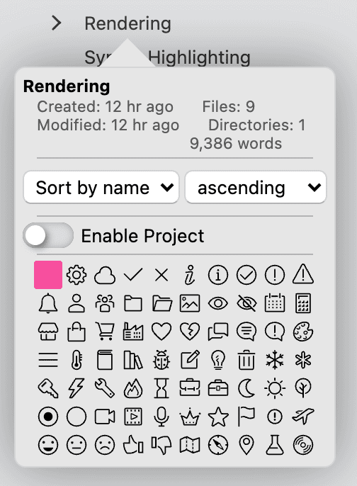
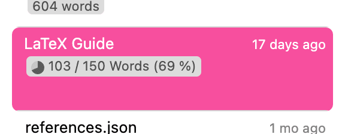

# The File List

The file list is a special view over your workspaces allows you to browse all your files as a list, instead of a tree.

You can control the contents of the file list view by selecting a folder in the tree view. This will tell the file list to display you the contents of that folder, but as a list. For some people, this may be easier to navigate than a tree view.

In addition, since the file list has more space to display file information, the file list allows you to view more metadata for each file and folder at a glance than the tree view.

## Information in the File List

The file list can show additional information on your files. For example, it can include information on the word count of a file, the keywords contained therein, or its Zettelkasten ID.

You can decide whether you want to view additional metadata or not by clicking “View” → “Additional Information” or by pressing <kbd>Cmd/Ctrl</kbd>+<kbd>Alt</kbd>+<kbd>S</kbd>. If you turn off display of additional information, the file list displays each item in a single line, making the view very compact.

As you can see in the screenshot above, the file list can display several pieces of metadata extracted from your files. Each “tile” or “card” consists of three lines when metadata is shown.

The first line always shows you the title of the file and the last modification date, or when the file was created. (You can determine which timestamp is displayed here in the preferences.)

In the second line, the file list shows all keywords that are contained in the file. You can define keywords either using the common syntax on social media (`#this-is-a-tag`), or by adding them to the YAML frontmatter in the `keywords` or `tags`-property.

Some keywords here have colored circles. You can define which of your keywords have special meaning and assign a color in the tag manager.

In the third line (second if the file does not contain any keywords), the file list displays a word count, indicating how big the file is. If you have set a writing target for this file, it shows the progress towards this target in addition to the current word count.

## How the File List Displays Folder Contents

Instead of using a tree-like appearance to display your files, the file list creates a long list from all a folder’s contents. You can imagine the process like follows.

Imagine you have the following folder structure:

* Papers
    * First term paper
        * Introduction.md
        * Background.md
        * Results.md
        * Conclusion.md
        * Notes.md
    * Second term paper
        * Notes.md
    * Third term paper
        * Notes.md
* Courses
    * Political Science 101
        * Lecture Notes.md
        * Literature List.md
    * Sociology 201
        * Lecture Notes.md
        * Literature List.md

The file list essentially **displays this same structure, but as a list**. This means that sub-folders (such as the term papers and course folders) will be listed one after another on the same level:

* Papers
* First term paper
* Introduction.md
* Background.md
* Results.md
* Conclusion.md
* Notes.md
* Second term paper
* Notes.md
* Third term paper
* Notes.md
* Courses
* Political Science 101
* Lecture Notes.md
* Literature List.md
* Sociology 201
* Lecture Notes.md
* Literature List.md

## Navigating the File List

This may be difficult to navigate. This is why you can **restrict the file list more and more, by clicking on folders in it**. When you click with your mouse on a folder (not a file), this tells the file list you want to move into that folder, that is, you move “down” your folder tree.

If you, say, click on the folder “First term paper” in your file list, this tells the file list to only display that folder’s contents, which looks like this:

* First term paper
* Introduction.md
* Background.md
* Results.md
* Conclusion.md
* Notes.md

If you now instead want to display **all** your papers, you can **hold down <kbd>Alt</kbd> to navigate up, instead of down** when you click a folder. So, <kbd>Alt</kbd>-clicking the folder name “First term paper” moves up one level and displays you the contents of the “Papers” folder instead:

* Papers
* First term paper
* Introduction.md
* Background.md
* Results.md
* Conclusion.md
* Notes.md
* Second term paper
* Notes.md
* Third term paper
* Notes.md

!!! tip

	As you can see, navigating the file list resembles a form of "filtering." If you need to focus on a particular type of work, you can navigate "down" the file list until only those files that you care about are displayed. At the same time, if you need a broader overview over your projects, you can navigate "up" until you see all files you need.

## How the File List Sorts

One important aspect in the file list is how it decides upon the sorting order of your files. This is relevant because there are some assumptions the file list has to make.

1. Whichever folder you select to view will always be displayed at the top. Clicking this folder will not do anything, but <kbd>Alt</kbd>-clicking it allows you to move “up” into the parent folder.
2. If there are any files in the current folder, those will always be sorted directly beneath this folder.
3. Any folders inside the current folder are sorted after the files.
4. The files inside folders themselves will be sorted according to however you wish to sort them.

***

The file list shows you all directories and files inside the directory that is currently selected in the tree view, but not like a normal file browser: **the file list treats all subdirectories as equals, and shows you all of them one after another!** Therefore you don't need to traverse further into the directory tree to reach buried directories.

If you turned off the meta information, both directories and files will be shown as one-liners. If you display the *file information*, you will see additional information: directories will show you the amount of files and folders they contain. The files, on the other hand, show their last modification date, any tags, an ID, and more.

!!! tip

    You can toggle the file information via the "View" menu, by pressing `Cmd/Ctrl+Alt+S`, or the relevant setting in the preferences dialog under the General tab

Additionally, you can traverse the directory tree within the file list by clicking on the directories. A simple click will select the directory and move further down the tree, while `Alt+Click` will select its parent directory. This is useful if you have to switch directories often, but prefer the thin mode of the sidebar and don't want to switch to the tree view repeatedly.

!!! note

    Within the file manager, you can perform most actions that you can also perform in your Explorer/Finder/file browser as you would expect it, such as opening, duplicating, creating, and removing files, dragging them around, and more.

### File and Folder Properties

Each file and each folder also has properties. You can view them by right-clicking any file or folder, and choosing the corresponding menu item.

Each folder can be turned into a [Project](../advanced/projects.md) by clicking the switch in its property popover. Afterwards you can fine-tune its project settings. Also, you can select a directory icon which makes it easier to identify the directory visually. Lastly, you can sort directories in their property popovers. Files, on the other hand, show you their tags, ID, and other useful information. You can also set writing targets in the properties of a file.

!!! tip

    To remove the writing target from a file, simply set the writing counter to zero.

Both file and folder property popovers show you some general information, like the last modification time, their creation time, and their size.

## Structural Implications for the File List

Each time you select a directory, the file list will display _all_ files and folders in this directory. Simply put, it flattens all your different subdirectories and files from the tree-like structure that is being resembled by the file tree into a one-dimensional list. The list will always change its contents whenever you select a different directory in the tree view.

!!! tip

    The list only displays all directories and files _within_ the currently selected directory. Therefore it works a little bit like a very fast search function. You only see the files in a specific directory and, when you move down level by level, less and less files are visible until only one directory and its files are visible. Given a good structure inside your root, this is a powerful way to only have those files in the list that you actually need.

As the file list flattens your complex directory tree, it has to make some assumptions on how to adequately _display_ the files. Therefore the following rules help you distinguish where the files are actually present on your disk:

1. The currently selected directory will be on top of the list of files. Always.
2. All files that are inside this directory are placed directly beneath this directory name.
3. All subdirectories that are _inside_ this directory will always be at the bottom of the file list, i.e., _after_ the files in the selected directory.
4. If directories are empty, they will be placed immediately after each other with no files in between.

So what is important to remember is: All directories will be displayed as if they reside on the very same level; as if they weren't nested. To identify which directories contain which, please refer to the tree view.

!!! tip

    If you do not like the "natural" sorting of Zettlr (so that 10 comes after 2), you can switch to "ASCII" sorting in the General tab of the settings dialog (so that 2 comes after 10).
