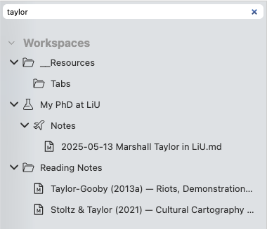

# Filtering

Unlike your computer’s file browser, Zettlr offers a very quick way of searching for items in your workspaces. On the top of the file browser, you can find a text field that allows you to filter the items displayed in the file manager.

For example, if you consistently name reading notes using the author names, and you want to search for a reading note of a particular author, you can start typing their name in this filter field. Zettlr will immediately hide any files that are not matched by this query.

## Using the Filter

Using the filter function is a quick way to find files without having to manually navigate your folder structure.

You can also focus the filter field using the shortcut <kbd>Cmd/Ctrl</kbd>+<kbd>Shift</kbd>+<kbd>T</kbd>.

The screenshot shows an example: The filter field contains the text “taylor,” and the file manager only shows files that match this filter query.

## Navigating the File Manager With Your Keyboard

Another benefit you get when you focus the filter field is that you can navigate the file manager using only your keyboard.

As soon as the filter field is focused – either by clicking into it, or by using the shortcut – you can start using the arrow keys on your keyboard to move between the shown items.

Use the <kbd>Arrow Up</kbd> and <kbd>Arrow Down</kbd> keys to move from item to item.

When you are on a folder, you can use the <kbd>Arrow Left</kbd> key to collapse the folder (hide its contents), or the <kbd>Arrow Right</kbd> key to expand the folder (show its contents). This does not work when you are actively filtering, only when you leave the filter field empty.

When you are on a file, you can press <kbd>Enter</kbd> to open the file.