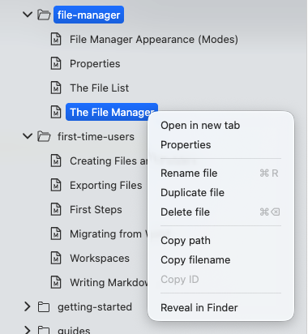

# The File Manager

The file manager is basically a built-in file browser (like Explorer or Finder) tuned to the needs of Zettlr. It is one of the core components of the app.

The file manager always lives to the left of the window. You can show and hide it with the first toolbar button.

## General

The file manager consists of two sections. First, there is a “Files” section that shows you what we call “standalone,” or “root” files. These are Markdown files which you have opened in Zettlr that do not live in any of your workspaces. This section will be hidden if you do not have any such files open.

The second section is called “Workspaces” and it lists all your opened workspaces. When you open a new folder as a workspace, it will be shown here.

You can collapse either section by clicking the small caret left of the section heading to reduce clutter, if you have many files and/or workspaces open.

Inside the file manager, you can perform all the usual actions that you can also perform in your computer’s file browser, but Zettlr includes a few additional actions that are helpful for managing a large amount of Markdown documents.

## Differences Between Zettlr’s File Manager and Your Computer’s File Manager

Despite Zettlr’s file browser looking and working similar to your computer’s file browser, there are a few crucial differences between the two:

* Zettlr only shows a subset of files, and not all.
* Zettlr can use information from within the files to display a more appropriate title in the file browser (such as the first heading of the file).
* You can configure the appearance of folders and change, e.g., their icon, or turn any folder into a project.
* You can quickly filter files and folders using the filter field at the top of the file manager. Start typing to quickly restrict the view to only files and folders that match this filter query.

It is important to recognize that Zettlr’s file browser is intentionally limited and, sometimes, you may have to use your computer’s file browser to perform some action.

## Behavior

The file manager allows you to do many things that you already know from your computer’s file browser. Most of these actions can be accessed via the context menu.

The context menu offers you a variety of actions depending on whether you click on a file or folder.

The most helpful entry in the context menu is the “Properties” entry. This allows you to view the file’s or folder’s properties. Learn more in the [properties documentation](./properties.md).

Next, just like in your computer’s file browser, you can create, rename, or delete files and folders.

In addition, you can copy both the name, and the entire path of a file or folder. This is important especially if you are a power user and work with command-line utensils. However, when you create a template, this is also helpful, as this allows you to copy the template’s path to your clipboard and use them in a defaults profile. Please refer to the documentation on profiles to learn more.

Finally, the context menu allows you to show the file or folder in your computer’s file browser. This is helpful if you need to do something that Zettlr cannot do. Choosing this option (the wording depends on your computer; on macOS the option is called “Reveal in Finder”) will open your file browser and show you the file.