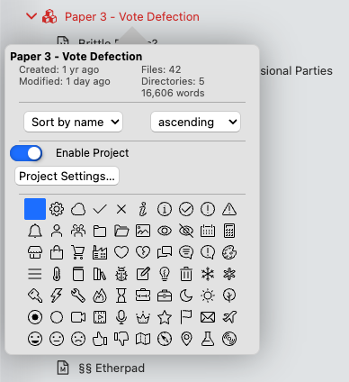
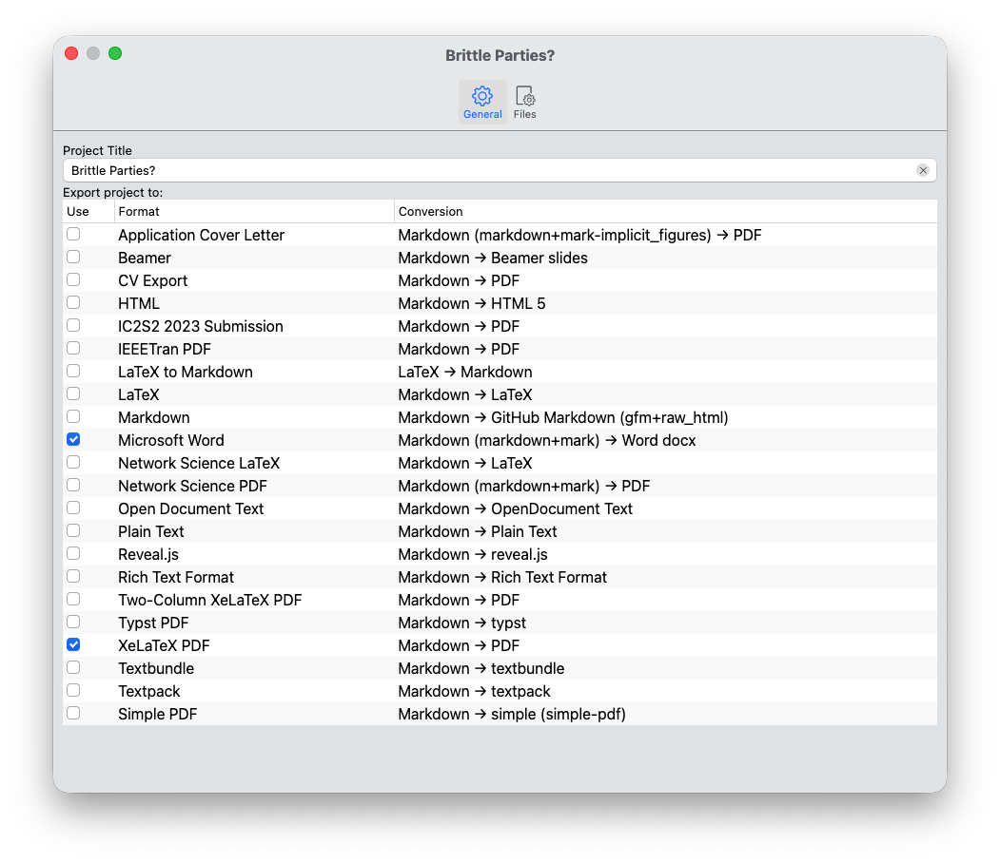
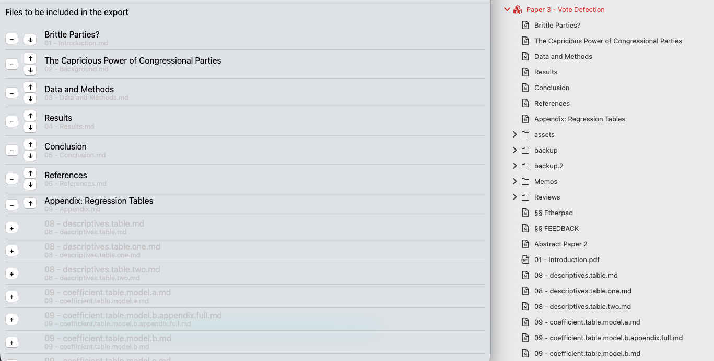

# Projects

Projects are a way to group together multiple Markdown documents in such a way that you can split up longer work into smaller parts. This is especially relevant to paper projects, or even entire books. Therefore, this is the perfect tool especially for academics and authors.

Projects are built upon the notion of aggregating work for a project inside its own project folder. Thus, projects are essentially a property of a folder — you can “activate” and “disable” project features on a per-folder-basis.

## Starting a New Project

Since projects are essentially just folders, starting a new project is as simple as creating a new folder for it.

Let’s say you want to start a new paper, and give it some preliminary name, say “Vote Defection.” So you could create a folder and give it that name.

!!! hint

	The examples in this section are not arbitrary: They are taken from the PhD project of the maintainer, Hendrik Erz. Therefore, they give you a glimpse into how this feature can be used in the real world.

Then, you can start creating files in this folder. For a regular paper, you might want to create one file per each section of the paper, as well as a general “Notes” file to jot down some thoughts:

* Introduction
* Background
* Data and Methods
* Results
* Discussion
* Conclusion
* Notes

## Turning on the Projects Feature

After creating the scaffold for your project, you will want to turn on the project-feature for this folder. To do so, right-click the folder and select “Properties.” In the properties popover, turn the projects toggle on.

Once you have enabled projects for this folder, a few things will change:

1. The folder name will turn red in the file manager, making it easy to find your projects.
2. The folder will receive a “projects” icon instead of the default folder icon.
3. The context menu will now show an additional entry, allowing you to “export” the project.

## Configuring your Project

The next step is to configure your project. To do so, select “Project Settings…” from the folder’s properties popover.

Doing so will open up the project settings for this project. You can configure everything necessary in this window.

### General Options

The first tab, “General,” shows you two settings. At the top, you can define a “title” for your project. This is necessary for exporting the project later on, as it will become the filename as well as populate the `title` property of your project.

!!! note

	The "Project Title" essentially fulfills the same function as the YAML frontmatter property `title`. If you have set a `title` manually somewhere in your project files, this will override it.

Below the title, you will see a long list with all your export profiles. This allows you to determine the export formats into which your project should be exported. You can select as many as you want, and Zettlr will export all of them at once.

The table has three columns. The first one contains a checkbox allowing you to turn on or off the export profile for this project. The second column contains the name of the profile. And the third column tells you the conversion path. As you can see, most profiles will read in Markdown documents and export them into various formats. Some also allow you to use LaTeX source code directly, if you so wish.

Finally, if the profile has a specifically configured reader or writer, any extensions will be displayed in brackets behind the reader or writer property. For example, if a profile defines as its output format “GitHub Markdown,” it may show you “gfm+raw_html” in brackets afterwards, indicating that it uses the GitHub Formatted Markdown reader with the extension “raw_html” enabled.

For more information on the various readers, writers, and their extension, see the corresponding documentation page for profiles.

### File Options

The second tab allows you to specify the files which will be included in the project. This essentially allows you to keep as many files inside the project folder as you wish, since only the files which you explicitly add here will be included in the final project export.

The list of files shows you a few options. First, you can see the actual filename of the various files. Below that, you can see the relative path from the project root to the file. This is especially important if you choose to further categorize your files into subfolders within this project, and helps you identify the correct ones.

To add a file to your project, click the “+”-icon next to its name. This will immediately move the file up, and change the “+”-icon to a “-“-icon. Zettlr will always show files that are included in your project on top of the other files.

To adjust the order of the files, use the arrow-buttons to move the files up or down.

!!! tip

	This setting also influences the display of your project in the file manager. As soon as you modify the list of included files, the file manager will display those files also on top of your project folder. All other files and folders will still obey your defined sorting order, but your project files will override this setting, and be displayed directly beneath the folder name, in the order you define here.

The following screenshot highlights what this means: To the left you can see the project settings dialog, and which files are included in the export. To the right, you can see how this is displayed in the file manager: The included project files are at the top, in the correct order, while all other files are sorted using the regular sort order below that.

## Further Options

Below the list of files to be included in the project export, you will find three additional settings that allow you to provide additional, custom files that determine how your project will be exported.

* **CSL Stylesheet**: This allows you to specify a custom CSL stylesheet to modify how Zettlr will format your citations. This is helpful if you have to submit a paper to a journal that uses a different citation style than the one you usually use.
* **LaTeX Template**: This file will override any `template`-directive of any export profile that exports to PDF via the LaTeX engine.
* **HTML Template**: Similar to the LaTeX template option, but this applies to HTML exports.

## Exporting a Project

The final step in every project is an export. To do so, you simply need to right-click the project folder and click the entry “Export project.” This will direct Zettlr to start a full project export.

During each project export, Zettlr will follow the same process as with single-file exports, but with some important differences:

1. Before the export, Zettlr will collect the files you specify, and provide those in the correct order to the exporter.
2. It will override any `title` using the provided “Project Title.”
3. It will use the custom CSL Stylesheet instead of your globally defined one, if applicable.
4. It will override the templates specified in your export profile, if applicable.
5. It will always place the exported files in the “current directory,” regardless of your settings.
6. It will not open the files upon successful export automatically.

!!! warning

	If you add, rename, or remove files while you are working on your project, the list of included files will become outdated. Zettlr does not automatically watch what you do in your project and adjust the list of included files. It only checks for the existence of included files when you export. If it detects that a file that you have selected to be included no longer exists, it will warn you so that you can check the list of files. Likewise, you need to remember to manually add any additional file you create and want to include in the export in the project properties.

## Removing Projects

To remove a project, simply uncheck the project switch in the directory properties. Note that this will immediately remove the project settings and is an irreversible action. If you choose to re-enable the project feature, you will have to re-apply all settings.
