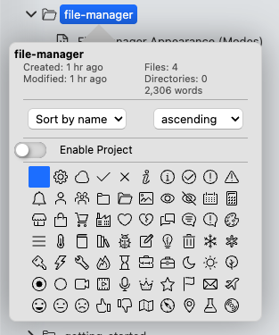
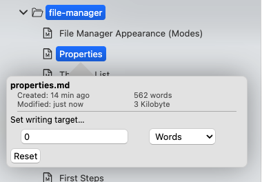
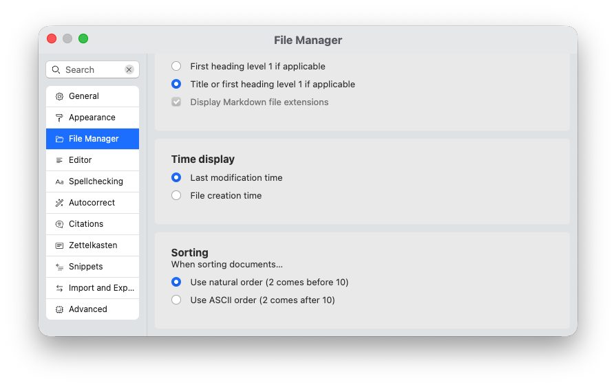

# Properties

Both the tree view and the list view allow you to right-click on either a file or folder to display a set of properties. Properties are shown in a popover next to the file or folder and contain varying information based on which file or folder you have selected.

## Folder Properties

When you show the properties of a folder, the popover contains information on that folder.

The popover is divided into four sections.

The top section shows you the folder name and a set of basic metadata. For example, it shows you when the folder has been created, and when it was last modified. Additionally, it counts the number of files and folders in this folder.

Lastly, it shows a cumulative word count of all Markdown documents contained in this folder.

The second section allows you to determine how the files will be sorted in this folder. The default is to sort files by name ascending. You can choose between sorting files by name or by time, and whether to sort ascending or descending. For both name and time sorting, you can further finetune the behavior in the settings (see the section “Adjusting sorting” below).

The third section is reserved for project settings. You can turn each folder into a project, which unlocks some special functionality to manage entire projects consisting of multiple files. When you turn a folder into a project, a button will appear that lets you edit the project’s settings. Learn more in the project documentation.

The last section in the popover lets you modify the appearance of the folder. You can pick from a selection of icons that will be displayed in the file manager instead of the standard folder icon. You can use this to, e.g., make a folder full of papers stand out more, or select more appropriate icons based on what you use the folder for.

## File Properties

The file properties popover looks similar to the folder properties popover, but displays information more suitable for files.

Again, the first section displays the file name above the file’s creation and modification time. In addition, it shows the file’s word count plus its actual size on your computer.

Sorting and project settings are expectably missing, but instead you have the option to set a writing target for this file. If this writing target is greater than 0, this will activate the writing target. You can determine how many words you aim for. You can always adapt or reset this target.

When a writing target is set for your file, this target will be shown with a progress indicator both in the file tree and the file list, depending on which file manager mode you use.

## Adjusting Sorting Preferences

If you navigate to the preferences → “File Manager,” this section contains two settings that control how Zettlr sorts files. These settings influence the behavior of the folder sorting setting.

The first is “Time Display.” This determines – across the entire app – whether Zettlr shows you the creation time of a file or folder (when it first was created on your computer), or the last modification time (when you last changed something in it). This setting also influences whether the time-sorting property of a folder utilizes the creation or modification date to sort its contents.

The second is the “Sorting”-setting. Here you can determine how Zettlr sorts your folder contents. You can pick between ASCII and natural sorting. Most people likely prefer “natural” over ASCII.

When you select ASCII, Zettlr will compare two items letter by letter, and sorts them based on the first difference. “Natural,” on the other hand, will look at entire logical groups.

For example, if you start filenames in some folder with numbers with the intention to sort them ascending, the file that starts with the number “10” would be sorted not after the file starting with “9,” but instead before the file starting with “2,” since the first letter of the filename – “1” – is smaller than “2.” When you sort naturally, however, it will look at the entire number, and recognize that “10” is probably a single logical group. Since “10” is then bigger than “9,” it would appear after that file.