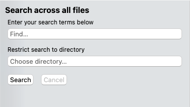
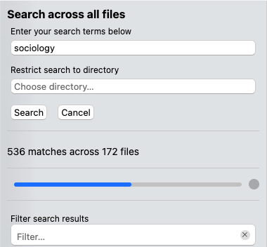
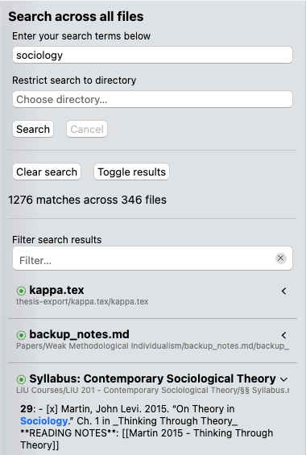

# Global Search

The file manager does not just allow you to navigate your workspaces; it also contains a powerful global full-text search that allows you to search for things deeply nested inside your workspaces.

Unlike the filter field of the file manager or searching inside files, the global search can check all files that you have opened in Zettlr at once.

You can open it either by pressing <kbd>Cmd/Ctrl</kbd>+<kbd>Shift</kbd>+<kbd>F</kbd> or by clicking the second button from the left in the toolbar. The full-text search is contained in the same panel as the file manager.

## Starting a Search

To start a search, enter your search terms in the query field. The section “Composing a Query” below demonstrates how you can optimize your search. Optionally, you can restrict the search to any directory contained in your workspaces. Once you are done, click “Search” to start the search.

The search will take some time, as Zettlr will look at the entire file contents. During the search, Zettlr shows the progress, and shows you how many matches it has found so far.

You can always interrupt a search by clicking the “x”-button next to the search progress.

The screenshot above shows you one example of such a full-text-search. At the top you can see the search term, “sociology.” Below the controls, you can see that Zettlr has found 1,276 matches across 346 files across all workspaces.

Finally, at the bottom, you can see some of the search results. The search results will always be sorted by relevancy.

## The Search Results

As Zettlr finds more matches in your files, it populates the list of search results below the controls. Each file in which Zettlr has found a match is one result.

!!! tip

    Too many results? You can toggle the display of all results using the corresponding button, and then only expand those which deserve a second look.

Each result has two sections. At the top, you can see the filename. the `title` property, or the first heading of level 1, depending on your settings. Below it you will see, in gray, the **relative path** from the workspace root to this file. Zettlr does not show the entire path to the file on your computer to remove unnecessary clutter and make these paths short, but keep them long enough that you know where in your loaded workspaces the file is located.

In addition, the header of each result contains a colored circle and a caret. The colored circle is an indicator of relevancy, measured in relation to all other search results. Green indicates a highly relevant result, blue indicates a relevant result, and gray indicates a less relevant search result. Relevancy is computed based on how many and where Zettlr has found a match in the file, and based on the quantity of matches.

The caret to the right side of the result allows you to show and hide individual matches in the file. When the caret points towards the left, the result is collapsed, and when the caret points downward, the search results are visible.

Below this header, a result item contains an enumeration of each individual match. Each match starts with the line number in which the match has been found, followed by the line contents. The actual match will be highlighted.

If the file name itself has been matched, it will be shown as the first match without a line number, and highlighted in its entirety.

## Navigating the Search Results

To further work with the search results, you can do several things.

First, you can filter the search results itself. This can be helpful if you want to quickly limit the search results display to some of the more relevant files to you.

Second, you can click on any individual match. This will open the corresponding file and automatically navigate to the correct line for you. This way you can check the context of the search result.

Lastly, you can also right-click the search result match. This allows you to copy the results to your clipboard, e.g., for pasting them somewhere else.

## Composing a Query

Zettlr utilizes a boolean search. You can make use of several operators to specify exactly what you are searching for:

* **AND operator:** Type `Boat Ship` to only display the files that contain *both* the term “boat” and the term “ship.” Each space is interpreted as “AND.”
* **OR operator:** Type `Boat | Ship` (`|` is the Pipe-character which you can type with <kbd>Shift</kbd>+<kbd>\`</kbd> on US-ANSI keyboards, <kbd>Alt</kbd>+<kbd>7</kbd> on ISO-style macOS keyboards, or <kbd>AltGr</kbd>+<kbd><</kbd> on other ISO-style systems) to select all files that contain *either* the word “boat” *or* the word “ship.”
* **Exact-Match operator:** Enclose your query in quotation marks (e.g.,`"Boat Ship"`) to search your files for that exact phrase.
* **NOT operator:** Type `!Boat` to search only for files *not* containing that term. Works with exact matches as well: `!"Boat Ship"` would exclude all files containing the exact phrase “Boat Ship.”

!!! warning

    While the `AND`, `OR`, and `Exact-Match` operators work by assigning weights (a file that fulfills all search criteria will be considered very relevant, while files which do not match all search terms are considered less relevant), the `NOT` operator definitely excludes files. So while a search for `boat ship` would also include files containing only one of the two terms (albeit with a much lower relevancy score), a search for `!boat ship` will definitely exclude all files containing the word boat.

Of course, you can chain all of these operators. So you could search for `"Boat Ship" | vessel captain` to display only files that either contain the exact phrase “Boat Ship” or the word “vessel,” and which also include the word “captain.”

Don't worry if you do not remember the complete word you are searching for: Zettlr will try to match your search terms also to partial words, so the word “trooper” would match “Stormtrooper” as well as “Troopership,” and the phrase “Boat Ship” matches a “Steamboat Ship.” **Searches are also case-insensitive**. So you don't have to worry about little typos you may have in some files.

## Search Results Relevancy

To achieve better results, Zettlr will weigh different types of matches differently. For instance, an exact match in the title can be a sign that the file is highly relevant to you. Therefore, Zettlr will weigh this heavier than other matches. Also, if a search term has matched case-sensitive, this match will receive a higher score than if the term has only matched case-insensitive (i.e., there was a difference in capitalization).