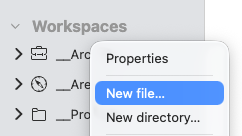
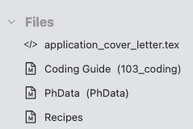
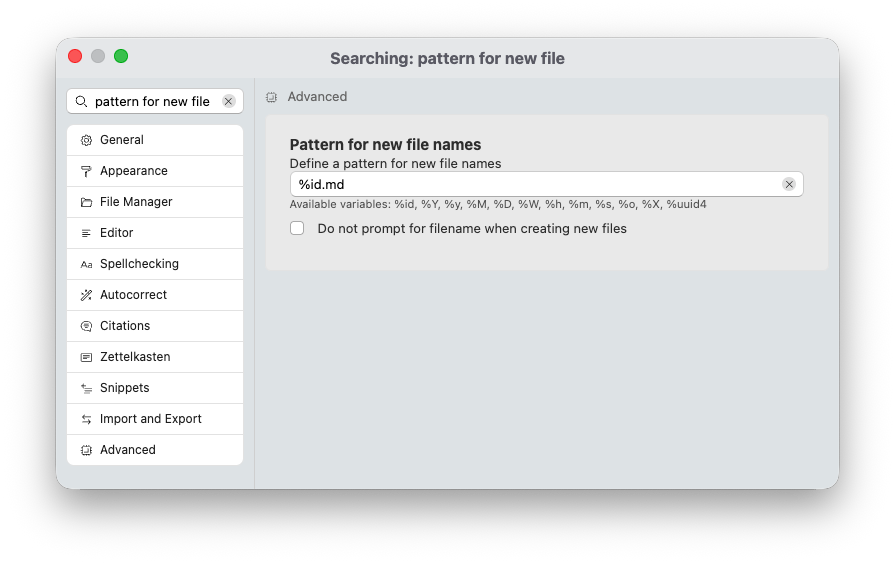

# Creating Files and Folders

With your workspaces set up, you can finally start adding files and start typing away.

Zettlr supports three ways of creating files:

1. Right-click the folder you want to create a file in
2. Use the menu item “File” → “New File…” or the shortcut <kbd>Cmd/Ctrl</kbd>+<kbd>N</kbd>
3. Automatic linking

## 1. Via the File Manager

The simplest and most straight-forward method to create new files is to right-click one of your newly added workspaces and select “New file…”. This will show you a small text input with pre-selected text. Either accept the suggested filename by pressing <kbd>Enter</kbd>, or overwrite the suggestion with a custom filename. Zettlr will create the file and immediately open it for you to start working directly.

Right-click the folder or workspace:

And then accept or change the suggested filename:

!!! tip

	New folders can be created exactly the same way, and we recommend doing it this way.

## 2. Via the Menu or Shortcut

Creating a file by choosing the menu item “File” → “New File…” or via the shortcut <kbd>Cmd/Ctrl</kbd>+<kbd>N</kbd> is the next-best option. This time, Zettlr will open a dialog that lets you pick both the location of your new file and a filename.

With this method, you can also create a file outside your loaded workspaces. This can be helpful if you have a need for some file that you do not want in your workspaces. In this case, the file will be opened on top of your workspaces in a dedicated “Files” section in the file manager.

## 3. Via Automatic Linking

The last method is to create files automatically when linking them. This is a feature which is part of the PKMS (Personal Knowledge Management System), or “Zettelkasten” functionality of Zettlr. For that to work, you’ll need to have a dedicated “Zettelkasten” workspace, and need to link the file.

This workflow will be introduced in the corresponding section.

## Creating Folders

Creating folders works almost analogous to creating files. You can either choose the corresponding menu shortcut “File” → “New directory…”, which will prompt you to enter a new folder name, or, what we recommend, right-click on a folder in which you wish to create a new folder. The process is exactly the same as creating files via the file manager (see above).

## Changing the Default Filename

In both approach 1 and 2 to creating new files, Zettlr will automatically suggest a filename for you. This filename consists only of numbers, and if you look closely it consists of the current date and time in the form “year month day hour minute second.”

This is by design: This filename is what Zettlr considers an ID. IDs are especially useful for implementing PKMS or Zettelkasten functionality, but they are also helpful for ensuring that no filename is the same.

If you do not want to have files automatically be named like this, you can also change the default filename suggestion. To do so, open the settings (<kbd>Cmd/Ctrl</kbd>+<kbd>,</kbd> or via the menu), and navigate to the “Advanced” section.

Search for the setting “Pattern for new file names.” This setting offers you a text input, in which you can choose how Zettlr generates filenames. You can either insert a static string, such as “my-awesome-file.md” or make use of a certain set of variables. These variables are the following:

* `%id`: Inserts a new ID, following another pattern which you can define in the Zettelkasten-section of the preferences. By default, it is just the current date.
* `%Y`: The year, four-digits (e.g., 2025).
* `%y`: The year, two-digits (e.g., 25)
* `%M`: The month, two-digits (e.g., 11)
* `%D`: The day, two-digits (e.g., 30)
* `%W`: The week number, two-digits (e.g., 48)
* `%h`: The hour, 24-hour-format, two-digits (e.g., 14)
* `%m`: The minute, two-digits (e.g., 19)
* `%s`: The second, two-digits (e.g., 04)
* `%o`: The day of the year (e.g., 331)
* `%X`: The UNIX-timestamp (e.g., 1764508829)
* `%uuid4`: A UUID v4 (e.g., 5b6d9b2f-e2f5-4847-a368-4cf5da1e51ae)

## Creating Files Other Than Markdown

Zettlr is a Markdown editor, and as such it will by default create Markdown files. However, from time to time you may require other files. When working with Markdown, you’ll sometimes need code files for configuration or templates. As a beginner you usually don’t need them, and even if you are a power-user, you will rarely explicitly need them. But if you do, you can change the file type of the file to one of the following filename extensions:

* `.tex`: This will create a LaTeX source file (useful, e.g., for templates)
* `.json`: This will create a JSON data file (these are used for bibliographies if you connect your reference manager; these will be introduced later)
* `.yaml`: This will create a YAML data file (used, e.g., to configure how Zettlr exports your files)

!!! tip

	You can also create Markdown files using other filename extensions than `.md`. For example, you can create `.Rmd`-files, `.qmd`-files, or `.txt`-files. You saw that correctly: Zettlr can easily open and display RMarkdown and Quarto files. Also, if you have plain-text files, these will, by definition, be interpreted as Markdown.