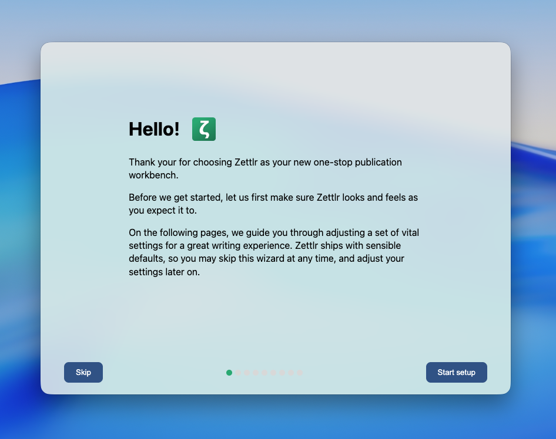

# First Steps

Once you have installed Zettlr and started the app, it will provide you with a quick setup guide. This setup guide allows you to quickly adjust the most important settings very quickly with a few clicks. We highly recommend you carefully move through this dialog to ensure that when you are done, Zettlr looks and feels as you wish. In addition, this setup guide will highlight a few central features the app offers you.

You can also choose to skip this setup wizard and change any setting later after the fact.

!!! note

	You can't make any mistake here. This setup guide simply changes preference settings that you can change later on in the preferences dialog yourself, if you are dissatisfied with some of your choices in the setup guide.

## A First Glance at Zettlr

Once you have completed the setup wizard, Zettlr’s main window will show. The interface is divided into **three major sections**.

* Front and center is the **editor area** where you can read and edit your files. As you can see, Zettlr supports **split-view**. To demonstrate this feature, the app has opened a small tutorial document to the left, and two documents with some helpful information to the right.
* To the left, you can see Zettlr’s **file manager**. The file manager is where you can view, search, and manage all your documents, folders, and any additional files inside of them. Notably, the file manager is only a view over the files already on your computer. All your data stays in human-readable files on your device, and there is **no vendor-lock-in**.
* Atop of these two sections you can find the **toolbar**, a quick-access way to many of the primary functions of the app. Most of this functionality can also be triggered via keyboard shortcuts, if you prefer.

!!! note

	There is also a fourth section, a sidebar, to the right. It is not shown by default. You can click the sidebar icon to the right of the toolbar to make it appear. This sidebar includes sections for a table of contents, references, related files, and assets related to whichever file you currently view.

## Working Through the Tutorial

Before you dive deeper, we recommend you work through the tutorial. First, read the file titled “Welcome to Zettlr,” and follow the instructions therein. At the bottom, you will see a link to a second tutorial document. In total, there are three such documents, and by working through them, you can get some hands on experience with the app.

After you’re done working through the tutorial, come back here, and continue reading the documentation. Click “Next” to move to the workspaces introduction.